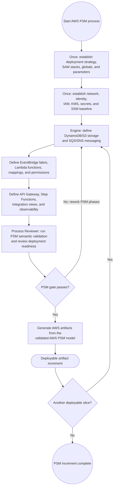

# AWS PSM Methodology Activity Diagram

This activity view shows one deployable-slice revolution of `modriss.psm.modeling` after PIM-to-PSM ETL.

```mermaid
flowchart TD
    start((Start AWS PSM process)) --> foundation["Once: establish deployment strategy,<br/>SAM stacks, globals, and parameters"]
    foundation --> network["Once: establish network, identity,<br/>IAM, KMS, secrets, and SSM baseline"]
    network --> storage["Engine: define DynamoDB/S3 storage<br/>and SQS/SNS messaging"]
    storage --> compute["Define EventBridge fabric,<br/>Lambda functions, mappings, and permissions"]
    compute --> api["Define API Gateway, Step Functions,<br/>integration views, and observability"]
    api --> review["Process Reviewer: run PSM semantic validation<br/>and review deployment readiness"]
    review --> passed{"PSM gate passes?"}
    passed -- "No: rework PSM phases" --> storage
    passed -- "Yes" --> generate["Generate AWS artifacts from the<br/>validated AWS PSM model"]
    generate --> ready(["Deployable artifact increment"])
    ready --> more{"Another deployable slice?"}
    more -- "Yes" --> storage
    more -- "No" --> done((PSM increment complete))
```
