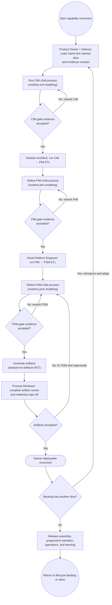

# End-to-End Methodology Activity Diagram

This activity view shows the vertical increment engine inside the full
`modriss.end-to-end.modeling` lifecycle. Initiation/tailoring, release/transition,
operations/evolution, and retirement/closure surround this engine in the normative
[full-lifecycle method](https://github.com/mehdieidi/modriss/blob/main/mde/process/software-development-process.md).

