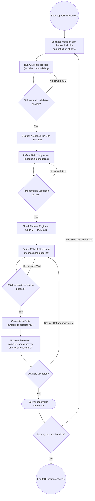

# End-to-End Methodology Activity Diagram

This activity view shows the full `modriss.end-to-end.modeling` vertical-slice process.

```mermaid
flowchart TD
    start((Start capability increment)) --> plan["Business Modeler: plan thin vertical slice<br/>and definition of done"]
    plan --> cim["Run CIM child process<br/>(modriss.cim.modeling)"]
    cim --> cimGate{"CIM semantic validation<br/>passes?"}
    cimGate -- "No: rework CIM" --> cim
    cimGate -- "Yes" --> cp["Solution Architect: run CIM → PIM ETL"]
    cp --> pim["Refine PIM child process<br/>(modriss.pim.modeling)"]
    pim --> pimGate{"PIM semantic validation<br/>passes?"}
    pimGate -- "No: rework PIM" --> pim
    pimGate -- "Yes" --> pp["Cloud Platform Engineer: run PIM → PSM ETL"]
    pp --> psm["Refine PSM child process<br/>(modriss.psm.modeling)"]
    psm --> psmGate{"PSM semantic validation<br/>passes?"}
    psmGate -- "No: rework PSM" --> psm
    psmGate -- "Yes" --> m2t["Generate artifacts<br/>(awspsm-to-artifacts M2T)"]
    m2t --> artifactReview["Process Reviewer: complete artifact review<br/>and readiness sign-off"]
    artifactReview --> accepted{"Artifacts accepted?"}
    accepted -- "No: fix PSM and regenerate" --> psm
    accepted -- "Yes" --> deliver(["Deliver deployable increment"])
    deliver --> more{"Backlog has another slice?"}
    more -- "Yes: retrospect and adapt" --> plan
    more -- "No" --> done((End MDE increment cycle))
```
