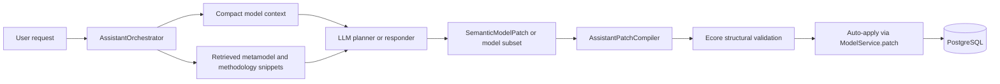

# How the Modless AI Assistant Works

This guide teaches the concepts behind the Modless AI assistant and connects each concept to the
code that implements it. For setup and operator notes see [assistant.md](assistant.md). For the
public summary see [ai-assistant.md](../../public-docs/docs/guides/ai-assistant.md).

The most important idea:

> The large language model is an adviser and proposal writer. The Modless backend remains the
> authority that compiles, structurally validates, auto-applies, audits, and undoes model changes.

The assistant is deliberately **bounded**. It does not receive an entire model, metamodel, or EVL
repository. It receives compact summaries and retrieved snippets. Valid mutations **auto-apply**
after structural validation. There is no REST approve/reject step; **undo** is the post-apply
control.

## 1. The Big Picture

Modless combines two kinds of intelligence:

1. **Probabilistic AI** — an LLM explains, clarifies, or drafts structured model changes; RAG
   supplies metamodel and methodology snippets; providers are OpenAI-compatible or Gemini.
2. **Deterministic MDE** — Ecore defines legal structure; Java compiles semantic operations into
   JSON Pointer patches; structural validation gates apply; PostgreSQL stores models, memory,
   proposals, and audits.

EVL semantic validation runs elsewhere in the platform (model workbench, MDE jobs) but is **not**
the assistant apply gate today. `ModelService.validateStructural()` is authoritative for whether a
mutation may be applied.

## 2. Technology Stack

| Layer          | Technologies                                                                                      |
| -------------- | ------------------------------------------------------------------------------------------------- |
| Application    | Java 17, Spring Boot 3.5, Spring MVC, WebSocket, JDBC, Actuator                                   |
| AI integration | Spring AI 1.1 — chat, structured output, tools, JDBC chat memory, OpenAI, Gemini, ONNX embeddings |
| Storage        | PostgreSQL 16, `jsonb`, `bytea`, pgvector, full-text search, Flyway                               |
| MDE runtime    | EMF/Ecore, Emfatic, XMI, Epsilon EVL/ETL/EGX                                                      |

Key configuration:

- `apps/backend/src/main/resources/application.yml` — `modless.ai.*` bindings
- `MODLESS_AI_MODELING_STRATEGY` — wired in `AssistantServicesConfig` (not on `AiProperties`)
- `deploy/compose.yaml` — local stack including pgvector Postgres

## 3. Modeling Strategies

`MODLESS_AI_MODELING_STRATEGY` defaults to `model-subset`.

| Strategy         | Planner                                           | Tools                                   | Output                                                          |
| ---------------- | ------------------------------------------------- | --------------------------------------- | --------------------------------------------------------------- |
| `model-subset`   | `AssistantModelSubsetPlanner`                     | None (single structured LLM call)       | JSON subset → `ModelSubsetPatchCompiler` → `SemanticModelPatch` |
| `semantic-patch` | `AbstractAssistantModelProvider.planMutationTurn` | Optional exploration phase, then commit | Direct `SemanticModelPatch` operations                          |

Aliases are accepted (`subset`, `json-subset`, `patch`, `operations`, etc.) via
`AssistantModelingStrategy.from()`.

Both strategies share `AssistantPatchCompleter`, the validation repair loop
(`MODLESS_AI_VALIDATION_REPAIR_ATTEMPTS`, default 6), and `autoApplyValidatedProposal()`.

## 4. Concepts

### Prompt and context boundary

`AssistantPromptGuard` redacts secrets, tags injection-like text, and caps snippet/system sizes.
Prompts include project, level, model ID, revision, view, selection, compact model context,
retrieved catalog snippets, recent chat, and the user message — never whole models or raw EVL files.

### Embeddings and RAG

`LocalAssistantEmbeddingService` supports:

- **HASH** (default) — deterministic 384-dimensional vectors
- **ONNX** — Spring AI Transformers when the `onnx-embeddings` profile is available

`JdbcAssistantCatalog` indexes:

- `mde/**/*.emf` and `mde/**/*.ecore` → package, classifier, feature, enum scopes
- Methodology JSON/Markdown under `mde/` and `docs/public-docs/docs/guides/`

On every refresh it calls `removeEvlCatalogDocuments()` — **EVL constraint rows are not kept** in
the retrieval catalog. Search uses exact title/source match, then hybrid full-text + pgvector
cosine distance.

### Model context snapshot

`JdbcAssistantModelContextIndex` caches compact element/relationship summaries per
`(modelId, revision, modelHash)` in `assistant_model_contexts`. This is separate from RAG and is
rebuilt when the revision changes.

### Structured mutations

The LLM must express changes as `SemanticModelPatch` operations:

- `ADD_ELEMENT`
- `CONNECT_ELEMENTS`
- `SET_ATTRIBUTE`
- `DELETE_ELEMENT`

`AssistantPatchCompiler` compiles these into JSON Pointer patch operations plus an inverse patch
for undo.

### Tools (semantic-patch exploration only)

`AssistantToolService` exposes 14 whitelisted Spring AI tools, including:

- `searchCatalogs`, `previewSemanticPatch`, `summarizeValidation`, `requestUserChoice`
- `getElementContext`, `getTypeContract`, `validateSnapshot`, `inspectCurrentSemanticPatch`
- `getLanguageIndex`, `getMetamodelCoverage`, `findCreatableTypes`, `findContainmentOptions`
- `summarizeCurrentModel`, `listModelElements`

Tools are bound per turn via `AssistantToolBridge.bindSession()`. Counts are tracked for metrics.
`MODLESS_AI_MAX_TOOL_CALLS`, `MODLESS_AI_MAX_TOOL_CALLS_PER_STEP`, and
`MODLESS_AI_MAX_AGENT_STEPS` are bound in configuration but **not enforced** by the orchestrator
today.

## 5. One Complete Turn

Example: user asks to add a PIM function connected to the selected API.

1. Frontend `POST /api/chatbot/sessions/{id}/messages` with `modelId`, `revision`, view,
   selection, optional `unsavedDraftPatch`, and `attachmentIds`.
2. `ChatbotController` → `AssistantOrchestrator.handleMessage()`.
3. Rate limit and circuit checks (`AssistantHardeningService`).
4. Persist user message to durable history and Spring AI JDBC chat memory.
5. Load authorized model; return **409** if `expectedRevision` is stale.
6. Build or load compact model context.
7. Retrieve catalog snippets (up to `MODLESS_AI_MAX_CONTEXT_SNIPPETS`, default 24, with schema
   reservation via `AssistantSnippetBudget`).
8. Plan: answer, structured clarification (`WAITING_FOR_CHOICE`), or mutation.
9. For CIM with attachments, optional `SOURCE_ANALYST` pass and deterministic
   `CimSourceModelMaterializer` may bypass the LLM planner.
10. Compile semantic patch; run repair loop on structural validation failures.
11. Publish realtime `assistant.progress` and optional `assistant.model.preview` events.
12. **Auto-apply** valid patch through `ModelService.patch()`; persist proposal as `APPLIED`.
13. Return `MessageResponse` with `workflowState: APPLIED` and proposal card data; publish
    `chat.assistant` and `model.updated`.

Failed validation yields `workflowState: FAILED` with grounded feedback. No proposal is persisted.

Undo: `POST .../proposals/{id}/undo` applies the inverse patch and sets status `UNDONE`.

## 6. Proposal Lifecycle and Risk

Database statuses: `APPLIED`, `UNDONE`, `FAILED` (orchestrator primarily writes `APPLIED` and
`UNDONE`). There is no `PROPOSED` state and no approve/reject API.

Risk levels (`LOW` / `MEDIUM` / `HIGH`) are computed for display and audit context. They do **not**
block auto-apply.

Current heuristics:

- **HIGH** — contains `DELETE_ELEMENT`
- **MEDIUM** — multiple operations or advisory validation noise
- **LOW** — single non-destructive operation

## 7. Realtime Delivery

`AssistantRealtimeHub` fans out to SSE (`GET /api/chatbot/sessions/{id}/events`) and WebSocket
(`/ws/chatbot/sessions/{id}`). Event envelope: `{ "type", "payload" }`.

| Type                      | Purpose                                                 |
| ------------------------- | ------------------------------------------------------- |
| `assistant.ready`         | Stream connected                                        |
| `assistant.progress`      | Stage updates (`PLANNING`, `VALIDATING`, `APPLYING`, …) |
| `assistant.model.preview` | Incremental preview during compile/validate             |
| `chat.assistant`          | Completed turn payload                                  |
| `model.updated`           | Model revision changed after apply or undo              |

SSE and WebSocket endpoints do not require `X-Auth-Token`; treat session IDs as capability tokens.

## 8. Resilience

| Control           | Implementation                                                                         |
| ----------------- | -------------------------------------------------------------------------------------- |
| Rate limit        | In-memory per user (`MODLESS_AI_RATE_LIMIT_REQUESTS` / `MODLESS_AI_RATE_LIMIT_WINDOW`) |
| Circuit breaker   | Per provider after consecutive failures                                                |
| Retries           | `MODLESS_AI_PROVIDER_RETRY_ATTEMPTS` with backoff                                      |
| Fallback provider | **HTTP 429 only** via `MODLESS_AI_FALLBACK_PROVIDER`                                   |
| AI proxy          | Optional HTTP/SOCKS for provider traffic only (`MODLESS_AI_PROXY_*`)                   |

The `assistant_rate_limits` table exists in schema but is not written by current Java code.

## 9. Storage Layout

| Table                           | Role                                                                      |
| ------------------------------- | ------------------------------------------------------------------------- |
| `assistant_threads`             | Durable thread per user/project/level                                     |
| `assistant_messages`            | Audit history                                                             |
| `SPRING_AI_CHAT_MEMORY`         | Recent LLM window                                                         |
| `assistant_thread_summaries`    | Rolling summary (deterministic truncation today; summarizer model unused) |
| `assistant_proposals`           | Applied patches, inverse, validation, citations                           |
| `assistant_action_audits`       | Apply, undo, choice events                                                |
| `assistant_retrieval_documents` | RAG documents + `vector(384)` embeddings                                  |
| `assistant_model_contexts`      | Compact snapshots by model revision                                       |

Flyway assistant migrations live under `classpath:db/assistant-migration` in `platform-assistant`.

## 10. Code Map

| Concern        | Primary classes                                                                        |
| -------------- | -------------------------------------------------------------------------------------- |
| Orchestration  | `packages/java/platform-assistant/.../AssistantOrchestrator.java`                      |
| HTTP API       | `apps/backend/.../ChatbotController.java`                                              |
| Realtime       | `apps/backend/.../AssistantRealtimeHub.java`, `ChatbotWebSocketHandler.java`           |
| Model-subset   | `.../subset/AssistantModelSubsetPlanner.java`, `ModelSubsetPatchCompiler.java`         |
| Semantic patch | `.../planning/AssistantTurnPlanParser.java`, `.../patch/SemanticModelPatchParser.java` |
| Compile / undo | `.../patch/AssistantPatchCompiler.java`                                                |
| RAG            | `.../persistence/jdbc/JdbcAssistantCatalog.java`                                       |
| Embeddings     | `.../persistence/embedding/LocalEmbeddingService.java`                                 |
| Model context  | `.../persistence/jdbc/JdbcAssistantModelContextIndex.java`                             |
| Tools          | `.../tools/AssistantToolService.java`                                                  |
| Hardening      | `.../application/AssistantHardeningService.java`                                       |
| Providers      | `.../provider/ConfiguredAssistantModelProvider.java`, OpenAI/Gemini adapters           |
| Config         | `.../config/AiProperties.java`, `apps/backend/.../AssistantServicesConfig.java`        |
| Frontend       | `apps/frontend/js/chat.js`                                                             |

## 11. EVL vs Assistant Validation

EVL remains central to the **platform** modeling pipeline:

- Workbench validation endpoints and MDE jobs execute full EVL profiles under `mde/validation/`.
- The assistant uses EVL issue text from the latest model context when available for prompting and
  repair feedback.

The assistant **apply gate** calls `ModelService.validateStructural()` (Ecore constraints). Do not
assume EVL mandatory rules block assistant auto-apply unless that behavior is added explicitly.

`MODLESS_AI_SEMANTIC_VALIDATION_ENABLED` appears in `.env.example` but is **not read** by runtime
code today.

## 12. Attachments and Session Resume

- Upload: `POST /api/chatbot/sessions/{id}/attachments` (`.md`, `.txt`, `.json`).
- Messages reference `attachmentIds`; recent session uploads may be reused automatically.
- Session create accepts `resumeSessionId` and `forceNew`; conversations list supports lookback.

## 13. Limitations (Deliberate Boundaries)

- No LLM fine-tuning on repository assets.
- No wholesale model/metamodel/EVL export to providers.
- Catalog indexing is compact extraction, not a full formal parser for every source dialect.
- Hash embeddings are weaker than ONNX sentence transformers.
- Summarizer model role is configured but not invoked for thread summaries today.
- Semantic patch compiler covers supported element patterns, not every theoretical metamodel edit.
- CIM source materialization and coverage heuristics are specialized fast paths.

## 14. Suggested Learning Path

1. `SemanticModelPatch.java` — allowed mutation protocol.
2. `AssistantOrchestrator.handleMessage()` — full turn pipeline.
3. `AssistantModelSubsetPlanner` or `AbstractAssistantModelProvider` — strategy-specific planning.
4. `JdbcAssistantCatalog.refresh()` — what enters RAG (and what does not).
5. `JdbcAssistantModelContextIndex` — compact model snapshots.
6. `AssistantPatchCompiler` — compile and inverse patches.
7. `ModelService.validateStructural()` — apply gate.
8. `apps/frontend/js/chat.js` — UI: choices, applied proposal cards, undo.
9. Diagrams: `docs/diagrams/14-ai-assistant-architecture.md`,
   `15-ai-assistant-turn-and-proposal.md`, `16-ai-assistant-rag-and-memory.md`.

Related references:

- [assistant.md](assistant.md)
- [sample-prompts.md](sample-prompts.md)
- [postgres-storage.md](../operations/postgres-storage.md)
- [realtime-api.md](../../public-docs/docs/reference/realtime-api.md)
