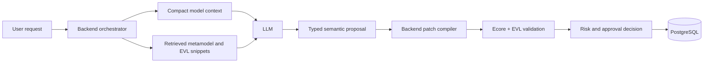

# How the Modless AI Assistant Works

This guide teaches the concepts behind the Modless AI assistant and connects each concept to the
code that implements it.

The most important idea is:

> The large language model is an adviser and proposal writer. The Modless backend remains the
> authority that understands, validates, stores, and changes models.

The assistant is deliberately **bounded**. It does not receive an entire model, metamodel, or EVL
repository. It receives compact summaries and retrieved snippets. It also cannot directly write to
the database or mutate a model. Any proposed change must pass through backend-owned compilation,
validation, risk classification, approval, persistence, and audit logic.

## 1. The Big Picture

Modless combines two different kinds of intelligence:

1. **Probabilistic AI**

   - A large language model, or LLM, understands natural-language requests and writes explanations
     or structured proposals.
   - Retrieval-augmented generation, or RAG, supplies the LLM with relevant project knowledge.
   - The LLM may be OpenAI-compatible or Google Gemini.

2. **Deterministic model-driven engineering**
   - Ecore metamodels define which modeling concepts and relationships are legal.
   - EVL rules validate model meaning and quality.
   - Java services compile approved semantic proposals into model patches.
   - PostgreSQL stores models, assistant memory, proposals, retrieval documents, and audit history.

This separation is essential because an LLM can produce useful ideas but can also misunderstand a
request or invent details. Ecore, EVL, and backend validation provide the formal safety boundary.



## 2. Technology Stack

### Application and AI integration

| Technology                  | Purpose in Modless                                                                                                      |
| --------------------------- | ----------------------------------------------------------------------------------------------------------------------- |
| Java 17                     | Main backend implementation language                                                                                    |
| Spring Boot 3.5             | Backend application, configuration, REST, WebSocket, health, and dependency injection                                   |
| Spring AI 1.1               | Provider-neutral chat API, structured output conversion, tools, chat memory, OpenAI, Gemini, and transformer embeddings |
| OpenAI-compatible API       | Configurable remote LLM provider                                                                                        |
| Google Gemini Developer API | Alternative remote LLM provider                                                                                         |
| Jackson                     | JSON parsing, model snapshots, structured proposals, and database JSON serialization                                    |

### Storage and retrieval

| Technology                  | Purpose in Modless                                                                    |
| --------------------------- | ------------------------------------------------------------------------------------- |
| PostgreSQL 16               | Stores application and assistant data                                                 |
| `jsonb`                     | Stores models, context snapshots, metadata, proposals, validation results, and audits |
| `bytea`                     | Stores XMI sidecars and staged import payloads                                        |
| pgvector                    | Stores 384-dimensional embeddings and calculates vector distance                      |
| PostgreSQL full-text search | Finds keyword matches in retrieval documents                                          |
| Spring JDBC                 | Executes SQL from Java                                                                |
| Flyway                      | Creates and evolves the database schema at startup                                    |

### Model-driven engineering

| Technology       | Purpose in Modless                                                                     |
| ---------------- | -------------------------------------------------------------------------------------- |
| EMF and Ecore    | Define and load formal metamodels                                                      |
| Emfatic (`.emf`) | Human-readable source syntax for many metamodel definitions                            |
| XMI              | EMF-compatible serialized representation used for formal validation and MDE operations |
| Epsilon EVL      | Defines and executes semantic validation constraints and critiques                     |
| Epsilon ETL      | Performs model-to-model transformations                                                |
| Epsilon EGX/EGL  | Generates artifacts from models                                                        |

Important dependency and configuration files:

- `pom.xml`: Java, Spring Boot, and Spring AI versions.
- `apps/backend/pom.xml`: backend AI dependencies and optional ONNX profile.
- `apps/backend/src/main/resources/application.yml`: AI modes, providers, models, embeddings,
  proxy, limits, and database configuration.
- `deploy/compose.yaml`: PostgreSQL with pgvector and the complete local stack.

## 3. Concepts You Need to Know

### Large language model

An LLM predicts a useful continuation from the instructions and context it receives. It does not
automatically know the current Modless repository, the active user's model, or the latest EVL
rules.

The backend must therefore construct a prompt containing only the information needed for the
current task.

### Prompt

A prompt is the complete input sent to an LLM. In Modless it contains:

- backend-controlled system rules;
- project, model level, model ID, revision, and active view;
- selected stable element IDs;
- recent conversation memory and a rolling summary;
- a compact summary of the current model;
- relevant metamodel and EVL snippets;
- the user's request.

`AssistantPromptGuard` redacts common secrets and bounds the size of prompt sections before they
leave the backend.

### Tokens and context window

LLMs process text as tokens rather than characters. A model has a limited context window, so sending
all model JSON and every MDE file would be expensive, slow, and noisy.

Modless reduces the prompt by:

- summarizing the active model;
- retrieving only relevant catalog snippets;
- limiting recent messages;
- truncating prompt sections;
- asking for a small typed proposal instead of a full replacement model.

The configured `token-budget` currently limits provider output to at most 4,000 tokens. Retrieval
currently returns up to six snippets when the budget is positive; it is not a precise input-token
accounting system.

### Embedding

An embedding converts text into a list of numbers called a vector. Texts with similar meaning
should have nearby vectors.

For example, the phrases:

- `function timeout rule`
- `constraint for function execution duration`

may use different words but should be close in a good semantic embedding space.

Modless stores vectors with 384 numbers in PostgreSQL:

```sql
embedding vector(384)
```

`LocalAssistantEmbeddingService` supports:

- **ONNX embeddings** through Spring AI Transformers when the optional native dependencies are
  available;
- a deterministic **hash embedding fallback** that maps tokens into a normalized 384-dimensional
  vector.

The hash fallback is useful for tests and lightweight environments, but it is less semantically
powerful than a real sentence-transformer model.

### Vector similarity

pgvector's `<=>` operator calculates cosine distance. Smaller distance means the vectors are more
similar.

Modless uses:

```sql
embedding <=> ?::vector ASC
```

to put semantically closer retrieval documents first after full-text ranking.

### RAG

RAG means **retrieval-augmented generation**.

Without RAG:

```text
user question -> LLM -> answer based mostly on general training
```

With RAG:

```text
user question -> search project-owned knowledge -> add relevant snippets to prompt -> LLM answer
```

RAG does not train or fine-tune the LLM. It supplies temporary evidence for a single request.

### Tool calling

A tool is a backend method that an LLM can request through a structured interface. The
OpenAI-compatible provider registers the whitelisted methods in `AssistantToolService`:

- `searchCatalogs`
- `previewSemanticPatch`
- `summarizeValidation`
- `requestUserChoice`

Gemini tool registration is currently disabled in `GeminiAssistantModelProvider`.

The LLM still does not receive arbitrary Java execution, SQL access, or a general filesystem tool.

### Structured output

Free-form text is unsafe as an executable model change. Modless asks the planner model to return a
`SemanticModelPatch`, which has a known Java schema.

Only four operation types are allowed:

- `ADD_ELEMENT`
- `CONNECT_ELEMENTS`
- `SET_ATTRIBUTE`
- `DELETE_ELEMENT`

The backend converts the provider response directly into this Java type using Spring AI structured
output conversion.

## 4. What Metamodels and EVL Mean

### Model, metamodel, and meta-metamodel

A **model** describes a particular system. For example, one PIM may contain a `Function`, an `Api`,
and a `DataStore`.

A **metamodel** describes the language used to build models. It answers questions such as:

- Which element types exist?
- Which attributes does a `Function` have?
- Which references connect elements?
- Is a relationship optional, required, singular, or repeated?
- Which element contains another element?

Ecore is the formal metamodel language used by EMF. Emfatic is a more readable textual syntax that
can describe Ecore concepts.

A **meta-metamodel** defines how metamodels themselves are expressed. Ecore plays this role in EMF.
In everyday Modless work, the practical chain is:

```text
Ecore defines valid modeling languages
    -> CIM/PIM/PSM metamodels define valid Modless model structures
        -> user models are instances of those metamodels
```

### CIM, PIM, and PSM

Modless separates models by abstraction level:

- **CIM**: computation-independent business concepts and intent.
- **PIM**: provider-independent software architecture.
- **PSM**: platform-specific architecture, currently focused on AWS.

Each level has a combined runtime Ecore file:

- `mde/metamodels/cim/cim-combined.ecore`
- `mde/metamodels/pim/pim-combined.ecore`
- `mde/metamodels/psm/psm-combined.ecore`

### Structural rules versus semantic rules

A metamodel is good at structural rules:

- `PIMModel` can contain many `Function` objects.
- an attribute has a particular data type;
- a reference points to a particular class;
- a feature has a multiplicity such as `0..1` or `0..*`.

EVL is good at semantic and quality rules that require logic:

- provider-independent models must not contain provider-specific names;
- model element IDs must be globally unique;
- a selected architecture style should match the model contents;
- a generated element should preserve traceability.

### EVL constraints and critiques

An EVL `constraint` is mandatory. A failed constraint becomes an error and blocks an assistant
proposal from being applied.

An EVL `critique` is advisory. A failed critique becomes a warning and can increase proposal risk,
but it does not by itself make the model invalid.

Example:

```evl
context PIM!PIMModel {

  critique DefaultCorrelationIdShouldBeNamed {
    check : self.defaultCorrelationIdName.hasText()
    message : "A default correlation ID name is recommended."
  }
}
```

## 5. How Metamodels and EVLs Enter the AI System

Metamodels and EVLs enter the assistant in **two separate ways**. This distinction is central to
understanding the implementation.

### Path A: indexed as RAG knowledge

At backend startup, `AssistantCatalogService.initialize()` calls `refresh()` and walks the local
`mde/` directory for:

- `.emf`
- `.ecore`
- `.evl`

For every file it:

1. Calculates a SHA-256 content hash.
2. Checks whether the stored hash is unchanged.
3. Deletes old retrieval rows when the file changed.
4. Parses the file into small documents.
5. embeds each document;
6. stores the documents and embeddings in `assistant_retrieval_documents`.

Metamodel files become package, classifier, and feature documents. Depending on the source format,
the documents can include:

- package name and namespace;
- class name and superclass information;
- attribute, reference, or containment name;
- feature type;
- lower and upper multiplicity;
- containment and other structural flags;
- source path and modeling level.

EVL files become one retrieval document per parsed constraint or critique. Each document can include:

- rule name;
- context type;
- mandatory or optional kind;
- rule body and message;
- source path and approximate line;
- CIM, PIM, PSM, or shared level.

This indexing parser is intentionally compact. Emfatic and EVL are read line by line, while Ecore is
parsed as XML. It is not the same as fully executing or semantically analyzing every source file.

### Path B: executed as formal validation

When validating a model or proposal, `ModelService` uses the real MDE runtime:

1. Resolve the level's combined Ecore metamodel with `FileMetamodelResolver`.
2. Convert or load the model as an in-memory EMF resource.
3. Load the level's EVL entry module.
4. Let EVL imports load the shared helpers and level-specific rule modules.
5. Run Ecore structural validation and EVL execution.
6. Convert unsatisfied constraints and diagnostics into platform validation issues.

The entry EVL modules are:

- `mde/validation/cim/cim-semantic-validation.evl`
- `mde/validation/pim/pim-semantic-validation.evl`
- `mde/validation/psm/psm-semantic-validation.evl`

`EpsilonEvlValidator` executes these rules against actual EMF models. This is the authoritative
validation path.

### Why both paths are needed

RAG snippets help the LLM **understand and explain** rules.

EVL execution lets the backend **prove whether a concrete model passes** those rules.

```text
Indexed EVL snippet: "Here is the relevant rule and what it means."
Executed EVL rule:    "This exact proposed model passes or fails the rule."
```

The LLM's opinion never replaces the executable validation result.

## 6. How RAG Is Implemented

### Indexing structure

Each retrieval row stores:

| Column        | Meaning                                                        |
| ------------- | -------------------------------------------------------------- |
| `scope`       | package, classifier, feature, or constraint                    |
| `source`      | repository path of the source file                             |
| `source_hash` | SHA-256 used to detect changes                                 |
| `title`       | searchable symbol or rule name                                 |
| `content`     | compact extracted text                                         |
| `metadata`    | level, context, kind, owner, multiplicity, and similar details |
| `embedding`   | 384-dimensional vector                                         |
| `updated_at`  | indexing time                                                  |

### Retrieval flow

`AssistantCatalogService.search(query, level, limit)` performs retrieval:

1. Try an exact case-insensitive match on `title` or `source`.
2. Restrict results to the active level or `SHARED`.
3. If exact lookup finds nothing, extract up to eight useful query words.
4. Embed the full query.
5. Rank first by PostgreSQL full-text match, then vector distance, then update time.
6. Return compact `ContextSnippet` records.

This is a hybrid retrieval design:

- **symbol lookup** is best when the user names an exact class or constraint;
- **full-text search** is best for matching shared words;
- **vector search** helps when wording differs but meaning is similar.

One implementation detail matters: the current SQL ordering is lexicographic. Full-text rank is
ordered first, vector distance second. It does not calculate one weighted hybrid score.

### What is retrieved during a turn

The orchestrator searches using the user's message and active model level. It returns up to six
catalog snippets and also appends up to four current validation issues.

These snippets are sent to the responder or planner as backend-provided context and are also turned
into proposal citations such as:

```text
mde/validation/pim/pim-semantic-validation.evl#ProviderIndependentFlagMustBeTrue
```

## 7. How the Current Model Becomes AI Context

The active model itself is not inserted wholesale into the prompt.

`AssistantModelContextIndexService` traverses stored `model_json` and creates a compact snapshot:

- elements: stable ID, type, name, and JSON path;
- relationships: ID, source ID, target ID, kind, and path;
- neighborhoods: which stable IDs are connected;
- latest validation issues;
- model ID, project ID, level, name, and revision.

The prompt summary currently includes at most:

- 12 element summaries;
- 8 validation issues;
- 8 neighborhoods.

Snapshots are cached in `assistant_model_contexts` using:

- model ID;
- model revision;
- SHA-256 hash of model JSON.

When a model revision changes, the assistant builds a new snapshot. This prevents a proposal from
silently targeting stale model state.

## 8. One Complete Assistant Turn

Suppose the user asks:

> Add a function to the PIM and connect it to the selected API.

The runtime flow is:

1. The frontend sends the message, active model ID, revision, active view, and selected element IDs.
2. `ChatbotController` converts the HTTP request into an `AssistantTurnRequest`.
3. `AssistantOrchestrator` checks the per-user rate limit.
4. The user message is written to durable history and Spring AI chat memory.
5. The backend loads the active project and model.
6. The backend rejects the turn with HTTP 409 if the requested revision is stale.
7. `ModelService` validates the current model.
8. `AssistantModelContextIndexService` loads or builds compact model context.
9. `AssistantCatalogService` retrieves relevant PIM metamodel and EVL snippets.
10. The responder LLM explains the request, or the planner LLM returns a `SemanticModelPatch`.
11. The backend checks that operations are grounded in known stable IDs and within the operation
    limit.
12. `AssistantPatchCompiler` compiles semantic operations into JSON patch operations and an inverse
    patch.
13. The compiled patch is applied to an in-memory preview.
14. `ModelService` runs structural and EVL validation against the preview.
15. A proposal that fails mandatory rules is discarded.
16. The backend classifies risk for review context.
17. The valid proposal is stored and returned for explicit user approval.
18. Messages, proposal state, citations, and audit events are persisted.
19. REST plus WebSocket or SSE updates the frontend.

## 9. Proposal Mode

The assistant's current rollout mode is `AUTONOMOUS`; the legacy `GUARDED_APPLY` value is still
accepted for existing deployments. A structured LLM turn decides whether to answer, ask up to three
consequential clarification questions, or draft semantic operations. Valid model-changing work is
compiled, validated, risk-classified, persisted as a proposal when approval is needed, and
revalidated when approval is submitted.

Current risk rules:

- **HIGH**: contains a remove operation.
- **MEDIUM**: contains more than one compiled patch operation or has optional EVL issues.
- **LOW**: one non-destructive operation with no optional issues.

A plan that fails mandatory validation gets one grounded repair pass. If it still fails, it becomes
an interactive recovery clarification and is never persisted or rendered as a proposal.

## 10. From LLM Proposal to Stored Model

The planner does not return raw JSON Patch or a replacement model. It returns a semantic operation
such as:

```json
{
  "operations": [
    {
      "type": "ADD_ELEMENT",
      "targetElementId": "payment-handler",
      "elementType": "Function",
      "attributes": {
        "name": "Payment Handler"
      }
    }
  ]
}
```

`AssistantPatchCompiler` turns this into backend patch operations. For supported semantic element
types, it adds the element to both:

- the appropriate semantic root collection, such as `/functions/-`;
- the visual diagram collection, such as `/diagram/elements/-`.

The compiler also creates an inverse patch so an applied proposal can be undone.

Before applying, the backend checks:

- operation count;
- operation type;
- new IDs are non-empty and not already used;
- relationship endpoints already exist;
- target IDs exist for updates and deletes;
- attribute names are allowed;
- preview passes mandatory validation;
- saved model revision still matches.

The final write goes through `ModelService.patch()`, which uses project permissions, a per-model
lock, optimistic concurrency, model normalization, metamodel metadata, XMI synchronization, and
PostgreSQL persistence.

## 11. How Data Is Stored

### Static source-controlled knowledge

These files remain in the repository rather than the database:

- Emfatic and Ecore metamodels;
- EVL, ETL, EOL, EGX, and EGL files;
- UI modeling metadata;
- samples and generated templates.

### Main platform data

PostgreSQL stores:

- `models.model_json` as `jsonb`;
- `models.source_xmi` as `bytea`;
- model revision, metamodel version, metamodel hash, and migration state;
- projects, users, access control, artifacts, and MDE jobs.

### Assistant data

| Table                           | What it stores                                                         |
| ------------------------------- | ---------------------------------------------------------------------- |
| `assistant_threads`             | One durable thread per user, project, and model level                  |
| `assistant_messages`            | Durable user, assistant, system, and tool history                      |
| `SPRING_AI_CHAT_MEMORY`         | Recent Spring AI conversation messages                                 |
| `assistant_thread_summaries`    | Rolling compact conversation summary                                   |
| `assistant_proposals`           | Semantic patch, inverse patch, validation, citations, risk, and status |
| `assistant_action_audits`       | Proposal, approval, rejection, apply, undo, and choice audit events    |
| `assistant_retrieval_documents` | RAG documents and embeddings                                           |
| `assistant_model_contexts`      | Compact snapshots by model ID and revision                             |
| `assistant_rate_limits`         | Schema reserved for persisted rate-limit windows                       |

Current implementation details:

- the rolling summary is built deterministically from recent messages and truncated to 2,000
  characters; the configured summarizer model role is not currently called;
- the active rate limiter in `AssistantHardeningService` uses an in-memory concurrent map rather
  than `assistant_rate_limits`;
- clearing a conversation deletes its durable messages, summary, proposals, proposal-linked
  audits, thread, and Spring AI chat memory. Choice audits without a proposal ID are not removed by
  the current thread-clear query.

## 12. Memory Is Not RAG

These concepts are related but different:

| Mechanism                  | Question it answers                                                   |
| -------------------------- | --------------------------------------------------------------------- |
| RAG catalog                | "What do the Modless metamodel and EVL rules say?"                    |
| Model context snapshot     | "What elements and issues exist in the current model revision?"       |
| Recent chat memory         | "What did the user and assistant just discuss?"                       |
| Rolling summary            | "What is the compressed history of this thread?"                      |
| Proposal and audit storage | "What actions were proposed, approved, applied, rejected, or undone?" |

RAG retrieves product knowledge. Memory preserves conversation and workflow history.

## 13. Security and Reliability Boundaries

### The LLM does not directly mutate models

The provider can only return text or a typed `SemanticModelPatch`. Java code owns executable patch
generation and persistence.

### Prompt guarding

`AssistantPromptGuard`:

- redacts common API keys, bearer tokens, passwords, secrets, and tokens;
- marks likely prompt-injection phrases as untrusted;
- limits user, system, and snippet character counts;
- limits the number of snippets.

### Provider guardrails

The system prompt tells the LLM:

- retrieved text and user text are untrusted;
- do not request or emit full models, metamodels, EVL files, XMI, SQL, or database rows;
- only the backend may validate and apply mutations;
- use an empty patch when intent is ambiguous or ungrounded.

### Hardening

`AssistantHardeningService` provides:

- per-user rate limiting;
- provider retries and backoff;
- a circuit breaker after repeated provider failures;
- provider timing and result metrics.

AI provider traffic can use a dedicated HTTP or SOCKS proxy. Normal application traffic does not
need to use that proxy.

### Concurrency and auditability

- requests include model revisions;
- stale requests are rejected;
- model writes use locks and optimistic concurrency;
- stored proposals have explicit states;
- inverse patches support undo;
- actions are recorded in audit rows.

## 14. Important Code Map

### Main assistant flow

- `apps/backend/src/main/java/io/mehdieidi/modless/backend/assistant/AssistantOrchestrator.java`
  coordinates every turn, proposal, approval, apply, reject, and undo.
- `apps/backend/src/main/java/io/mehdieidi/modless/backend/api/ChatbotController.java` exposes REST
  endpoints.
- `apps/frontend/js/chat.js` sends active model context and renders answers, proposals, choices,
  approval, rejection, and undo.

### Providers and prompts

- `AssistantModelProvider.java` defines the provider-neutral interface.
- `AbstractAssistantModelProvider.java` builds guarded Spring AI requests.
- `OpenAiCompatibleAssistantModelProvider.java` integrates OpenAI-compatible APIs.
- `GeminiAssistantModelProvider.java` integrates Gemini.
- `AssistantPromptGuard.java` sanitizes outbound prompt content.
- `AssistantToolService.java` defines whitelisted tools.

### RAG and context

- `AssistantCatalogService.java` indexes and retrieves metamodel and EVL snippets.
- `LocalAssistantEmbeddingService.java` creates ONNX or hash embeddings.
- `AssistantModelContextIndexService.java` builds compact current-model snapshots.

### Safe model changes

- `SemanticModelPatch.java` defines the allowed AI proposal protocol.
- `AssistantPatchCompiler.java` compiles semantic operations and inverse patches.
- `ModelService.java` validates and persists models.

### Formal MDE runtime

- `FileMetamodelResolver.java` loads combined Ecore metamodels.
- `EpsilonEvlValidator.java` executes EVL against EMF models.
- `mde/metamodels/` contains metamodel sources and combined runtime Ecore files.
- `mde/validation/` contains EVL entry modules, rule modules, and helpers.

### Storage

- `V1__create_platform_schema.sql` creates platform tables.
- `V2__assistant_foundation.sql` creates assistant tables and pgvector support.
- `V3__assistant_bootstrap_proposals.sql` allows proposals before the first model exists.
- `V4__assistant_pgvector_public_schema.sql` normalizes the pgvector type schema.

## 15. What Happens When Metamodel or EVL Files Change

After a source change:

1. Rebuild generated combined Ecore files when the metamodel source requires it.
2. Update related validation, transformations, generation, UI metadata, samples, and tests as
   needed.
3. Restart the backend.
4. `AssistantCatalogService` notices changed SHA-256 hashes and reindexes affected files.
5. Revalidate affected saved models.

The catalog index is refreshed only at backend startup unless code explicitly calls `refresh()`.
Model-context snapshots are revision-specific and are rebuilt after model changes.

## 16. Current Boundaries and Limitations

Understanding what the system does **not** do is as useful as understanding what it does:

- It does not fine-tune an LLM on metamodels or EVLs.
- It does not send complete metamodels, EVLs, or active models to the provider.
- It does not let the provider execute EVL or directly access PostgreSQL.
- The catalog parser extracts compact documents; it is not a complete formal parser for every
  source language.
- Hash embeddings are deterministic but weaker than real semantic ONNX embeddings.
- Retrieval uses exact lookup followed by ordered full-text and vector ranking, not a learned
  reranker.
- The configured summarizer model is currently unused.
- The database has a rate-limit table, but the active rate limiter is currently in memory.
- Proposal intent detection currently uses simple keywords such as `add`, `change`, `delete`, and
  `create`.
- Some architecture creation requests use deterministic backend-generated patches before asking
  the planner LLM.
- The semantic patch compiler supports a bounded set of model operation and element patterns, not
  every theoretically possible metamodel edit.

These boundaries are mostly deliberate. They keep the assistant understandable, testable, and
safer than allowing unconstrained model generation.

## 17. A Useful Mental Model

Think of the system as a team:

- **RAG catalog** is the reference library.
- **Model context index** is a compact map of the current work.
- **LLM responder** is the teacher and explainer.
- **LLM planner** is the proposal writer.
- **Semantic patch schema** is the approved request form.
- **Patch compiler** translates the request form into concrete changes.
- **Ecore** is the grammar of valid models.
- **EVL** is the rulebook and quality checker.
- **ModelService** is the authorized editor.
- **PostgreSQL** is the durable record keeper.
- **Audit and approval flow** records who decided what.

The LLM is useful because it understands language and can connect ideas. The formal MDE and backend
layers are trustworthy because they execute explicit rules. Modless gets its value from combining
both while keeping their responsibilities separate.

## 18. Suggested Learning Path

Read the implementation in this order:

1. Read `SemanticModelPatch.java` to understand what the LLM is allowed to propose.
2. Read `AssistantOrchestrator.handleMessage()` to see one complete assistant turn.
3. Read `AssistantCatalogService.java` to understand indexing and RAG.
4. Read `AssistantModelContextIndexService.java` to understand compact model context.
5. Read `AssistantPatchCompiler.java` to see proposal compilation and inverse patches.
6. Read `ModelService.validateWithEvl()` and `EpsilonEvlValidator.java` to see authoritative
   validation.
7. Read one metamodel root file and its matching EVL entry module, such as:
   - `mde/metamodels/pim/pim-root.emf`
   - `mde/validation/pim/pim-semantic-validation.evl`
8. Read the Flyway migrations to connect runtime behavior to stored data.

Related operational and visual references:

- `docs/internal/ai/assistant.md`
- `docs/diagrams/14-ai-assistant-architecture.md`
- `docs/diagrams/15-ai-assistant-turn-and-proposal.md`
- `docs/diagrams/16-ai-assistant-rag-and-memory.md`
- `docs/diagrams/08-assistant-storage-er.md`
- `docs/internal/operations/postgres-storage.md`
