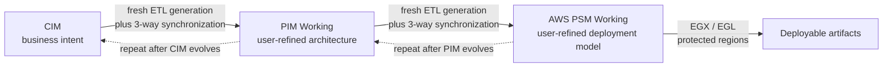
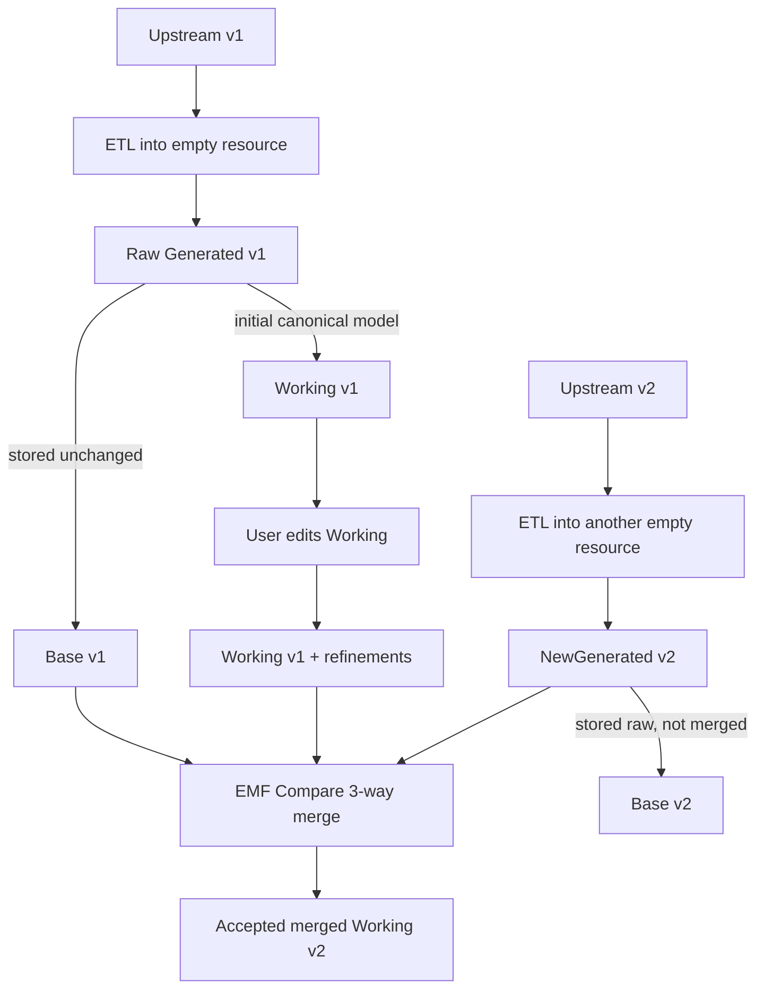
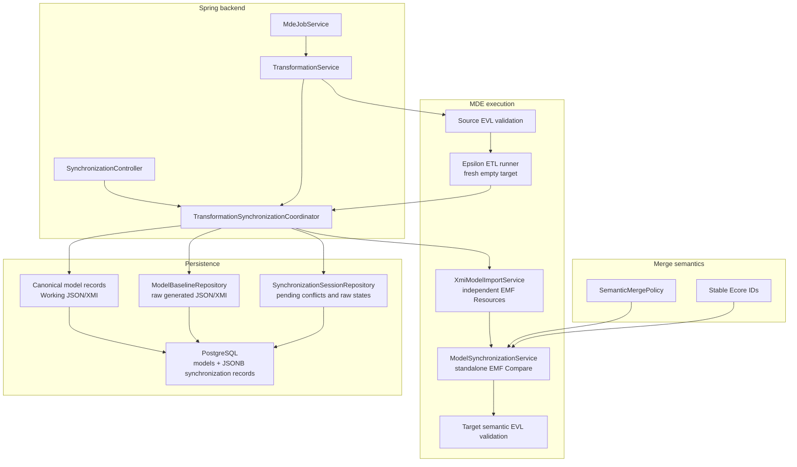
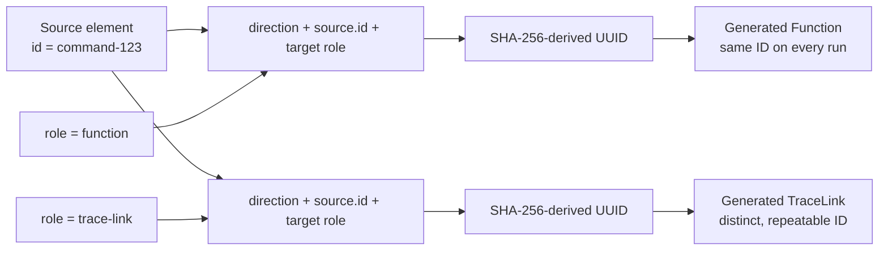
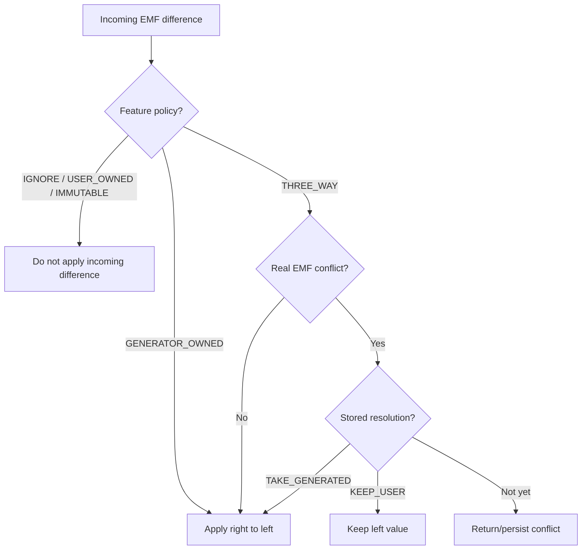
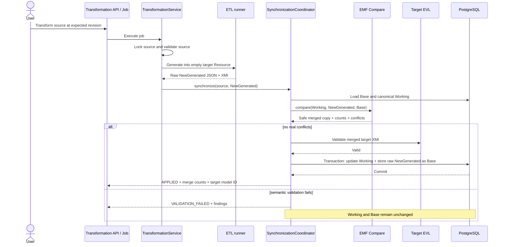
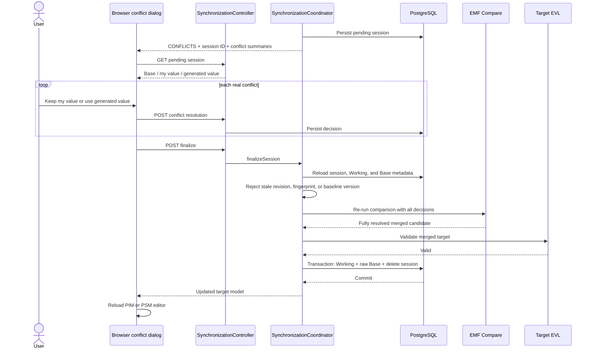
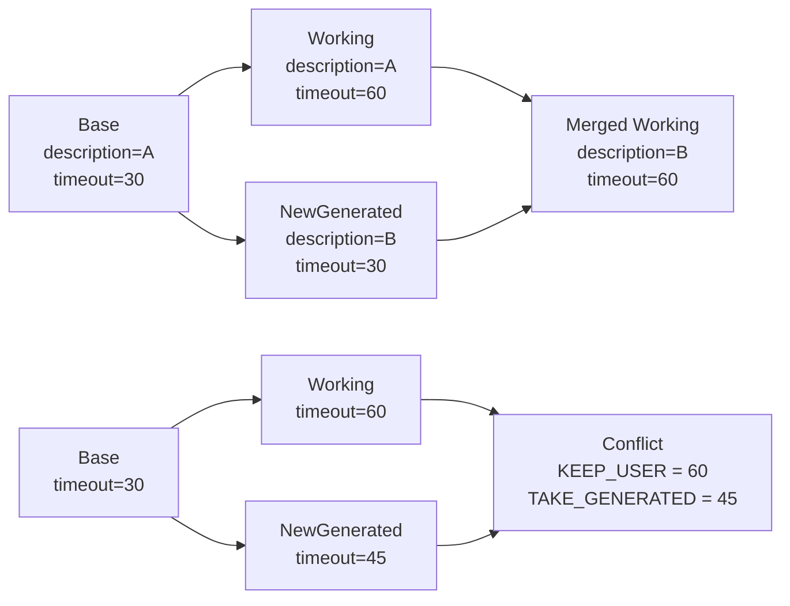
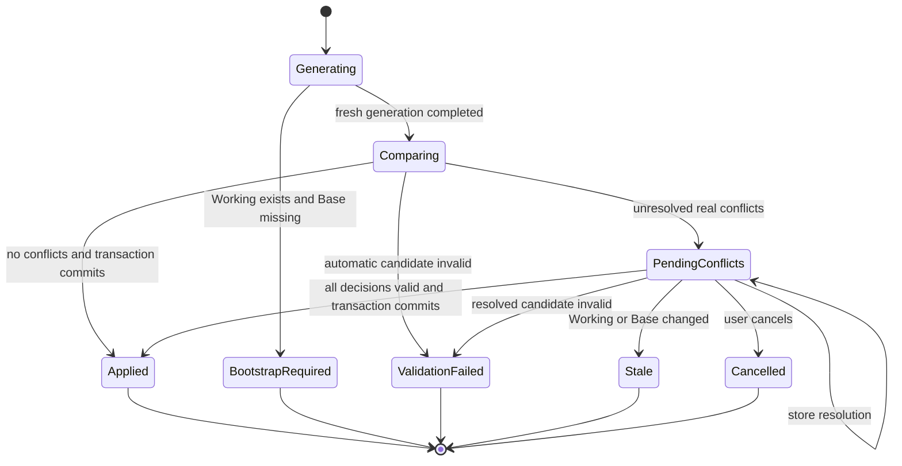
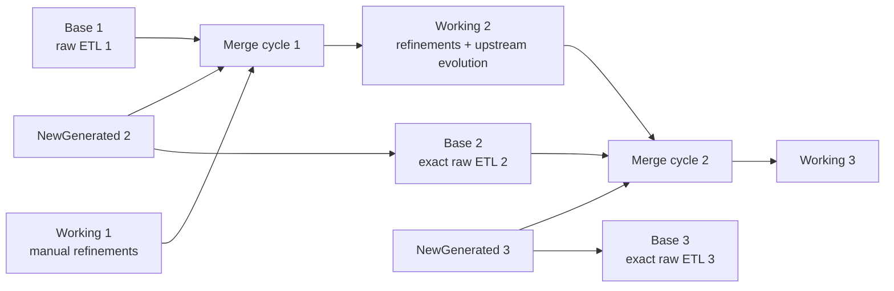

# Iterative and evolutionary model transformations

Varka's model-to-model pipeline is designed for repeated evolution, not one-time waterfall
generation. A generated PIM or AWS PSM is a persistent working model that users can refine. When its
upstream model changes, Varka generates a new candidate and performs an ancestor-based, three-way
EMF merge. Independent user edits survive, safe upstream changes propagate, and incompatible edits
become explicit conflicts.

This architecture applies to both model-to-model boundaries:



The AWS PSM-to-artifact boundary is intentionally different. It continues to use the existing EGL
protected-region mechanism; EMF Compare is used only for model-to-model synchronization.

## The three model states

Each transformation relationship has three distinct model states:

| State            | Meaning                                                             |
| ---------------- | ------------------------------------------------------------------- |
| **Base**         | Untouched raw output from the most recently accepted ETL execution  |
| **Working**      | Canonical downstream model, including all accepted user refinements |
| **NewGenerated** | Fresh raw ETL output generated from the current upstream model      |

The essential invariant is:

> The baseline is always the untouched raw output of the most recent successfully accepted ETL
> generation. It is never the user-refined merged Working model.

Keeping Base separate from Working is what lets Varka distinguish a user edit from a generator
change on the next execution.



## Runtime architecture

`TransformationService` remains the application entry point for CIM-to-PIM and PIM-to-AWS-PSM.
It validates the source and invokes ETL to generate a completely fresh target resource. It then
hands the raw JSON and XMI to `TransformationSynchronizationCoordinator`.

The coordinator loads Base, Working, and NewGenerated into independent EMF resources and delegates
semantic comparison and merging to `ModelSynchronizationService`. Baselines and pending sessions
are accessed through repositories backed by the existing `PlatformStore` port. Production storage
maps those records to PostgreSQL through `PostgresPlatformStore`.



The main implementation classes are:

| Responsibility                                       | Implementation                                                 |
| ---------------------------------------------------- | -------------------------------------------------------------- |
| Transformation orchestration and fresh generation    | `TransformationService`                                        |
| Three-way lifecycle, validation, locking, and commit | `TransformationSynchronizationCoordinator`                     |
| Standalone EMF comparison and merge                  | `ModelSynchronizationService`                                  |
| Extensible feature ownership rules                   | `SemanticMergePolicy`, `MergeFeaturePolicy`                    |
| Baseline persistence                                 | `GeneratedBaseline`, `ModelBaselineRepository`                 |
| Pending conflict persistence                         | `SynchronizationSession`, `SynchronizationSessionRepository`   |
| Public conflict contract                             | `ModelConflict`, `ConflictResolution`, `SynchronizationResult` |
| Stable generated identities                          | `ModelElementIdGenerator` and transformation EOL helpers       |
| Conflict REST operations                             | `SynchronizationController`                                    |
| Browser conflict workflow                            | `apps/frontend/js/model-ops.js`                                |

## Fresh, deterministic generation

ETL never transforms directly into the current Working model. Every execution uses an empty target
resource, which makes generation reproducible and prevents transformation rules from accidentally
preserving, changing, or deleting user content. Preservation belongs exclusively to the merge
layer.

Transformation-owned objects use deterministic identifiers derived from:

```text
transformation direction/namespace
+ stable source element ID
+ generated target role
+ stable semantic suffix or deterministic occurrence
```

`ModelElementIdGenerator.deterministicId` hashes the namespace and semantic key with SHA-256 and
encodes the first 128 bits as a UUID with name-based UUID version and variant bits. Repeated helper
objects use a deterministic occurrence suffix within one repeatable ETL traversal. Display names are
not identity when a stable source ID exists, so renaming a source element does not replace its
downstream identity.

User-created elements still receive a random UUID once at creation time. IDs are not ordinary
editable properties, and shared EVL constraints require every persisted model element to have an ID
and require IDs to be unique within the logical model.



## EMF Compare configuration and merge behavior

The backend packages the official EMF Compare core bundle as a reproducible Maven adapter with a
pinned version and SHA-256 checksum. No Eclipse IDE or UI runtime is required.

`ModelSynchronizationService` creates a standalone match-engine registry containing an
identifier-only `MatchEngineFactoryImpl(UseIdentifiers.ONLY)`. Comparison uses:

```text
DefaultComparisonScope(
    left   = Working,
    right  = NewGenerated,
    origin = Base
)
```

Only incoming/right differences that are safe or explicitly accepted are copied right-to-left with
EMF Compare's `BatchMerger`. The service works on EMF `Resource` object graphs and structural
features; it does not compare serialized XMI or JSON text.

| Working since Base   | NewGenerated since Base           | Result                            |
| -------------------- | --------------------------------- | --------------------------------- |
| unchanged            | changed                           | Apply generated change            |
| changed              | unchanged                         | Preserve user change              |
| same change          | same change                       | Accept without conflict           |
| changed differently  | changed differently               | Report a real conflict            |
| unchanged            | generated addition                | Add generated element             |
| user addition        | no corresponding generated change | Preserve user element             |
| unchanged            | generated deletion                | Delete obsolete generated element |
| user changed element | generator deletes element         | Delete/change conflict            |
| user deleted element | generator unchanged               | Preserve user deletion            |
| user deleted element | generator changes element         | Delete/change conflict            |

Because differences are EMF differences, the same mechanism covers scalar and multi-valued
attributes, containment, non-containment references, collection membership, moves, nested helper
objects, and persisted trace links.



The default semantic policy is deliberately small and extensible:

| Policy            | Current use                                                                                    |
| ----------------- | ---------------------------------------------------------------------------------------------- |
| `THREE_WAY`       | Ordinary domain attributes and references, including user-facing decisions                     |
| `GENERATOR_OWNED` | `generatedFrom`, `generatedByTransformation`, `traceId`, and trace endpoint IDs                |
| `IMMUTABLE`       | `id`                                                                                           |
| `IGNORE`          | Derived/transient/volatile features, opposite trace navigation, and internal XMI bridge fields |
| `USER_OWNED`      | Available for future explicit ownership rules; not applied as a blanket default                |

`manuallyMaintained = true` is only domain metadata indicating expected refinement. It does not
discard generator changes. Actual history across Base, Working, and NewGenerated determines whether
a user changed a feature.

## Automatic synchronization

When EMF Compare finds no unresolved real conflicts, the coordinator validates the merged target
using the target semantic EVL profile. A successful commit updates Working and advances Base to the
exact raw NewGenerated state in one PostgreSQL transaction.



For the first transformation, when neither Base nor Working exists, the validated NewGenerated
model becomes both initial Working and raw Base. If Working exists but Base does not, the operation
returns `BOOTSTRAP_REQUIRED`; it never guesses history or overwrites the legacy model.

When normalized Base and Working are byte-for-byte equal, the fresh generated resource is adopted
as the exact result without a filtered EMF copy. During finalization, if every decision is
`TAKE_GENERATED`, the complete raw incoming resource is adopted as the candidate. Both are
implementation optimizations with the same target validation and atomic commit guarantees.

## Conflict sessions and manual resolution

A real conflict is never resolved with “latest wins.” The coordinator applies safe incoming changes
only to an independent Working resource, then stores a durable pending session containing the three
raw states, the safe merged candidate, model revisions/fingerprints, conflict descriptions, and any
submitted decisions. Canonical Working and Base remain unchanged.

The public conflict DTO contains the affected element ID/class/name, feature, difference kind, Base
value, Working value, generated value, explanation, JSON pointer, and available resolutions. Public
REST responses intentionally omit the raw XMI/session payloads.



The conflict API is:

| Method   | Path                                                              | Purpose                                    |
| -------- | ----------------------------------------------------------------- | ------------------------------------------ |
| `GET`    | `/api/synchronizations/{projectId}/{sessionId}`                   | Read conflict summaries and decisions      |
| `POST`   | `/api/synchronizations/{projectId}/{sessionId}/resolutions`       | Store `KEEP_USER` or `TAKE_GENERATED`      |
| `POST`   | `/api/synchronizations/{projectId}/{sessionId}/resolutions/batch` | Store multiple decisions atomically        |
| `POST`   | `/api/synchronizations/{projectId}/{sessionId}/finalize`          | Recompare, validate, and atomically commit |
| `DELETE` | `/api/synchronizations/{projectId}/{sessionId}`                   | Cancel and remove the pending session      |

Transformation jobs report one of four synchronization outcomes:

| Status               | Meaning                                                                       |
| -------------------- | ----------------------------------------------------------------------------- |
| `APPLIED`            | Working and the raw baseline were committed successfully                      |
| `CONFLICTS`          | A pending session was stored; canonical Working and Base were not changed     |
| `BOOTSTRAP_REQUIRED` | A legacy Working model exists without trustworthy generated history           |
| `VALIDATION_FAILED`  | The merged candidate failed target semantic validation; Base was not advanced |

## Why manual edits are preserved

Suppose Base has `timeout = 30`. A user changes Working to `60`, while a later ETL execution still
generates `30`. EMF Compare sees a left-only change, so `60` remains. If ETL independently changes
another feature such as `description`, that right-only difference is applied without touching the
timeout.

If both user and generator change timeout to different values, Varka can prove that neither side is
merely unchanged from Base. It therefore reports a conflict and waits for an explicit decision.



User-created downstream elements have no generated deletion relative to Base, so they remain.
Generated elements removed upstream are deleted only when Working did not independently modify
them. Persisted `TraceModel`, `TraceLink`, `generatedFrom`, `traceId`, and source/target IDs continue
through the same identity-based merge instead of being replaced by a second trace mechanism.

## Safety properties

The synchronization design protects canonical models through several independent controls:

1. **No in-place ETL:** generation happens in an empty temporary target.
2. **Independent EMF graphs:** Base, Working, and NewGenerated are loaded into separate resources.
3. **Stable identity:** matching uses immutable Ecore IDs rather than names or text similarity.
4. **Copy-before-commit:** merge operations modify the independently loaded Working resource, not
   the sole persisted canonical model.
5. **Explicit conflicts:** unresolved real conflicts leave canonical Base and Working untouched.
6. **Semantic validation:** automatic and manually resolved results pass the target EVL profile
   before persistence. These transformation workflows are separate from chatbot apply/repair paths,
   whose generated outputs remain gated only by structural Ecore/EMF conformance.
7. **Optimistic concurrency:** source and Working revisions/fingerprints, plus baseline versions,
   prevent stale sessions from committing.
8. **Locking:** the current backend uses its per-model in-process lock service and a per-source,
   per-direction synchronization lock to serialize competing operations in one backend process.
9. **Atomic PostgreSQL commit:** Working update, raw Base advancement, and session closure commit or
   roll back together.
10. **Transport isolation:** REST DTOs expose understandable values and decisions, not EMF Compare
    internals or raw pending XMI.



For a future multi-instance backend deployment, the in-process transformation lock should be
replaced or supplemented with a distributed lock or PostgreSQL advisory lock. Revision/fingerprint
checks and database transactions still prevent stale conflict finalization, but distributed locking
would avoid duplicate generation work across instances.

## Iterative and evolutionary behavior

After each accepted cycle, the raw NewGenerated state becomes the next Base while the merged model
becomes the next Working state. User knowledge therefore remains in Working, generator history
remains clean in Base, and upstream evolution can be compared repeatedly without absorbing manual
edits into generator history.



An unchanged repeated ETL execution produces the same generated IDs and equivalent raw model.
Comparison therefore yields no meaningful incoming changes, no conflicts, and no duplicate helper
objects. This idempotence makes transformation safe to run as part of an ongoing review-and-refine
cycle rather than only once at project inception.

## Verification coverage

Automated tests cover deterministic generation in both directions, rename stability, initial
creation, independent edits, same-feature conflicts and both resolutions, generated additions and
deletions, delete/change conflicts, user additions and deletions, references, containment,
multi-valued features, traceability, idempotence, raw-baseline correctness, legacy bootstrap, and
stale pending sessions. PostgreSQL integration tests also verify direction-safe baseline keys and
transaction rollback.

The focused implementation tests are located in:

- `ModelElementIdGeneratorTest`
- `DeterministicGeneratedIdentityIntegrationTest`
- `ModelSynchronizationServiceTest`
- `TransformationServiceTest`
- `PostgresPlatformStoreIntegrationTest`
