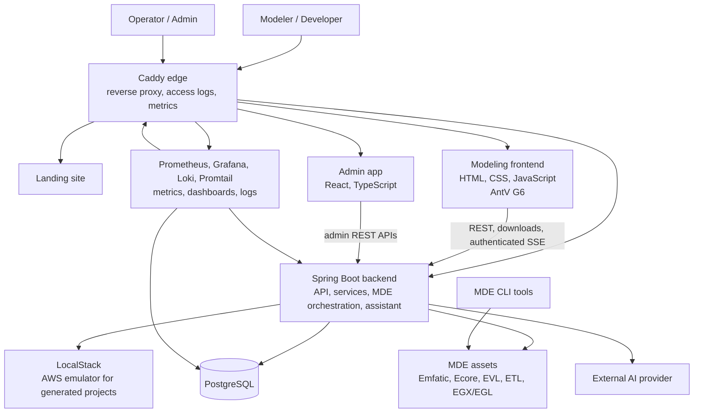

# System Architecture

## Architectural Style

The backend is a modular monolith. Spring MVC controllers expose public transports, application
services own use cases, `PlatformStore` defines the persistence boundary, and the PostgreSQL module
implements that boundary. Modeling and MDE runners remain reusable Java modules.

The frontend is a static browser application made of ES modules. It consumes backend-derived
modeling configuration rather than maintaining a second independent metamodel.

## Runtime Boundaries

- Static browser assets can be hosted independently from the backend.
- The backend requires PostgreSQL and filesystem access to the `mde/` assets.
- The admin app is a separate browser app for operational control-plane workflows.
- Prometheus, Grafana, Loki, Promtail, Caddy logs, and Dozzle provide the local DevOps/SRE surface.
- AI provider calls are optional and isolated from normal platform traffic.
- LocalStack is used to test generated AWS projects, not to run Varka itself.
