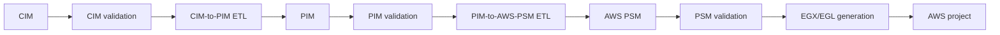

# Validation, Transformation, and Generation

The MODRISS pipeline carries a model from business intent to a generated AWS project. Each target is a model that can be inspected and refined before the next step.

## End-to-end pipeline

## Validation

Structural validation checks that the model loads and conforms to its Ecore metamodel. It checks required features, multiplicities, and reference integrity.

EVL semantic validation checks rules about the model's domain and readiness. EVL `constraint` results report mandatory violations; `critique` results suggest optional improvements. The report can include the affected element, source location, diagnostic, message, and repair guidance.

Semantic validation is an explicit user/model workflow. The assistant's apply, repair, and commit paths validate generated model output only through structural Ecore/EMF conformance with `ModelService.validateStructural(...)`. They do not invoke EVL.

The [EVL reference](../evl/index.md) explains the rules. The [transformation reference](../transformations/index.md) describes source and target mappings, guards, traceability, manual decisions, and post-processing. The [generation reference](../generation/index.md) documents output paths and generation behavior.

## CIM to PIM

The CIM-to-PIM ETL profile derives PIM scaffolding from a CIM model. It covers service boundaries, security concepts, data structures, behavior, contracts, processes, policies, integrations, deployment concepts, traces, and readiness. Concern-specific ETL modules use shared EOL helpers.

## PIM to AWS PSM

The PIM-to-AWS-PSM ETL profile derives AWS roots, stages, stacks, compute, APIs, storage, messaging, events, workflows, IAM, configuration, observability, and provider mappings. Post-processing resolves relationships and checks placement and readiness.

Both model-to-model stages support repeated upstream evolution through deterministic fresh generation and three-way EMF synchronization. The [iterative transformation guide](../architecture/iterative-model-transformations.md) explains the Base, Working, and NewGenerated lifecycle, merge rules, conflicts, and safety checks.

## AWS PSM to artifacts

The generator creates a reviewable AWS serverless project. Depending on the model, the output can include:

- SAM or CloudFormation infrastructure
- Go Lambda handlers and shared runtime packages
- OpenAPI, JSON Schema, ASL, and sample events
- Unit, integration, contract, workflow, event, end-to-end, and security tests
- Build, validation, packaging, deployment, and local-run scripts
- GitHub Actions workflows
- Architecture, security, operations, deployment, and traceability documentation
- Generation, trace, protected-region, manual-action, and security-review reports

Review generated files before deployment. Protected regions and manual-action reports identify application logic, credentials, ownership, and production decisions that still need attention.
