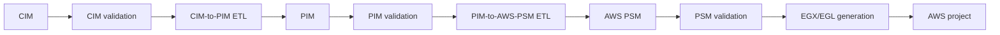

# Validation, Transformation, and Generation

## End-to-End Pipeline

## Validation

Validation has two layers:

1. Structural validation checks Ecore conformance, model loading, required features, multiplicity,
   and reference integrity.
2. EVL semantic validation checks domain-specific constraints and critiques.

EVL `constraint` results are treated as mandatory violations. EVL `critique` results are optional
improvements. Reports contain phases, diagnostics, source locations, element references, messages,
and fix suggestions where available.

## CIM to PIM

The CIM-to-PIM ETL profile creates PIM scaffolding, boundaries, security concepts, data structures,
behaviors, contracts, processes, policies, integrations, deployment concepts, traces, and readiness
information. The transformation is split into concern-specific ETL modules with shared EOL helpers.

## PIM to AWS PSM

The PIM-to-AWS-PSM ETL profile creates AWS roots, stages, stacks, compute, APIs, storage, messaging,
events, workflows, IAM, configuration, observability, and provider mappings. Post-processing resolves
relationships and validates placement and readiness.

Both model-to-model stages support repeated upstream evolution through deterministic fresh
generation and three-way EMF synchronization. See
[Iterative and evolutionary model transformations](../architecture/iterative-model-transformations.md)
for the Base/Working/NewGenerated lifecycle, merge rules, conflict handling, and safety guarantees.

## PSM to Artifacts

The generator emits a reviewable AWS serverless project containing, as applicable:

- SAM or CloudFormation infrastructure
- Go Lambda handlers and shared runtime packages
- OpenAPI, JSON Schema, ASL, and sample events
- Unit, integration, contract, workflow, event, end-to-end, and security tests
- Build, validation, packaging, deployment, and local-run scripts
- GitHub Actions workflows
- Architecture, security, operations, deployment, and traceability documentation
- Generation, trace, protected-region, manual-action, and security-review reports

Generation is deliberately not the final human decision. Generated projects expose protected
regions and manual actions for application-specific logic, credentials, ownership, and production
review.
