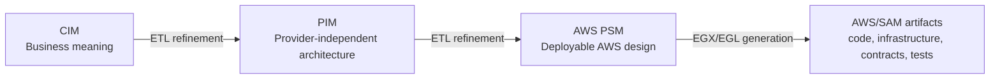

# MODRISS DSML reference

MODRISS is a model-driven framework for serverless software development. The landing site presents it as two connected research artefacts: an explicit development process and a modeling framework. This section documents the modeling framework itself. Its purpose is to preserve the meaning of the models at the point where a researcher, modeler, or reviewer needs to make a decision.

The three DSMLs are deliberately different. CIM speaks about the problem domain and the organization that owns it. PIM expresses a serverless architecture without naming a cloud provider. AWS PSM describes the concrete AWS resources, policies, documents, and integration wiring that can be turned into deployment and application artifacts. The levels are connected through ETL transformations, then EGX and EGL coordinate model-to-text generation from the AWS PSM.

The pages below are a semantic reference, rather than a list of class names. Every declared class, attribute, containment, and reference is retained. The prose explains the decision represented by that feature and the connections through which the feature participates in the larger model.

## The three modeling levels

| Level   | Main question                                                           | What belongs here                                                                                                                                       | Reference                |
| ------- | ----------------------------------------------------------------------- | ------------------------------------------------------------------------------------------------------------------------------------------------------- | ------------------------ |
| CIM     | What problem are we solving and what does it mean to the business?      | Requirements, stakeholders, capabilities, domain language, commands, queries, events, processes, policies, decisions, privacy, security, and compliance | [CIM DSML](cim/index.md) |
| PIM     | What provider-independent serverless architecture realizes that intent? | Services, functions, APIs, contracts, data stores, channels, workflows, policies, identity, configuration, and external adapters                        | [PIM DSML](pim/index.md) |
| AWS PSM | How is that architecture deployed and operated on AWS?                  | SAM stacks, CloudFormation properties, Lambda, API Gateway, EventBridge, SQS/SNS, DynamoDB, S3, Cognito, IAM, KMS, Step Functions, and CloudWatch       | [AWS PSM](psm/index.md)  |

## The distinction between syntax, meaning, and output

The `.emf` files define abstract syntax. A class declaration determines which concepts can exist; an attribute gives a concept a value; `val` creates an owned model object; and `ref` connects independently modeled objects. Multiplicities are part of this contract. The combined `.ecore` files are the compiled form used by EMF and the workbench.

The abstract syntax intentionally carries more than the minimum needed to draw a diagram. Rationale, source references, trace links, readiness records, policy decisions, and manual decisions preserve why a model has its current form. They are important when a transformation cannot infer an answer safely or when a generated project needs human completion.

EVL supplies semantic validation. It checks relationships between features and asks whether a model expresses enough information for the current workflow. A structurally valid model can still fail EVL because a business rule, security decision, contract, or readiness condition is missing. ETL reads the source model and creates a refined model, often carrying traceability and creating explicit assumptions or hotspots where a decision remains open. Generation acts on the refined AWS PSM and produces reviewable artifacts such as infrastructure, handlers, contracts, tests, scripts, and documentation.

## Start here

- [CIM reference](cim/index.md): begin with business and domain vocabulary.
- [PIM reference](pim/index.md): refine behavior into generic serverless architecture.
- [AWS PSM reference](psm/index.md): bind the architecture to AWS resources and deployment details.
- [Shared kernel reference](shared-kernel.md): find inherited identity, lifecycle, traceability, expression, and readiness attributes.
- [Capability-increment process](../guides/end-to-end-modeling-methodology.md): see how the process coordinates work across all three modeling levels.
- [Validation, transformation, and generation](../concepts/pipeline.md): understand where EVL, ETL, EGX, and EGL act on the models.
- [EVL semantic validation reference](../evl/index.md): understand every semantic constraint and critique, its applicability, its diagnostic, and the repair path.
- [Model-to-model transformation reference](../transformations/index.md): follow every CIM→PIM and PIM→AWS PSM rule, guard, target, trace, and deferred-resolution phase.
- [Model-to-text and code-generation reference](../generation/index.md): understand how the AWS PSM becomes infrastructure, contracts, runtime code, tests, scripts, CI/CD, and review artifacts.

## How to read an element page

Each class section begins with its role in the DSML and names its direct supertypes. **Declared attributes** lists every attribute written directly on that class. The type and multiplicity come from the Emfatic declaration; enum-typed attributes list their complete controlled vocabulary, while primitive and string attributes include a valid shape and representative example. The explanation also records relevant EVL, ETL, and generator use where that evidence exists.

**Relationships** lists every `val` containment and `ref` reference, including multiplicity, opposite role where declared, and whether the relationship is derived or read-only. A containment answers “which object owns this part of the model?” A reference answers “which separately modeled concept does this object depend on or describe?” That difference matters during transformation, synchronization, and deletion.

Inherited attributes are not copied into every class table because that would obscure the class-specific vocabulary and make the reference difficult to maintain. A class section names all direct supertypes and links to the shared-kernel page; the inherited fields remain part of that class's effective Ecore API.

## Source-of-truth boundaries

The reference follows the `.emf` files under `mde/metamodels/`. The combined `.ecore` files are the compiled abstract syntax. EVL files add semantic constraints and readiness rules, ETL files refine one model level into the next, and EGX/EGL files generate implementation artifacts. A value being syntactically accepted by the metamodel does not by itself mean it will pass EVL or produce a deployable artifact.

For chatbot assistant apply, repair, and commit paths, generated model output is gated by structural Ecore/EMF conformance through `ModelService.validateStructural(...)`. EVL semantic validation remains part of explicit user/model validation workflows outside that assistant apply boundary.

## Coverage

The reference covers the current repository definitions: 56 CIM classes, 110 PIM classes, 214 AWS PSM classes, and the shared kernel used by all three levels. It includes the declared attributes and relationships in every module. When a metamodel changes, update the affected semantic prose together with the `.emf` declaration, the combined Ecore model, EVL rules, transformations, notation, samples, and generation behavior.

## Additional resources

- [Eclipse Modeling Framework](https://eclipse.dev/modeling/emf/): Ecore's metamodeling foundation.
- [Emfatic language](https://eclipse.dev/emfatic/): textual notation used by the source metamodels.
- [Eclipse Epsilon EVL](https://eclipse.dev/epsilon/doc/evl/): validation language used for semantic constraints.
- [Eclipse Epsilon ETL](https://eclipse.dev/epsilon/doc/etl/): model-to-model transformation language used between levels.
- [Eclipse Epsilon EGL and EGX](https://eclipse.dev/epsilon/doc/egl/): model-to-text generation and generation orchestration.
- [AWS Well-Architected Serverless Applications Lens](https://docs.aws.amazon.com/wellarchitected/latest/serverless-applications-lens/welcome.html): operational context for AWS PSM.
