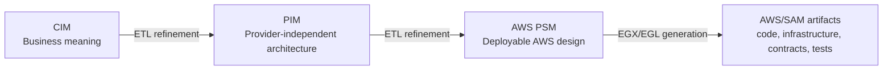

# Varka DSML reference

This is the complete modeler-facing reference for Varka's three serverless domain-specific modeling languages. It explains the abstract syntax declared in Emfatic, the role of every declared attribute, accepted value shapes and examples, containment/reference relationships, and the way each level participates in refinement and generation.

The reference is intentionally split into module pages. Use the page for the concern you are modeling, then follow the links in its relationship tables to understand how the element connects to the rest of the model.

## The three modeling levels

| Level   | Main question                                                           | What belongs here                                                                                                                                       | Reference                |
| ------- | ----------------------------------------------------------------------- | ------------------------------------------------------------------------------------------------------------------------------------------------------- | ------------------------ |
| CIM     | What problem are we solving and what does it mean to the business?      | Requirements, stakeholders, capabilities, domain language, commands, queries, events, processes, policies, decisions, privacy, security, and compliance | [CIM DSML](cim/index.md) |
| PIM     | What provider-independent serverless architecture realizes that intent? | Services, functions, APIs, contracts, data stores, channels, workflows, policies, identity, configuration, and external adapters                        | [PIM DSML](pim/index.md) |
| AWS PSM | How is that architecture deployed and operated on AWS?                  | SAM stacks, CloudFormation properties, Lambda, API Gateway, EventBridge, SQS/SNS, DynamoDB, S3, Cognito, IAM, KMS, Step Functions, and CloudWatch       | [AWS PSM](psm/index.md)  |

## Start here

- [CIM reference](cim/index.md): begin with business and domain vocabulary.
- [PIM reference](pim/index.md): refine behavior into generic serverless architecture.
- [AWS PSM reference](psm/index.md): bind the architecture to AWS resources and deployment details.
- [Shared kernel reference](shared-kernel.md): find inherited identity, lifecycle, traceability, expression, and readiness attributes.
- [End-to-end modeling methodology](../guides/end-to-end-modeling-methodology.md): follow the workflow across all three levels.
- [Validation, transformation, and generation](../concepts/pipeline.md): understand where EVL, ETL, EGX, and EGL act on the models.
- [EVL semantic validation reference](../evl/index.md): understand every semantic constraint and critique, its applicability, its diagnostic, and the repair path.
- [Model-to-model transformation reference](../transformations/index.md): follow every CIM→PIM and PIM→AWS PSM rule, guard, target, trace, and deferred-resolution phase.
- [Model-to-text and code-generation reference](../generation/index.md): understand how the AWS PSM becomes infrastructure, contracts, runtime code, tests, scripts, CI/CD, and review artifacts.

## How to read an element page

Each class section contains two tables. **Declared attributes** lists every attribute written directly on that class. The type and multiplicity come from the Emfatic declaration; enum-typed attributes list their complete controlled vocabulary, while primitive and string attributes include a valid shape and representative example. **Relationships** lists every `val` containment and `ref` reference, including multiplicity, opposite role where declared, and whether the relationship is derived or read-only.

Inherited attributes are not copied into every class table because that would obscure the class-specific vocabulary and make the reference difficult to maintain. A class section names all direct supertypes and links to the shared-kernel page; the inherited fields remain part of that class's effective Ecore API.

## Source-of-truth boundaries

The reference is derived from the `.emf` files under `mde/metamodels/`. The combined `.ecore` files are the compiled abstract syntax. EVL files add semantic constraints and readiness rules, ETL files refine one model level into the next, and EGX/EGL files generate implementation artifacts. A value being syntactically accepted by the metamodel does not by itself mean it will pass EVL or produce a deployable artifact.

For chatbot assistant apply, repair, and commit paths, generated model output is gated by structural Ecore/EMF conformance through `ModelService.validateStructural(...)`. EVL semantic validation remains part of explicit user/model validation workflows outside that assistant apply boundary.

## Coverage

The reference covers the current repository definitions: 56 CIM classes, 110 PIM classes, 214 AWS PSM classes, 76 shared-kernel attributes, and the declared attributes and relationships in every module. Regenerate the pages after a metamodel change with `scripts/generate-dsml-reference.py`; review the resulting patch together with the `.emf` change.

## Additional resources

- [Eclipse Modeling Framework](https://eclipse.dev/modeling/emf/): Ecore's metamodeling foundation.
- [Emfatic language](https://eclipse.dev/emfatic/): textual notation used by the source metamodels.
- [Eclipse Epsilon EVL](https://eclipse.dev/epsilon/doc/evl/): validation language used for semantic constraints.
- [Eclipse Epsilon ETL](https://eclipse.dev/epsilon/doc/etl/): model-to-model transformation language used between levels.
- [Eclipse Epsilon EGL and EGX](https://eclipse.dev/epsilon/doc/egl/): model-to-text generation and generation orchestration.
- [AWS Well-Architected Serverless Applications Lens](https://docs.aws.amazon.com/wellarchitected/latest/serverless-applications-lens/welcome.html): operational context for AWS PSM.
