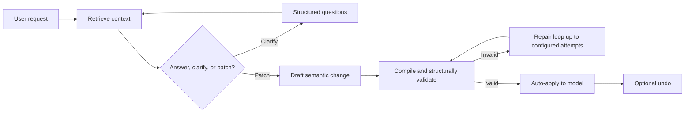

# AI Assistant

The Modless assistant is a bounded modeling agent. It can explain formal concepts, retrieve metamodel
and methodology context, ask structured clarification questions, and apply validated model changes.
It does not receive whole models or raw constraint files.

## Operating Model

Each turn runs through one autonomous agent loop:

1. Load the active project, model ID, revision, view, selection, and optional draft patch.
2. Retrieve compact metamodel and methodology snippets plus a cached model-context snapshot.
3. Plan an answer, clarification, or model mutation using the configured modeling strategy.
4. Compile semantic operations into JSON Pointer patches against the current Ecore metamodel.
5. Run structural validation (Ecore constraints). EVL semantic validation is **not** part of the
   assistant apply gate today.
6. **Auto-apply** valid mutations immediately, persist audits, and return an applied proposal with
   undo support.

Invalid mutations never reach the canvas. Failed turns return `workflowState: FAILED` with grounded
feedback and no persisted proposal.

There is **no REST approve or reject step**. The UI shows applied changes and offers **Undo** when
an inverse patch is available.

## Modeling Strategies

Configure with `MODLESS_AI_MODELING_STRATEGY` (default `model-subset`).

| Strategy         | How the LLM drafts changes                                                                                                                                         |
| ---------------- | ------------------------------------------------------------------------------------------------------------------------------------------------------------------ |
| `model-subset`   | JSON Schema guided partial model subsets compiled deterministically into semantic operations                                                                       |
| `semantic-patch` | Direct semantic operations (`ADD_ELEMENT`, `CONNECT_ELEMENTS`, `SET_ATTRIBUTE`, `DELETE_ELEMENT`) via a two-phase planner (optional tool exploration, then commit) |

Both strategies share the same backend compiler, structural validation, repair loop, and auto-apply
path.

## Context Boundary

The assistant works from:

- Project, modeling level, selected model ID, and revision
- Active view, selected element IDs, and optional compact draft patch
- A compact indexed model context (`assistant_model_contexts`)
- Retrieved metamodel and methodology catalog entries (`.emf`, `.ecore`, guides — not raw EVL files)
- Recent conversation memory and durable summaries

Metamodel catalogs are indexed from `mde/**/*.emf` and `mde/**/*.ecore` plus methodology guides.
Changed sources are detected by content hash and reindexed at startup or through
`POST /api/chatbot/catalogs/reindex`.

## Proposal Lifecycle



Applied proposals include risk level, validation summary, citations, affected elements, and an
inverse patch when undo is available. Clarification turns use `workflowState: WAITING_FOR_CHOICE` and
`POST /api/chatbot/sessions/{sessionId}/choices`.

## Attachments and CIM Source Analysis

Upload text attachments with `POST /api/chatbot/sessions/{sessionId}/attachments` (`.md`, `.txt`,
`.json`). Reference them from messages with `attachmentIds`. When no attachments are supplied, the
backend may reuse the three most recent session uploads.

On CIM with attachments, the agent can run a dedicated source-analysis pass and, for create-style
requests, a deterministic local materializer that bypasses the LLM planner when structured evidence
is sufficient.

## Providers and Resilience

Chat providers:

- OpenAI-compatible endpoints through Spring AI
- Gemini through Spring AI

Resilience controls:

- Per-user rate limit (default 30 requests per minute, in-memory)
- Per-provider circuit breaker after consecutive failures
- Provider retries with configurable backoff
- Optional **fallback provider on HTTP 429 only** (`MODLESS_AI_FALLBACK_PROVIDER`)

Retrieval embeddings default to local hash vectors (`MODLESS_AI_EMBEDDINGS_PROVIDER=HASH`). Enable
ONNX with the `onnx-embeddings` Maven profile when higher-quality semantic retrieval is required.

## Enable Safely

```bash
MODLESS_AI_ENABLED=true
MODLESS_AI_PROVIDER=openai
OPENAI_COMPATIBLE_API_KEY=your_api_key
```

Do not commit provider credentials. Use environment variables or an untracked local `.env`.

## Realtime Behavior

Message submission uses REST. Progress and results are published through SSE or the receive-only
assistant WebSocket:

| Event type                | Purpose                                      |
| ------------------------- | -------------------------------------------- |
| `assistant.ready`         | Stream connected                             |
| `assistant.progress`      | Turn stage updates                           |
| `assistant.model.preview` | Incremental validated preview during compile |
| `chat.assistant`          | Completed turn payload                       |
| `model.updated`           | Model revision changed after apply or undo   |

See [Realtime Assistant API](../reference/realtime-api.md) and
[internal assistant setup](../../../internal/ai/assistant.md) for operator details.
