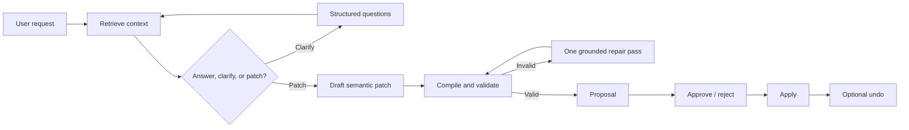

# AI Assistant

The Modless assistant is a bounded modeling assistant. It can explain formal concepts, retrieve
metamodel and constraint context, ask bounded questions, and draft validated semantic model-change
proposals.

## Operating Model

The assistant runs as one autonomous modeling agent. The LLM plans each turn with retrieved
metamodel, model, and constraint context; valid model changes are compiled against stable element
IDs and the current Ecore metamodel, checked by structural validation and mandatory EVL
constraints, applied immediately, audited, and exposed with undo.

## Context Boundary

The assistant does not receive an unrestricted dump of the entire model or raw EVL files. It works
from:

- Project, modeling level, selected model ID, and revision
- Active view, selected element IDs, and optional compact draft patch
- A compact indexed model context
- Retrieved metamodel and EVL catalog entries
- Recent conversation memory and durable summaries

Metamodel and constraint catalogs are indexed from `.emf`, `.ecore`, and `.evl` files at backend
startup. Changed sources are detected by hash and reindexed.

## Proposal Lifecycle



Invalid changes never become proposals. Proposals include risk, validation summary, citations,
status, and an inverse patch when undo is available. Proposal, clarification, and action records are
persisted for auditability and restart-safe continuation.

## Providers and Embeddings

Chat providers:

- OpenAI-compatible endpoints through Spring AI
- Gemini through Spring AI

The configured provider is tried first. Transient failures and rate limits fall back to the other
configured provider, with an independent circuit breaker for each provider.

Retrieval embeddings default to local ONNX with a hash-vector fallback. The hash fallback keeps
development environments functional without native ONNX dependencies, but provides lower-quality
semantic retrieval.

## Enable Safely

```bash
MODLESS_AI_ENABLED=true
MODLESS_AI_PROVIDER=openai
OPENAI_COMPATIBLE_API_KEY=your_api_key
```

Do not commit provider credentials. Use environment variables or an untracked local `.env`.

## Realtime Behavior

Message submission uses REST. Progress and proposal events can be received through SSE or the
receive-only assistant WebSocket. See [Realtime Assistant API](../reference/realtime-api.md).
