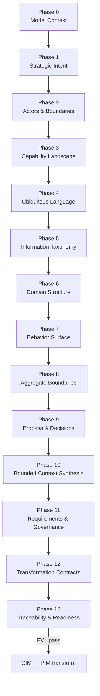

# CIM Modeling Methodology

The Computation-Independent Model (CIM) captures business intent, domain structure, behavior, and
governance without platform or implementation detail. This guide is the canonical walkthrough for
Modless CIM modeling: **14 phases (0–13)**, ordered by metamodel dependencies and EVL gates—not by
illustrative samples.

Use the **Guided Modeling** panel (when enabled) or this document to track phase progress. Each phase
maps to a modeling viewpoint and palette focus in the editor.

## Roles

| Role                      | Responsibility in CIM                                                           |
| ------------------------- | ------------------------------------------------------------------------------- |
| **Business Modeler**      | Phases 0–10 and 12: intent, domain, behavior, process, transformation contracts |
| **Requirements Engineer** | Phase 11: requirements, acceptance criteria, governance constraints             |
| **Process Reviewer**      | Phase 13: EVL gate approval and production readiness sign-off                   |

## Phase Flow

## Phase Overview

| Phase | Name                      | Primary role          | Duration | Inputs               | Outputs                                 |
| ----- | ------------------------- | --------------------- | -------- | -------------------- | --------------------------------------- |
| 0     | Model Context             | Business Modeler      | 30–45m   | New project          | `CIMModel` root with domain metadata    |
| 1     | Strategic Intent          | Business Modeler      | 1–2h     | Model context        | Goals, KPIs, stakeholders (GQM anchor)  |
| 2     | Actors & Boundaries       | Business Modeler      | 1h       | Strategic intent     | Actors, roles, external systems         |
| 3     | Capability Landscape      | Business Modeler      | 1–2h     | Actors defined       | Capability map linked to goals          |
| 4     | Ubiquitous Language       | Business Modeler      | 1h       | Capability draft     | Domain glossary                         |
| 5     | Information Taxonomy      | Business Modeler      | 1–2h     | Glossary started     | `InformationItem`, `DataClassification` |
| 6     | Domain Structure          | Business Modeler      | 2–4h     | Information taxonomy | Entities, value objects, relationships  |
| 7     | Behavior Surface          | Business Modeler      | 2–4h     | Domain structure     | Commands, queries, events, conditions   |
| 8     | Aggregate Boundaries      | Business Modeler      | 1–2h     | Behavior modeled     | Aggregate candidates with consistency   |
| 9     | Process & Decisions       | Business Modeler      | 2–3h     | Aggregates defined   | Processes, policies, decision tables    |
| 10    | Bounded Context Synthesis | Business Modeler      | 1–2h     | Process complete     | Bounded context assignments             |
| 11    | Requirements & Governance | Requirements Engineer | 2–3h     | Contexts synthesized | Requirements, NFRs, constraints         |
| 12    | Transformation Contracts  | Business Modeler      | 1h       | Governance captured  | Risks, assumptions, transform profile   |
| 13    | Traceability & Readiness  | Process Reviewer      | 1–2h     | Transform contracts  | Trace model, readiness gate approval    |

---

## Phase 0 — Model Context

**Viewpoint:** dashboard · **Duration:** 30–45 minutes

Establish the CIM root and modeling conventions before any domain content.

### Tasks

#### Model Context

**Palette focus:** `CIMModel`

1. Create the `CIMModel` root with domain name and business scope.
2. Set modeling date, language, and organization metadata.
3. Review lifecycle status and annotation conventions.

#### Configure Model Context enumerations

Review enum literals used across the model: `Severity`, `ConstraintStrength`, `LifecycleStatus`,
`TraceConfidence`, `TraceLinkType`, `FindingType`, `StructuredFormat`, `ExpressionLanguage`,
`ExpressionPhase`.

### Common mistakes

| Mistake                                                      | EVL rule                           |
| ------------------------------------------------------------ | ---------------------------------- |
| Skipping root metadata (no `domainName`)                     | — (exit criteria: root must exist) |
| Inconsistent severity or lifecycle enums across later phases | —                                  |

### Phase gate checklist

- [ ] `CIMModel` root exists with `domainName` set
- [ ] Modeling metadata (date, language, organization) recorded
- [ ] Shared enumeration conventions agreed

---

## Phase 1 — Strategic Intent

**Viewpoint:** requirements · **Duration:** 1–2 hours

Anchor the model in measurable business intent using Goal–Question–Metric (GQM).

### Tasks

**Palette focus:** `BusinessGoal`, `KPI`, `Stakeholder`

1. Capture business goals with success criteria (GQM).
2. Define measurable KPIs linked to goals.
3. Identify stakeholders and their concerns.

### Common mistakes

| Mistake                                                | EVL rule       |
| ------------------------------------------------------ | -------------- |
| Goal without success criterion                         | `CIM-GOAL-001` |
| Critical goal missing owner or KPI                     | `CIM-GOAL-002` |
| KPI not measurable (missing operator, target, or unit) | `CIM-KPI-001`  |
| KPI missing definition, frequency, or data source      | `CIM-KPI-002`  |

### Phase gate checklist

- [ ] At least one `BusinessGoal` with linked `KPI`
- [ ] `CIM-GOAL-001` and `CIM-KPI-001` pass for all goals and KPIs
- [ ] Stakeholders identified for primary concerns

---

## Phase 2 — Actors & Boundaries

**Viewpoint:** actor · **Duration:** ~1 hour

Define who and what interacts at domain boundaries before authoring behavior.

### Tasks

**Palette focus:** `Actor`, `Role`, `ExternalSystem`

1. Model human and system actors with trust levels.
2. Define roles and authorization scope.
3. Register external systems at domain boundaries.

### Common mistakes

| Mistake                                                          | EVL rule        |
| ---------------------------------------------------------------- | --------------- |
| Actor missing `actorType` or `trustLevel`                        | `CIM-ACTOR-001` |
| External/untrusted actor without auth expectations               | `CIM-ACTOR-003` |
| Privileged role without responsibility summary                   | `CIM-ROLE-001`  |
| External system not typed as external                            | `CIM-EXT-000`   |
| External system missing ownership or trust rationale             | `CIM-EXT-001`   |
| External system exchanging data but no linked information/events | `CIM-EXT-002`   |

### Phase gate checklist

- [ ] Actors defined for primary user journeys
- [ ] Roles scoped to authorization boundaries
- [ ] External systems documented with trust and data exchange

---

## Phase 3 — Capability Landscape

**Viewpoint:** capability · **Duration:** 1–2 hours

Map what the organization must be able to do, linked to goals, before structural domain modeling.

### Tasks

**Palette focus:** `BusinessCapability`, `CapabilityDependency`

1. Map business capabilities to goals.
2. Record capability dependencies and criticality.
3. Prepare ownership boundaries before domain modeling.

### Common mistakes

| Mistake                                    | EVL rule      |
| ------------------------------------------ | ------------- |
| Capability supports no business goal       | `CIM-CAP-001` |
| Capability lacks owner or responsibility   | `CIM-CAP-002` |
| Self-referential or unexplained dependency | `CIM-CAP-005` |

### Phase gate checklist

- [ ] Capability map covers core value streams
- [ ] Each capability links to at least one goal
- [ ] Dependencies and criticality recorded

---

## Phase 4 — Ubiquitous Language

**Viewpoint:** capability · **Duration:** ~1 hour

Resolve vocabulary before entities and processes (DDD strategic design).

### Tasks

**Palette focus:** `UbiquitousLanguageTerm`

1. Define domain terms with definitions and examples.
2. Link terms to capabilities where helpful.
3. Resolve naming conflicts before structural modeling.

### Common mistakes

| Mistake                                                | EVL rule     |
| ------------------------------------------------------ | ------------ |
| Term without definition                                | `CIM-UL-001` |
| Premature bounded-context creation (defer to Phase 10) | —            |

### Phase gate checklist

- [ ] Glossary covers core domain nouns
- [ ] Naming conflicts resolved
- [ ] Terms linked to capabilities where useful

---

## Phase 5 — Information Taxonomy

**Viewpoint:** domain · **Duration:** 1–2 hours

**Mandatory before domain entities.** `DomainEntity.primaryIdentityAttribute` must reference an
`InformationItem`.

### Tasks

#### Information Taxonomy

**Palette focus:** `InformationItem`, `DataClassification`

1. Define data classifications and confidentiality levels.
2. Create `InformationItem` elements **before** entities (`CIM-ENTITY-001`).
3. Set identifiability and data kind for each item.

#### Configure Information Taxonomy enumerations

Review: `PrimitiveBusinessType`, `IdentityStrategy`, `DataKind`, `Identifiability`.

### Common mistakes

| Mistake                                             | EVL rule                         |
| --------------------------------------------------- | -------------------------------- |
| Creating entities before information items          | `CIM-ENTITY-001`                 |
| Information item without type                       | `CIM-INFO-001`                   |
| Sensitive/regulated data without privacy constraint | `CIM-INFO-004`                   |
| Cyclic or invalid sub-item structure                | `CIM-INFO-000A`, `CIM-INFO-000B` |

### Phase gate checklist

- [ ] At least one `DataClassification` exists
- [ ] Information items exist for all planned entities
- [ ] `CIM-ENTITY-001` preconditions satisfied

---

## Phase 6 — Domain Structure

**Viewpoint:** domain · **Duration:** 2–4 hours

Model structural domain concepts that reference the information taxonomy.

### Tasks

**Palette focus:** `DomainEntity`, `ValueObject`, `DomainRelationship`, `LifecycleStateDefinition`, `BusinessInvariant`

1. Model entities with primary identity from `InformationItem`.
2. Add value objects and domain relationships.
3. Define lifecycle states and business invariants.

### Common mistakes

| Mistake                                                      | EVL rule         |
| ------------------------------------------------------------ | ---------------- |
| Entity without `primaryIdentityAttribute`                    | `CIM-ENTITY-001` |
| Identity attributes inconsistent with primary                | `CIM-ENTITY-002` |
| Lifecycle without exactly one initial and one terminal state | `CIM-ENTITY-004` |
| Value object without equality attributes                     | `CIM-VO-002`     |
| Relationship connects concept to itself                      | `CIM-REL-001`    |
| Ownership flag mismatched to relationship type               | `CIM-REL-003`    |
| Invariant without statement or expression                    | `CIM-INV-001`    |

### Phase gate checklist

- [ ] Core aggregate entities modeled
- [ ] All entities reference valid information items
- [ ] Relationships and invariants documented

---

## Phase 7 — Behavior Surface

**Viewpoint:** eventstorming · **Duration:** 2–4 hours

Discover commands, queries, and events (Event Storming ordering).

### Tasks

#### Behavior Surface

**Palette focus:** `Command`, `CommandOutcome`, `Query`, `BusinessEvent`, `BusinessError`, `Condition`

1. Model commands, queries, and domain events.
2. Link behavior to actors, capabilities, and information items.
3. Define conditions, outcomes, and business errors.

#### Configure Behavior Surface enumerations

Review: `CommandType`, `QueryType`, `FreshnessNeed`, `EventTimeSemantics`.

### Common mistakes

| Mistake                                                   | EVL rule             |
| --------------------------------------------------------- | -------------------- |
| Commands/events not linked to actors or information items | — (traceability gap) |
| Orphan behavior with no domain anchor                     | —                    |

### Phase gate checklist

- [ ] CQRS surface covers primary use cases
- [ ] Behavior linked to actors, capabilities, and information items
- [ ] Conditions and business errors defined

---

## Phase 8 — Aggregate Boundaries

**Viewpoint:** aggregate · **Duration:** 1–2 hours

Group entities by consistency and command/event ownership.

### Tasks

**Palette focus:** `AggregateCandidate`

1. Group entities into aggregate candidates.
2. Assign handled commands and emitted events.
3. Document consistency expectations.

### Common mistakes

| Mistake                                                        | EVL rule      |
| -------------------------------------------------------------- | ------------- |
| Aggregate root not in members                                  | `CIM-AGG-001` |
| Strong consistency without boundary rationale                  | `CIM-AGG-002` |
| `strongConsistencyRequired` inconsistent with expectation enum | `CIM-AGG-003` |

### Phase gate checklist

- [ ] Aggregates align with command/event ownership
- [ ] Consistency expectations documented
- [ ] Handled commands and emitted events assigned

---

## Phase 9 — Process & Decisions

**Viewpoint:** process · **Duration:** 2–3 hours

Orchestrate modeled behavior into processes, policies, and decision logic.

### Tasks

**Palette focus:** `BusinessProcess`, `ProcessStep`, `StartStep`, `EndStep`, `CommandStep`, `QueryStep`, `EventStep`, `PolicyStep`, `HumanTaskStep`, `ExternalInteractionStep`, `DecisionStep`, `WaitStep`, `ProcessTransition`, `Policy`, `DecisionTable`, `DecisionRule`, `ExceptionScenario`, `TemporalConstraint`

1. Model business processes with step hierarchy.
2. Add policies and decision tables.
3. Connect transitions to commands, events, and policies.

### Common mistakes

| Mistake                                                        | EVL rule                              |
| -------------------------------------------------------------- | ------------------------------------- |
| Process without exactly one START and one END                  | `CIM-PROC-001`                        |
| Long-running process without temporal constraint               | `CIM-PROC-003`                        |
| Transition connects step to itself                             | `CIM-TRANS-001`                       |
| Decision table with no rules                                   | `CIM-DT-001`                          |
| Policy neither reacts nor guards                               | `CIM-POL-001`                         |
| Step kind mismatch (e.g. `CommandStep` without `COMMAND` kind) | `CIM-STEP-004` through `CIM-STEP-013` |

### Phase gate checklist

- [ ] Key processes orchestrate modeled behavior
- [ ] Policies and decision tables complete
- [ ] Process structure passes `CIM-PROC-*` rules

---

## Phase 10 — Bounded Context Synthesis

**Viewpoint:** capability · **Duration:** 1–2 hours

**Assignment phase**—group already-modeled elements; do not create contexts before behavior exists.

### Tasks

**Palette focus:** `BoundedContextCandidate`

1. Group capabilities, entities, CQRS, events, and policies into contexts.
2. Validate membership against modeled elements.
3. Document context boundaries and integration expectations.

### Common mistakes

| Mistake                                                  | EVL rule          |
| -------------------------------------------------------- | ----------------- |
| Creating bounded contexts in Phase 4 (empty assignments) | —                 |
| Context without language or ownership boundary           | `CIM-BC-001`      |
| Non-empty membership check failed                        | — (exit criteria) |

### Phase gate checklist

- [ ] Bounded contexts assigned with non-empty memberships
- [ ] Language and ownership boundaries documented
- [ ] Integration expectations recorded

---

## Phase 11 — Requirements & Governance

**Viewpoint:** governance · **Duration:** 2–3 hours

Backfill traceability to concrete modeled elements (Twin Peaks closure).

### Tasks

#### Requirements & Governance

**Palette focus:** `NonFunctionalRequirement`, `QualityScenario`, `SecurityConstraint`, `PrivacyConstraint`, `ComplianceConstraint`, `Requirement`, `RequirementRelationship`, `AcceptanceCriterion`

1. Backfill requirements with `constrains` links to domain and behavior.
2. Add acceptance criteria and NFR quality scenarios.
3. Record security, privacy, and compliance constraints.

#### Configure Requirements & Governance enumerations

Review: `RequirementType`, `RequirementSourceType`, `RequirementRelationshipKind`, `QualityType`, `LegalBasis`.

### Common mistakes

| Mistake                                                  | EVL rule             |
| -------------------------------------------------------- | -------------------- |
| Requirement without fit criterion or acceptance criteria | `CIM-REQ-001`        |
| Production-blocking requirement not mandatory            | `CIM-REQ-002`        |
| Incomplete acceptance criterion                          | `CIM-REQ-005`        |
| Requirements not linked to goals or modeled elements     | — (traceability gap) |

### Phase gate checklist

- [ ] Requirements trace to goals and modeled elements
- [ ] NFRs, security, privacy, and compliance constraints recorded
- [ ] Acceptance criteria complete

---

## Phase 12 — Transformation Contracts

**Viewpoint:** traceability · **Duration:** ~1 hour

Record assumptions and risks before CIM→PIM transformation.

### Tasks

**Palette focus:** `Risk`, `Assumption`, `Hotspot`, `TransformationProfile`

1. Record transformation risks, assumptions, and hotspots.
2. Define transformation profile for CIM→PIM.
3. Document manual decisions needed before transform.

### Common mistakes

| Mistake                                    | EVL rule |
| ------------------------------------------ | -------- |
| Skipping transformation profile before ETL | —        |
| Hotspots not linked to affected elements   | —        |

### Phase gate checklist

- [ ] Risks, assumptions, and hotspots recorded
- [ ] `TransformationProfile` ready for ETL
- [ ] Manual decisions flagged

---

## Phase 13 — Traceability & Readiness

**Viewpoint:** traceability · **Duration:** 1–2 hours

Final gate before CIM→PIM transform. Run full CIM semantic validation.

### Tasks

**Palette focus:** `TraceModel`, `TraceLink`, `TransformationAssumption`, `ProductionReadinessAssessment`, `ReadinessFinding`, `ReadinessCheck`, `ManualDecision`

1. Build trace links across goals, requirements, and domain.
2. Complete production readiness assessment.
3. Resolve readiness findings before CIM→PIM transform.

### Common mistakes

| Mistake                                              | EVL rule                  |
| ---------------------------------------------------- | ------------------------- |
| Proceeding to transform with open readiness findings | `cim-semantic-validation` |
| Missing trace links from goals to requirements       | —                         |
| Unresolved manual decisions                          | —                         |

### Phase gate checklist

- [ ] Trace model links goals, requirements, and domain elements
- [ ] `ProductionReadinessAssessment` complete
- [ ] All readiness findings resolved or waived by reviewer
- [ ] **CIM EVL passes** (`cim-semantic-validation`)
- [ ] Process Reviewer sign-off obtained

---

## Next Steps

When Phase 13 gate criteria are met, proceed to [CIM → PIM transformation](../concepts/pipeline.md)
and the [PIM Modeling Methodology](pim-modeling-methodology.md) for refinement of generated scaffolding.
