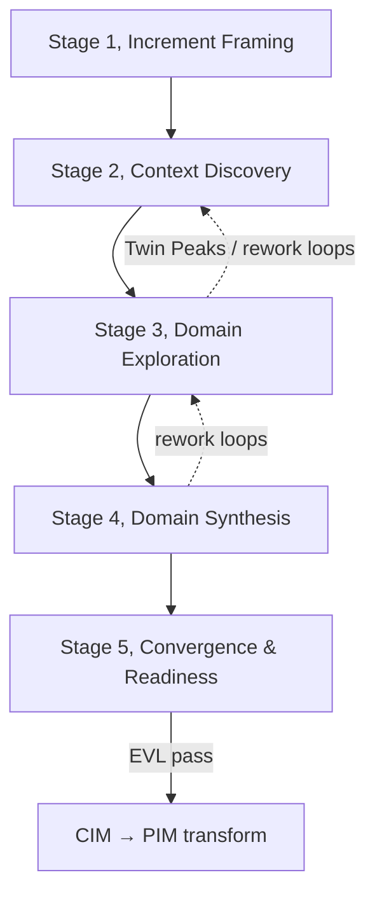

# CIM Modeling Process

The Computation-Independent Model (CIM) records business intent, domain structure, behavior, and
governance before provider and implementation decisions are made. Each model-driven increment invokes
five ordered stages; they are not product-lifecycle phases. Each stage contains substages in the
workbench, with task uses that select reusable
task definitions.

A task may produce a process work product, such as an increment plan or readiness assessment. Its
`metamodelBindings` separately identify the CIM classes and enumerations that the task covers. Use
the **Guided Modeling** panel, when enabled, or this guide to follow stage, substage, and task progress.
Tasks also identify a viewpoint and palette focus for the editor. When review finds a gap, revisit the
earlier stage that owns it and continue within the same engine cycle.

## SPEM Structure

```text
methodContent → RoleDefinitions / TaskDefinitions / WorkProductDefinitions / Guidance
Process → Activities → TaskUses + RoleUses + WorkProductUses + WorkSequences
         MODRISS extensions: progressModel, governance, processEngine
```

## Process Engine

The **process engine** (`processEngine` in JSON) is the iterative agile kernel: the repeating cycle
that frames, models, validates, reviews, and adapts **one capability slice per revolution**.

CIM engine cycle: **Increment Framing → Context Discovery → Domain Exploration → Domain Synthesis →
Convergence, Readiness & Review → ↻**

The first cycle creates the CIM root; later cycles refresh the same stage for the next slice. While
modeling inside a cycle, use **engine rework loops** (e.g. language refinement back to glossary, Twin
Peaks back to domain structure).

## CIM Stages

| Stage     | Name                    | In engine | Substages                                                                 |
| --------- | ----------------------- | --------- | ------------------------------------------------------------------------- |
| `cim.ph1` | Increment Framing       | ✓         | Program Charter, Capability Slice Planning, Strategic Framing             |
| `cim.ph2` | Context Discovery       | ✓         | Participation Model, Capability Landscape, Ubiquitous Language            |
| `cim.ph3` | Domain Exploration      | ✓         | Information Architecture, Structural Model, Behavior Surface (sub-stages) |
| `cim.ph4` | Domain Synthesis        | ✓         | Aggregate Boundaries, Process & Decisions, Bounded Contexts               |
| `cim.ph5` | Convergence & Readiness | ✓         | Requirements (Twin Peaks), Governance, EVL gate                           |

## Roles

| Role                      | Responsibility in CIM                                                             |
| ------------------------- | --------------------------------------------------------------------------------- |
| **Business Modeler**      | Increment framing through synthesis: intent, domain, behavior, process, contracts |
| **Requirements Engineer** | Convergence stage: requirements, acceptance criteria, governance constraints      |
| **Process Reviewer**      | EVL gate approval and production readiness sign-off                               |

## Stage Flow



## Stage Overview

| Stage | Name                    | Primary role                             | Key artifacts                                                 |
| ----- | ----------------------- | ---------------------------------------- | ------------------------------------------------------------- |
| 1     | Increment Framing       | Business Modeler                         | CIM Model Root, CIM Increment Plan, Strategic Intent          |
| 2     | Context Discovery       | Business Modeler                         | Participation Model, Capability, Glossary                     |
| 3     | Domain Exploration      | Business Modeler                         | Information Taxonomy, Domain Structure, CQRS Behavior Surface |
| 4     | Domain Synthesis        | Business Modeler                         | Aggregates, Process Flows, Bounded Contexts                   |
| 5     | Convergence & Readiness | Requirements Engineer / Process Reviewer | Requirements, Governance, Trace & Readiness                   |

<!-- TASK-CATALOG:START -->
<!-- Generated from the process definition; do not edit manually -->

## Task Catalog

Process `modriss.cim.modeling` · 5 stages · 26 TaskUses / TaskDefinitions · CIM metamodel coverage enforced in CI.

### Increment Framing (`cim.ph1`)

Frame the current capability slice, establish or refresh the CIM program container, and anchor modeling in measurable intent.

**Runs:** in engine cycle · **Role:** Business Modeler

**Stage entry:**

- MODRISS project created or prior CIM increment selected for evolution

**Stage exit:**

- CIMModel root exists
- Capability-slice objective and definition of done are agreed
- At least one BusinessGoal with KPI traces to the slice

#### Program Charter (`cim.ph1.st1`)

Create the CIMModel root and modeling conventions on the first cycle; refresh them when the program scope changes.

**Viewpoint:** dashboard

##### Tasks

#### Create CIM model root (`cim.ph1.st1.t1`)

**Viewpoint:** dashboard
**Duration:** 20m
**Work products:** CIM Model Root
**Palette focus:** `CIMModel`

**Steps:**

1. Create or verify CIMModel with domainName and businessScope.
2. Set organizationName, modelingDate, and language.
3. Apply lifecycle status and annotation conventions on the root.

**Entry criteria:**

- Project created or existing CIM opened for a new increment

**Exit criteria:**

- CIMModel root with domainName exists

#### Establish shared model contract and evidence conventions (`cim.ph1.st1.t2`)

**Viewpoint:** dashboard
**Duration:** 30m
**Inputs:** CIM Model Root
**Work products:** CIM Model Root
**Palette focus:**

- `DeployableElement`
- `InvocationSource`
- `InvocationTarget`
- `FunctionTarget`
- `WorkflowTarget`
- `SubscriptionTarget`
- `RoutingTarget`
- `FlowEndpoint`
- `ProtectedResource`
- `PolicyTarget`
- `DataAccessTarget`
- `ExternalCallTarget`

**Steps:**

1. Apply the shared identity, annotation, traceability, expression, and lifecycle conventions used by every CIM element.
2. Set the evidence convention for source references, review status, and model-level provenance.
3. Confirm that shared support concepts are handled by inspectors and readiness records rather than mistaken for business concepts.

**Entry criteria:**

- CIM model root exists

**Exit criteria:**

- Shared model contract and evidence convention are recorded

#### Capability Slice Planning (`cim.ph1.st2`)

Select the smallest valuable capability slice and define the cycle-level definition of done.

**Viewpoint:** capability

##### Tasks

#### Plan capability slice (`cim.ph1.st2.t1`)

**Viewpoint:** capability
**Duration:** 30m
**Inputs:** CIM Model Root
**Work products:** CIM Increment Plan

**Steps:**

1. Select one capability or bounded-context candidate from the modeling backlog.
2. Record slice objective, scope boundaries, assumptions, and definition of done.
3. Identify the validation gate and review participants for the cycle.

**Entry criteria:**

- CIM model root exists

**Exit criteria:**

- Capability-slice scope and definition of done are agreed

#### Strategic Framing (`cim.ph1.st3`)

Capture measurable business intent for the selected slice using GQM before domain modeling.

**Viewpoint:** requirements

##### Tasks

#### Define business goals and KPIs (`cim.ph1.st3.t1`)

**Viewpoint:** requirements
**Duration:** 45m
**Inputs:** CIM Increment Plan
**Work products:** Strategic Intent Package
**Palette focus:** `BusinessGoal`, `KPI`

**Steps:**

1. Capture BusinessGoal elements with success criteria.
2. Define measurable KPIs linked to each goal.

**Entry criteria:**

- Capability-slice scope agreed

**Exit criteria:**

- At least one goal with linked KPI

**Validation:**

- `CIM-GOAL-001`
- `CIM-KPI-001`

#### Identify stakeholders (`cim.ph1.st3.t2`)

**Viewpoint:** requirements
**Duration:** 30m
**Inputs:** Strategic Intent Package, CIM Increment Plan
**Work products:** Strategic Intent Package
**Palette focus:** `Stakeholder`

**Steps:**

1. Register stakeholders and their concerns linked to goals.

**Entry criteria:**

- Goals drafted

**Exit criteria:**

- Stakeholders identified for primary outcomes

---

### Context Discovery (`cim.ph2`)

Map who participates in the domain, what the organization can do, and shared vocabulary.

**Runs:** in engine cycle · **Role:** Business Modeler

**Stage entry:**

- Increment Framing complete

**Stage exit:**

- Actors, capabilities, and glossary cover the increment slice

#### Participation Model (`cim.ph2.st1`)

Model human/system actors, roles, and boundary external systems.

**Viewpoint:** actor

##### Tasks

#### Model actors and roles (`cim.ph2.st1.t1`)

**Viewpoint:** actor
**Duration:** 45m
**Inputs:** Strategic Intent Package, CIM Increment Plan
**Work products:** Participation Model
**Palette focus:** `Actor`, `Role`

**Steps:**

1. Model human and system Actor elements with trust levels.
2. Define Role elements and link to actors.

**Entry criteria:**

- Strategic intent captured

**Exit criteria:**

- Actors exist for primary user journeys

#### Register external systems (`cim.ph2.st1.t2`)

**Viewpoint:** actor
**Duration:** 20m
**Inputs:** Participation Model, Strategic Intent Package
**Work products:** Participation Model
**Palette focus:** `ExternalSystem`

**Steps:**

1. Register ExternalSystem actors at domain boundaries.

**Entry criteria:**

- Actors modeled

**Exit criteria:**

- External integrations at boundaries identified

#### Capability Topology (`cim.ph2.st2`)

Map business capabilities to goals and record dependencies.

**Viewpoint:** capability

##### Tasks

#### Map business capabilities (`cim.ph2.st2.t1`)

**Viewpoint:** capability
**Duration:** 1h
**Inputs:** Participation Model, Strategic Intent Package
**Work products:** Capability
**Palette focus:** `BusinessCapability`

**Steps:**

1. Create BusinessCapability elements linked to goals.
2. Set criticality for each capability in the increment slice.

**Entry criteria:**

- Participation model drafted

**Exit criteria:**

- Capabilities cover core value streams for slice

#### Record capability dependencies (`cim.ph2.st2.t2`)

**Viewpoint:** capability
**Duration:** 30m
**Inputs:** Capability, Strategic Intent Package
**Work products:** Capability
**Palette focus:** `CapabilityDependency`

**Steps:**

1. Model CapabilityDependency relationships between capabilities.

**Entry criteria:**

- Capability drafted

**Exit criteria:**

- Dependencies documented for slice

#### Ubiquitous Language (`cim.ph2.st3`)

Build shared glossary before structural modeling (DDD).

**Viewpoint:** capability

##### Tasks

#### Define domain glossary (`cim.ph2.st3.t1`)

**Viewpoint:** capability
**Duration:** 45m
**Inputs:** Capability, Strategic Intent Package
**Work products:** Ubiquitous Language Glossary
**Palette focus:** `UbiquitousLanguageTerm`

**Steps:**

1. Define UbiquitousLanguageTerm entries with definitions and examples.
2. Link terms to capabilities where helpful.
3. Resolve naming conflicts before entity modeling.

**Entry criteria:**

- Capability drafted

**Exit criteria:**

- Glossary covers core domain nouns for slice

---

### Domain Exploration (`cim.ph3`)

Explore information, structure, and behavior using Twin Peaks, iterate until CQRS surface is coherent.

**Runs:** in engine cycle · **Role:** Business Modeler

**Stage entry:**

- Context Discovery complete for slice

**Stage exit:**

- Commands, queries, and events cover primary use cases

#### Information Architecture (`cim.ph3.st1`)

Classify data and name information items before entities (CIM-ENTITY-001).

##### Data Classification (`cim.ph3.st1.ss1`)

Define confidentiality and handling classifications.

**Viewpoint:** domain

##### Tasks

#### Define data classifications (`cim.ph3.st1.ss1.t1`)

**Viewpoint:** domain
**Duration:** 30m
**Inputs:** Ubiquitous Language Glossary, Strategic Intent Package
**Work products:** Information Taxonomy
**Palette focus:** `DataClassification`

**Steps:**

1. Create DataClassification elements with confidentiality levels.

**Entry criteria:**

- Glossary established

**Exit criteria:**

- Classifications cover sensitive categories

##### Information Items (`cim.ph3.st1.ss2`)

Name and type the facts the domain cares about.

**Viewpoint:** domain

##### Tasks

#### Create information items (`cim.ph3.st1.ss2.t1`)

**Viewpoint:** domain
**Duration:** 1h
**Inputs:** Information Taxonomy, Ubiquitous Language Glossary
**Work products:** Information Taxonomy
**Palette focus:** `InformationItem`

**Steps:**

1. Create InformationItem elements for each planned entity attribute group.
2. Set identifiability and data kind on each item.

**Entry criteria:**

- Classifications defined

**Exit criteria:**

- Information items exist for planned entities

**Validation:**

- `CIM-ENTITY-001`

#### Structural Domain Model (`cim.ph3.st2`)

Model entities, value objects, relationships, lifecycle, and invariants.

##### Entities & Lifecycle (`cim.ph3.st2.ss1`)

Model stateful domain entities with identity from information items.

**Viewpoint:** domain

##### Tasks

#### Model domain entities (`cim.ph3.st2.ss1.t1`)

**Viewpoint:** domain
**Duration:** 1-2h
**Inputs:** Information Taxonomy, Ubiquitous Language Glossary, Capability
**Work products:** Domain Structure Model
**Palette focus:** `DomainEntity`, `LifecycleStateDefinition`, `BusinessInvariant`

**Steps:**

1. Create DomainEntity elements referencing primary InformationItem identity.
2. Define lifecycle states and business invariants per entity.

**Entry criteria:**

- Information taxonomy complete

**Exit criteria:**

- Core entities for slice modeled

**Validation:**

- `CIM-ENTITY-001`

##### Value Objects & Relationships (`cim.ph3.st2.ss2`)

Model descriptive types and associations between domain concepts.

**Viewpoint:** domain

##### Tasks

#### Model value objects and relationships (`cim.ph3.st2.ss2.t1`)

**Viewpoint:** domain
**Duration:** 1h
**Inputs:** Domain Structure Model, Information Taxonomy
**Work products:** Domain Structure Model
**Palette focus:** `ValueObject`, `DomainRelationship`, `DomainConcept`

**Steps:**

1. Add ValueObject elements for descriptive data.
2. Model DomainRelationship elements between concepts.

**Entry criteria:**

- Entities modeled

**Exit criteria:**

- Relationships and VOs complete for slice

**Validation:**

- `CIM-RELATIONSHIP-001`

#### Behavior Surface (`cim.ph3.st3`)

CQRS and event storming, commands, queries, events linked to actors and capabilities.

##### Commands (`cim.ph3.st3.ss1`)

Model state-changing operations with outcomes and preconditions.

**Viewpoint:** eventstorming

##### Tasks

#### Model commands and outcomes (`cim.ph3.st3.ss1.t1`)

**Viewpoint:** eventstorming
**Duration:** 1h
**Inputs:** Domain Structure Model, Participation Model, Capability
**Work products:** CQRS Behavior Surface
**Palette focus:** `Command`, `CommandOutcome`

**Steps:**

1. Create Command elements with actors and target capabilities.
2. Define CommandOutcome and link expected/rejection events.

**Entry criteria:**

- Domain structure drafted

**Exit criteria:**

- Commands cover primary write use cases

##### Queries (`cim.ph3.st3.ss2`)

Model read operations with freshness needs.

**Viewpoint:** eventstorming

##### Tasks

#### Model queries (`cim.ph3.st3.ss2.t1`)

**Viewpoint:** eventstorming
**Duration:** 45m
**Inputs:** CQRS Behavior Surface, Information Taxonomy, Participation Model
**Work products:** CQRS Behavior Surface
**Palette focus:** `Query`

**Steps:**

1. Create Query elements linked to actors and information items.
2. Set freshness requirements per query.

**Entry criteria:**

- Commands modeled

**Exit criteria:**

- Queries cover primary read use cases

##### Events & Guards (`cim.ph3.st3.ss3`)

Model domain events, business errors, and guard conditions.

**Viewpoint:** eventstorming

##### Tasks

#### Model events, errors, and conditions (`cim.ph3.st3.ss3.t1`)

**Viewpoint:** eventstorming
**Duration:** 1h
**Inputs:** CQRS Behavior Surface, Domain Structure Model, Participation Model
**Work products:** CQRS Behavior Surface
**Palette focus:** `BusinessEvent`, `BusinessError`, `Condition`

**Steps:**

1. Create BusinessEvent elements emitted by commands or external systems.
2. Define BusinessError and Condition elements guarding behavior.

**Entry criteria:**

- Commands and queries modeled

**Exit criteria:**

- Event vocabulary covers slice workflows

---

### Domain Synthesis (`cim.ph4`)

Synthesize transactional boundaries, orchestration, and bounded contexts from explored domain.

**Runs:** in engine cycle · **Role:** Business Modeler

**Stage entry:**

- Domain Exploration coherent for slice

**Stage exit:**

- Bounded contexts assigned with memberships

#### Aggregate Boundaries (`cim.ph4.st1`)

Group entities into consistency boundaries with command/event ownership.

**Viewpoint:** aggregate

##### Tasks

#### Define aggregate candidates (`cim.ph4.st1.t1`)

**Viewpoint:** aggregate
**Duration:** 1h
**Inputs:** CQRS Behavior Surface, Domain Structure Model, Capability
**Work products:** Aggregate Boundary Model
**Palette focus:** `AggregateCandidate`

**Steps:**

1. Create AggregateCandidate groupings with handled commands and emitted events.
2. Document consistency and interaction expectations.

**Entry criteria:**

- Behavior surface modeled

**Exit criteria:**

- Aggregates align with command/event ownership

#### Process Orchestration (`cim.ph4.st2`)

Model long-running business flows, policies, and decisions.

##### Business Processes (`cim.ph4.st2.ss1`)

Orchestrate commands, events, and human steps into end-to-end flows.

**Viewpoint:** process

##### Tasks

#### Model business processes (`cim.ph4.st2.ss1.t1`)

**Viewpoint:** process
**Duration:** 2h
**Inputs:** CQRS Behavior Surface, Domain Structure Model, Strategic Intent Package, Aggregate Boundary Model
**Work products:** Business Process Model
**Palette focus:**

- `BusinessProcess`
- `ProcessStep`
- `StartStep`
- `EndStep`
- `CommandStep`
- `QueryStep`
- `EventStep`
- `PolicyStep`
- `HumanTaskStep`
- `ExternalInteractionStep`
- `DecisionStep`
- `WaitStep`

**Steps:**

1. Create BusinessProcess with step hierarchy and transitions.
2. Connect steps to modeled commands, queries, events, and policies.

**Entry criteria:**

- Aggregates defined

**Exit criteria:**

- Key processes orchestrate modeled behavior

##### Policies & Decisions (`cim.ph4.st2.ss2`)

Encode business rules and decision tables.

**Viewpoint:** decision

##### Tasks

#### Define policies and decision tables (`cim.ph4.st2.ss2.t1`)

**Viewpoint:** decision
**Duration:** 1h
**Inputs:** Business Process Model, CQRS Behavior Surface, Domain Structure Model
**Work products:** Decision & Policy Model
**Palette focus:** `Policy`, `DecisionTable`, `DecisionRule`

**Steps:**

1. Create Policy elements guarding commands, events, and processes.
2. Model DecisionTable with DecisionRule rows for branching logic.

**Entry criteria:**

- Processes drafted

**Exit criteria:**

- Policies linked to behavior elements

#### Bounded Context Synthesis (`cim.ph4.st3`)

Assign capabilities, domain, behavior, and policies into cohesive contexts.

**Viewpoint:** capability

##### Tasks

#### Synthesize bounded contexts (`cim.ph4.st3.t1`)

**Viewpoint:** capability
**Duration:** 1h
**Inputs:**

- Capability
- Domain Structure Model
- CQRS Behavior Surface
- Business Process Model
- Decision & Policy Model
  **Work products:** Bounded Context Map
  **Palette focus:** `BoundedContextCandidate`

**Steps:**

1. Group capabilities, entities, CQRS, events, and policies into contexts.
2. Validate memberships reference concrete modeled elements.

**Entry criteria:**

- Process and behavior complete

**Exit criteria:**

- Contexts have non-empty memberships

---

### Convergence & Readiness (`cim.ph5`)

Backfill requirements, record transformation contracts, close traceability and EVL gate.

**Runs:** in engine cycle · **Role:** Requirements Engineer

**Stage entry:**

- Domain Synthesis complete for slice

**Stage exit:**

- CIM EVL passes
- Readiness gate approved
- CIM increment reviewed and improvement actions captured

#### Requirements Engineering (`cim.ph5.st1`)

Twin Peaks backfill, formalize requirements traced to modeled elements.

**Viewpoint:** governance

##### Tasks

#### Formalize requirements (`cim.ph5.st1.t1`)

**Viewpoint:** governance
**Duration:** 1-2h
**Inputs:**

- Strategic Intent Package
- Domain Structure Model
- CQRS Behavior Surface
- Bounded Context Map
- Decision & Policy Model
  **Work products:** Requirements Package
  **Palette focus:**

- `Requirement`
- `RequirementRelationship`
- `AcceptanceCriterion`
- `NonFunctionalRequirement`
- `QualityScenario`

**Steps:**

1. Create Requirement elements with constrains links to domain and behavior.
2. Add AcceptanceCriterion per requirement.

**Entry criteria:**

- Bounded contexts synthesized

**Exit criteria:**

- Requirements trace to goals and model elements

#### Apply governance constraints (`cim.ph5.st1.t2`)

**Viewpoint:** governance
**Duration:** 1h
**Inputs:**

- Requirements Package
- Strategic Intent Package
- Participation Model
- Information Taxonomy
- Domain Structure Model
  **Work products:** Governance Constraint Package
  **Palette focus:** `SecurityConstraint`, `PrivacyConstraint`, `ComplianceConstraint`

**Steps:**

1. Record security, privacy, and compliance constraints on actors and information items.

**Entry criteria:**

- Requirements drafted

**Exit criteria:**

- Governance constraints linked to targets

#### Transformation Contracts (`cim.ph5.st2`)

Document risks, assumptions, and CIM→PIM transformation profile.

**Viewpoint:** traceability

##### Tasks

#### Record transformation metadata (`cim.ph5.st2.t1`)

**Viewpoint:** traceability
**Duration:** 45m
**Inputs:**

- Governance Constraint Package
- Requirements Package
- Bounded Context Map
- Domain Structure Model
- Decision & Policy Model
  **Work products:** Transformation Contract
  **Palette focus:** `Risk`, `Assumption`, `Hotspot`, `TransformationProfile`

**Steps:**

1. Record Risk, Assumption, and Hotspot elements on model hotspots.
2. Define TransformationProfile for CIM→PIM with manual decisions.

**Entry criteria:**

- Governance captured

**Exit criteria:**

- Transformation profile ready for ETL

#### Traceability & Readiness Gate (`cim.ph5.st3`)

Close trace links and production readiness before CIM→PIM.

**Viewpoint:** traceability

##### Tasks

#### Complete trace and readiness (`cim.ph5.st3.t1`)

**Viewpoint:** traceability
**Duration:** 1-2h
**Inputs:**

- Transformation Contract
- Strategic Intent Package
- Requirements Package
- Domain Structure Model
- CQRS Behavior Surface
- Bounded Context Map
- Governance Constraint Package
- Business Process Model
- Decision & Policy Model
  **Work products:** Trace & Readiness Record
  **Palette focus:**

- `TraceModel`
- `TraceLink`
- `TransformationAssumption`
- `ProductionReadinessAssessment`
- `ReadinessFinding`
- `ReadinessCheck`
- `ManualDecision`

**Steps:**

1. Build TraceModel links across goals, requirements, and domain.
2. Complete ProductionReadinessAssessment and resolve findings.

**Entry criteria:**

- Transformation contracts recorded

**Exit criteria:**

- CIM EVL passes; readiness approved

**Validation:**

- `cim-semantic-validation`

#### Increment Review & Adapt (`cim.ph5.st4`)

Review the CIM slice with stakeholders, accept the increment, and adapt the next cycle.

**Viewpoint:** traceability

##### Tasks

#### Review and adapt CIM increment (`cim.ph5.st4.t1`)

**Viewpoint:** traceability
**Duration:** 45m
**Inputs:**

- Trace & Readiness Record
- Strategic Intent Package
- CIM Increment Plan
- Requirements Package
- Governance Constraint Package
  **Work products:** CIM Increment Review Record

**Steps:**

1. Review slice outcomes against goals, KPIs, and acceptance criteria.
2. Record accepted scope, deferred work, and stakeholder feedback.
3. Create improvement actions and backlog adjustments for the next engine cycle.

**Entry criteria:**

- CIM EVL passes or all blocking findings are dispositioned

**Exit criteria:**

- Increment accepted or rework loop selected; improvement actions captured

---

## Process transition

The CIM process produces a reviewed CIM revision for CIM-to-PIM transformation. Review the resulting PIM draft before beginning PIM refinement.

<!-- TASK-CATALOG:END -->
