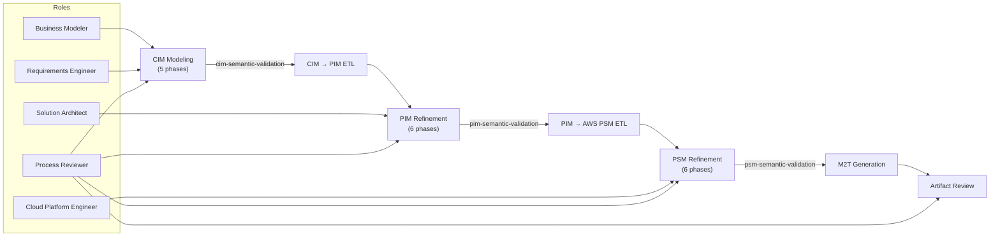
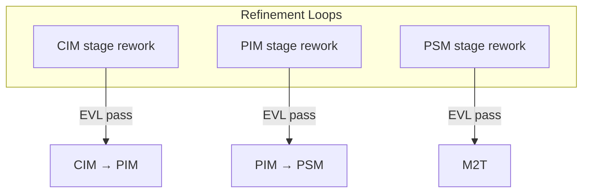

# End-to-End Modeling Methodology

This guide describes the full **incremental-evolutionary** Modless modeling lifecycle from business
intent through deployable AWS artifacts. It connects three level-specific methodologies—[CIM](cim-modeling-methodology.md),
[PIM](pim-modeling-methodology.md), and [PSM](psm-modeling-methodology.md)—with transformation
milestones, EVL gates, iteration loops, and human-in-the-loop refinement.

The machine-readable process definition lives at
`mde/methodology/process-definitions/end-to-end.json`. Its **`processEngine`** is the top-level agile kernel: one full CIM → PIM → PSM → artifacts revolution per capability increment, looping while backlog remains.

## Incremental Delivery (Engine Cycle)

The end-to-end engine delivers in **capability slices**:

1. **Increment Planning** (`e2e.p0`) — engine cycle entry
2. **CIM engine** → **CIM→PIM** → **PIM engine** → **PIM→PSM** → **PSM engine** → **M2T** → **Artifact closure**
3. **Engine loop** — retrospective, then back to step 1 if more slices remain

Cross-level **rework loops** inside the engine (PIM feedback to CIM, etc.) are not failures — they are how the engine corrects course within a revolution.

## Roles Across the Pipeline

| Role                        | Primary responsibility                                            |
| --------------------------- | ----------------------------------------------------------------- |
| **Business Modeler**        | CIM modeling (`cim.ph1`–`cim.ph5`)                                |
| **Requirements Engineer**   | CIM convergence phase (`cim.ph5`)                                 |
| **Solution Architect**      | CIM→PIM transform oversight; PIM refinement (`pim.ph1`–`pim.ph6`) |
| **Cloud Platform Engineer** | PIM→PSM transform; PSM refinement (`psm.ph1`–`psm.ph6`); M2T      |
| **Process Reviewer**        | EVL gate approval and readiness sign-off at each level            |

## End-to-End Flow

## Milestones Overview

| Milestone              | ID                 | Phase                        | Gate / deliverable                                   |
| ---------------------- | ------------------ | ---------------------------- | ---------------------------------------------------- |
| CIM readiness approved | `e2e.m1.cim-ready` | CIM Modeling                 | `cim-semantic-validation` passes; `cim.ph5` complete |
| PIM readiness approved | `e2e.m2.pim-ready` | PIM Refinement               | `pim-semantic-validation` passes; `pim.ph6` complete |
| PSM readiness approved | `e2e.m3.psm-ready` | PSM Refinement               | `psm-semantic-validation` passes; `psm.ph6` complete |
| Artifacts delivered    | `e2e.m4.artifacts` | Artifact Review & Completion | Generated project reviewed and accepted              |

## Phase Overview

| Phase | Name                         | Primary role            | Transform             | Validation gate           | Outputs                                      |
| ----- | ---------------------------- | ----------------------- | --------------------- | ------------------------- | -------------------------------------------- |
| 1     | CIM Modeling (5 phases)      | Business Modeler        | —                     | `cim-semantic-validation` | Complete CIM with traceability and readiness |
| 2     | CIM → PIM Transformation     | Solution Architect      | `cim-to-pim`          | —                         | Draft PIM scaffolding from CIM               |
| 3     | PIM Refinement (6 phases)    | Solution Architect      | —                     | `pim-semantic-validation` | Production-ready PIM                         |
| 4     | PIM → AWS PSM Transformation | Cloud Platform Engineer | `pim-to-awspsm`       | —                         | Draft AWS PSM from PIM                       |
| 5     | PSM Refinement (6 phases)    | Cloud Platform Engineer | —                     | `psm-semantic-validation` | Production-ready AWS PSM                     |
| 6     | M2T Artifact Generation      | Cloud Platform Engineer | `awspsm-to-artifacts` | —                         | SAM/CloudFormation, handlers, tests, docs    |
| 7     | Artifact Review & Completion | Process Reviewer        | —                     | —                         | Reviewed, deployable AWS project             |

---

## Stage 1 — CIM Modeling (5 phases)

**Child process:** `modless.cim.modeling` · **Guide:** [CIM Modeling Methodology](cim-modeling-methodology.md)

Model business intent, domain, behavior, governance, and transformation contracts without platform
detail. Follow all five CIM phases (`cim.ph1`–`cim.ph5`) in SPEM order: phases → stages → tasks.

### Key activities

1. `cim.ph1` Establishment: model root and strategic intent (GQM).
2. `cim.ph2` Context Discovery: actors, capabilities, ubiquitous language.
3. `cim.ph3` Domain Exploration: information taxonomy **before** entities (`CIM-ENTITY-001`), structure, CQRS behavior.
4. `cim.ph4` Domain Synthesis: aggregates, processes, bounded contexts.
5. `cim.ph5` Convergence: Twin Peaks requirements, governance, trace & EVL gate.

### Common mistakes

| Mistake                                            | EVL rule / impact                 |
| -------------------------------------------------- | --------------------------------- |
| Skipping information taxonomy before entities      | `CIM-ENTITY-001`                  |
| Creating bounded contexts before behavior modeling | Empty context memberships         |
| Transforming before `cim.ph5` readiness            | `cim-semantic-validation` failure |

### Stage gate checklist

- [ ] All CIM phases complete per [CIM guide](cim-modeling-methodology.md) (`cim.ph1`–`cim.ph5`)
- [ ] `ProductionReadinessAssessment` approved
- [ ] **`cim-semantic-validation` passes**
- [ ] Milestone `e2e.m1.cim-ready` achieved

---

## Stage 2 — CIM → PIM Transformation

**Transform:** `cim-to-pim` · **Primary role:** Solution Architect

Run the semi-automated CIM-to-PIM ETL profile. The transformation creates PIM scaffolding—service
boundaries, security concepts, data structures, behaviors, contracts, integrations, deployment
concepts, traces, and readiness information—split across concern-specific ETL modules.

### Tasks

1. Confirm CIM model revision is saved and EVL-clean.
2. Execute CIM→PIM transform from the pipeline UI or API.
3. Review transform report, manual decisions, and trace links.
4. Do **not** skip PIM refinement; generated elements require human review.

### Common mistakes

| Mistake                         | Impact                                    |
| ------------------------------- | ----------------------------------------- |
| Transforming stale CIM revision | HTTP 409 or inconsistent PIM              |
| Ignoring manual-action report   | Unresolved decisions propagate to PSM     |
| Treating generated PIM as final | Missing refinement in `pim.ph1`–`pim.ph6` |

### Stage gate checklist

- [ ] Transform completed without errors
- [ ] Manual decisions and hotspots reviewed
- [ ] PIM model revision saved
- [ ] Ready to begin PIM refinement

---

## Stage 3 — PIM Refinement (6 phases)

**Child process:** `modless.pim.modeling` · **Guide:** [PIM Modeling Methodology](pim-modeling-methodology.md)

Refine generated PIM through six SPEM phases (`pim.ph1`–`pim.ph6`): phases → stages → atomic tasks.

### Key activities

1. `pim.ph1` Architecture Establishment: model root, services, boundaries.
2. `pim.ph2` Contracts & Data: schemas, events, data stores.
3. `pim.ph3` Compute & Exposure: functions, APIs.
4. `pim.ph4` Integration & Orchestration: channels, workflows.
5. `pim.ph5` Assurance & Configuration: security, policies, external config.
6. `pim.ph6` Platform Readiness: mapping assessment and EVL gate.

### Common mistakes

| Mistake                                            | EVL rule / impact                 |
| -------------------------------------------------- | --------------------------------- |
| Accepting ETL service boundaries without CIM trace | Broken traceability               |
| Missing platform capability mapping                | PIM→PSM transform gaps            |
| Proceeding to PSM with open readiness findings     | `pim-semantic-validation` failure |

### Stage gate checklist

- [ ] All 6 PIM phases complete per [PIM guide](pim-modeling-methodology.md)
- [ ] `PlatformMappingAssessment` complete
- [ ] **`pim-semantic-validation` passes**
- [ ] Milestone `e2e.m2.pim-ready` achieved

---

## Stage 4 — PIM → AWS PSM Transformation

**Transform:** `pim-to-awspsm` · **Primary role:** Cloud Platform Engineer

Run the PIM-to-AWS-PSM ETL profile. Creates AWS roots, stages, stacks, compute, APIs, storage,
messaging, events, workflows, IAM, configuration, observability, and provider mappings. Post-processing
resolves relationships and validates placement.

### Tasks

1. Confirm PIM model revision is saved and EVL-clean.
2. Execute PIM→PSM transform.
3. Review relationship resolution and readiness warnings.
4. Plan PSM refinement through `psm.ph1`–`psm.ph6`.

### Common mistakes

| Mistake                                        | Impact                                   |
| ---------------------------------------------- | ---------------------------------------- |
| PIM platform mapping gaps                      | Missing or placeholder AWS resources     |
| Skipping transform report                      | Unresolved IAM or networking assumptions |
| Deploying generated SAM without PSM refinement | Incomplete infrastructure model          |

### Phase gate checklist

- [ ] Transform completed without errors
- [ ] Post-processing relationship resolution reviewed
- [ ] PSM model revision saved
- [ ] Ready to begin PSM refinement

---

## Stage 5 — PSM Refinement (6 phases)

**Child process:** `modless.psm.modeling` · **Guide:** [PSM Modeling Methodology](psm-modeling-methodology.md)

Refine generated AWS resources through six SPEM phases (`psm.ph1`–`psm.ph6`).

### Key activities

1. `psm.ph1` Deployment Foundation: account strategy, stacks, security baseline.
2. `psm.ph2` Network & Identity: VPC, Cognito.
3. `psm.ph3` Storage & Messaging: DynamoDB, S3, SQS/SNS.
4. `psm.ph4` Event Fabric & Compute: EventBridge, Lambda.
5. `psm.ph5` API & Orchestration: API Gateway, Step Functions, CloudWatch.
6. `psm.ph6` Integration Views & Readiness: relationship views and EVL gate.

### Common mistakes

| Mistake                                         | EVL rule / impact                         |
| ----------------------------------------------- | ----------------------------------------- |
| IAM roles too permissive vs PIM least-privilege | Security review failure at artifact stage |
| Missing integration relationship views          | `psm-semantic-validation` or M2T gaps     |
| Unvalidated Step Functions ASL                  | Deployment failure                        |

### Stage gate checklist

- [ ] All 6 PSM phases complete per [PSM guide](psm-modeling-methodology.md)
- [ ] Integration views document Lambda–API–event wiring
- [ ] **`psm-semantic-validation` passes**
- [ ] Milestone `e2e.m3.psm-ready` achieved

---

## Stage 6 — M2T Artifact Generation

**Transform:** `awspsm-to-artifacts` · **Primary role:** Cloud Platform Engineer

Generate a reviewable AWS serverless project from the validated PSM. Output may include SAM/CloudFormation
templates, Go Lambda handlers, OpenAPI and JSON Schema, ASL definitions, tests, CI workflows, and
generation reports.

See [Generated AWS Projects](generated-artifacts.md) for review expectations.

### Tasks

1. Confirm PSM EVL passes on saved revision.
2. Execute M2T generation.
3. Review `generated/reports/manual-actions.md` and `security-review.md`.
4. Inspect protected regions and external-secret placeholders.

### Common mistakes

| Mistake                         | Impact                            |
| ------------------------------- | --------------------------------- |
| Generating from unvalidated PSM | Incomplete or invalid templates   |
| Ignoring manual-actions report  | Undocumented production decisions |
| Skipping ASL validation         | Step Functions deployment failure |

### Phase gate checklist

- [ ] Generation completed successfully
- [ ] Manual-actions and security-review reports read
- [ ] Protected regions identified for application logic
- [ ] Artifact bundle saved to project

---

## Stage 7 — Artifact Review & Completion

**Primary role:** Process Reviewer

Human final gate before deployment. Generation is deliberately not the last decision—reviewers
validate infrastructure, security, operations, and traceability documentation.

### Tasks

1. Run `sam validate --lint` on generated templates.
2. Execute unit, integration, and workflow tests in generated project.
3. Verify trace links from artifacts back to CIM intent where required.
4. Sign off artifact delivery milestone.

### Common mistakes

| Mistake                                          | Impact                          |
| ------------------------------------------------ | ------------------------------- |
| Deploying without reading security-review report | Production security gaps        |
| Hard-coding secrets instead of placeholders      | Credential exposure             |
| Skipping LocalStack or staging validation        | Undetected integration failures |

### Phase gate checklist

- [ ] SAM templates lint-clean
- [ ] Generated tests pass
- [ ] Security and operations documentation reviewed
- [ ] Manual actions resolved or tracked
- [ ] Milestone `e2e.m4.artifacts` achieved

---

## Iteration and Twin Peaks

The end-to-end process supports iterative refinement:

- **CIM loop:** Twin Peaks in `cim.ph5` revisits `cim.ph3` when requirements expose domain gaps.
- **Post-ETL refinement:** Transform output is a draft. SPEM tasks at each level are mandatory.
- **Revision discipline:** Every model update requires the expected revision; stale writes return HTTP
  `409`.

## Related Documentation

- [Validation, Transformation, and Generation](../concepts/pipeline.md) — pipeline mechanics
- [Modeling Workflow](modeling-workflow.md) — editor, validation, and export
- [CIM Modeling Methodology](cim-modeling-methodology.md)
- [PIM Modeling Methodology](pim-modeling-methodology.md)
- [PSM Modeling Methodology](psm-modeling-methodology.md)
- [Generated AWS Projects](generated-artifacts.md)
