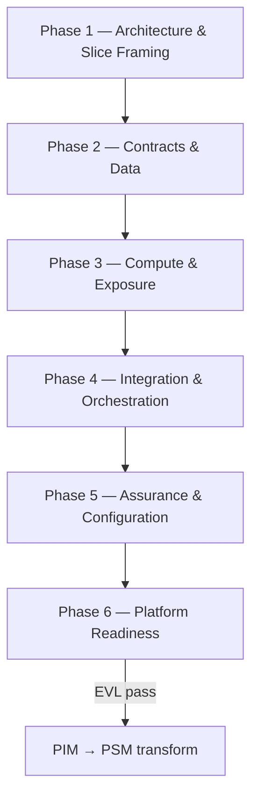

# PIM Modeling Methodology

The Platform-Independent Model (PIM) describes serverless architecture—service boundaries, contracts,
data, compute, integration, and policies—without binding to a specific cloud provider. This guide
covers **6 sequential phases** with nested stages and atomic tasks for greenfield PIM work and
post–CIM-to-PIM refinement.

After CIM→PIM ETL, treat generated elements as **draft architecture scaffolding** that still moves
through service-slice framing, refinement, readiness, review, and adapt work. Iterate within engine
phases when contracts or wiring gaps appear.

## Sequential Phases

| Phase     | Name                         | In engine | Stages (summary)                                                 |
| --------- | ---------------------------- | --------- | ---------------------------------------------------------------- |
| `pim.ph1` | Architecture & Slice Framing | ✓         | Service Slice Planning, Architecture Posture, Service Boundaries |
| `pim.ph2` | Contracts & Data             | ✓         | Contracts & Schemas, Data Architecture                           |
| `pim.ph3` | Compute & Exposure           | ✓         | Compute Units, API Surface                                       |
| `pim.ph4` | Integration & Orchestration  | ✓         | Integration Topology, Workflow Orchestration                     |
| `pim.ph5` | Assurance & Configuration    | ✓         | Security & Identity, Architecture Policies, External & Config    |
| `pim.ph6` | Platform Readiness           | ✓         | Platform Mapping, Trace & Readiness, Increment Review            |

## Roles

| Role                   | Responsibility in PIM                                                                    |
| ---------------------- | ---------------------------------------------------------------------------------------- |
| **Solution Architect** | Engine phases: slice framing, architecture, boundaries, contracts, integration, policies |
| **Process Reviewer**   | Readiness phase: EVL gate approval and platform mapping readiness                        |

## Phase Flow

## Detailed tasks

<!-- TASK-CATALOG:START -->
<!-- Generated by mde/methodology/tools/generate-methodology-guides.mjs — do not edit manually -->

## Task Catalog

Process `modless.pim.modeling` · 6 phases · 31 atomic tasks · PIM metamodel coverage enforced in CI.

### Architecture & Slice Framing (`pim.ph1`)

Frame the current service slice, establish or refresh PIM posture, and align serverless boundaries to CIM intent.

**Runs:** in engine cycle · **Role:** solution-architect

**Phase entry:**

- CIM transform complete, prior PIM increment selected, or greenfield PIM

**Phase exit:**

- PIM root configured
- Service-slice objective and architecture definition of done are agreed
- Services cover deployable boundaries for the slice

#### Service Slice Planning (`pim.ph1.st0`)

Select the PIM service slice and define architecture review expectations.

**Viewpoint:** services

##### Tasks

#### Plan service slice (`pim.ph1.st0.t1`)

**Viewpoint:** services
**Duration:** 30m
**Artifacts:** PIM Increment Plan

**Steps:**

1. Select one service slice traced to CIM goals, bounded contexts, and behavior.
2. Record scope boundaries, architectural risks, manual transform decisions, and definition of done.
3. Confirm the expected PIM EVL gate and review participants for the cycle.

**Entry criteria:**

- CIM transform complete, prior PIM increment selected, or greenfield PIM

**Exit criteria:**

- Service-slice scope and definition of done are agreed

#### Architecture Posture (`pim.ph1.st1`)

Create or refresh the PIMModel root with architecture style and implementation profile.

**Viewpoint:** dashboard

##### Tasks

#### Create PIM model root (`pim.ph1.st1.t1`)

**Viewpoint:** dashboard
**Duration:** 20m
**Artifacts:** Architecture Posture
**Palette focus:** `PIMModel`

**Steps:**

1. Create or verify PIMModel with domain linkage to CIM source.
2. Set modeling date, lifecycle status, and annotation conventions.

**Entry criteria:**

- Service-slice scope agreed

**Exit criteria:**

- PIMModel root exists

#### Set architecture posture (`pim.ph1.st1.t2`)

**Viewpoint:** dashboard
**Duration:** 30m
**Artifacts:** Architecture Posture
**Palette focus:** `ImplementationProfile`

**Steps:**

1. Configure ImplementationProfile with serverless posture and platform assumptions.
2. Select ArchitectureStyle and document key architectural decisions.

**Entry criteria:**

- PIM model root exists

**Exit criteria:**

- Architecture style and profile configured

#### Service Boundaries (`pim.ph1.st2`)

Define serverless services and element memberships aligned to bounded contexts.

**Viewpoint:** services

##### Tasks

#### Define serverless services (`pim.ph1.st2.t1`)

**Viewpoint:** services
**Duration:** 1h
**Artifacts:** Service Boundary Map
**Palette focus:** `ServerlessService`

**Steps:**

1. Create ServerlessService elements aligned to CIM bounded contexts.
2. Set boundary type and ownership scope per service.

**Entry criteria:**

- Architecture posture set

**Exit criteria:**

- Services defined for increment slice

#### Assign element memberships (`pim.ph1.st2.t2`)

**Viewpoint:** services
**Duration:** 45m
**Artifacts:** Service Boundary Map
**Palette focus:** `ServiceElementMembership`

**Steps:**

1. Create ServiceElementMembership links from services to planned elements.
2. Set OwnershipKind for each membership.

**Entry criteria:**

- Services defined

**Exit criteria:**

- Memberships cover deployable boundaries

---

### Contracts & Data (`pim.ph2`)

Define API/event contracts and persistent data architecture for the increment slice.

**Runs:** in engine cycle · **Role:** solution-architect

**Phase entry:**

- Architecture & Slice Framing complete

**Phase exit:**

- Contracts exist for APIs and events
- Persistent stores cover domain data

#### Contracts & Schemas (`pim.ph2.st1`)

Model schemas, validation constraints, and event envelopes aligned to CIM behavior.

**Viewpoint:** contracts

##### Tasks

#### Define schemas and fields (`pim.ph2.st1.t1`)

**Viewpoint:** contracts
**Duration:** 1-2h
**Artifacts:** Contract Catalog
**Palette focus:** `Schema`, `SchemaField`, `SchemaEnumLiteral`

**Steps:**

1. Create Schema elements with fields and enum literals.
2. Set schema kind and field types aligned to CIM information items.

**Entry criteria:**

- Service boundaries defined

**Exit criteria:**

- Schemas cover API and message payloads

#### Model event types and envelopes (`pim.ph2.st1.t2`)

**Viewpoint:** contracts
**Duration:** 1h
**Artifacts:** Contract Catalog
**Palette focus:** `EventType`, `EventEnvelope`, `SchemaValidationConstraint`, `SchemaConstraint`

**Steps:**

1. Define EventType and EventEnvelope elements from CIM events.
2. Apply validation constraints and compatibility rules.

**Entry criteria:**

- Schemas defined

**Exit criteria:**

- Event contracts aligned with CIM behavior surface

#### Data Architecture (`pim.ph2.st2`)

Model data stores, access patterns, and change streams for domain persistence.

**Viewpoint:** data

##### Tasks

#### Model data stores and models (`pim.ph2.st2.t1`)

**Viewpoint:** data
**Duration:** 1-2h
**Artifacts:** Data Architecture
**Palette focus:** `DataStore`, `ObjectStore`, `DataModel`, `DataField`

**Steps:**

1. Create DataStore and ObjectStore elements per service.
2. Define DataModel and DataField structures from CIM entities.

**Entry criteria:**

- Contracts defined

**Exit criteria:**

- Stores and models cover domain data

#### Define access patterns and indexes (`pim.ph2.st2.t2`)

**Viewpoint:** data
**Duration:** 1h
**Artifacts:** Data Architecture
**Palette focus:** `AccessPattern`, `IndexCandidate`, `DataAccess`

**Steps:**

1. Model AccessPattern elements from CIM queries and commands.
2. Define IndexCandidate and DataAccess bindings per store.

**Entry criteria:**

- Data models drafted

**Exit criteria:**

- Access patterns cover read/write use cases

#### Configure change streams and notifications (`pim.ph2.st2.t3`)

**Viewpoint:** data
**Duration:** 45m
**Artifacts:** Data Architecture
**Palette focus:** `DataChangeStream`, `ObjectNotificationRule`

**Steps:**

1. Define DataChangeStream elements for event-sourced projections.
2. Configure ObjectNotificationRule for object store triggers.

**Entry criteria:**

- Access patterns defined

**Exit criteria:**

- Change streams linked to event contracts

---

### Compute & Exposure (`pim.ph3`)

Define compute units and expose them through a coherent API surface.

**Runs:** in engine cycle · **Role:** solution-architect

**Phase entry:**

- Contracts & Data complete for slice

**Phase exit:**

- Functions cover behavioral surface
- Public API surface complete

#### Compute Units (`pim.ph3.st1`)

Define functions with contracts and triggers mapped to CIM commands and events.

**Viewpoint:** compute

##### Tasks

#### Define functions and contracts (`pim.ph3.st1.t1`)

**Viewpoint:** compute
**Duration:** 1-2h
**Artifacts:** Compute Catalog
**Palette focus:** `Function`, `FunctionContract`

**Steps:**

1. Create Function elements with FunctionContract bindings.
2. Set compute profile and execution model per handler.

**Entry criteria:**

- Data architecture drafted

**Exit criteria:**

- Functions mapped to CIM commands and queries

#### Configure triggers and runtime (`pim.ph3.st1.t2`)

**Viewpoint:** compute
**Duration:** 1h
**Artifacts:** Compute Catalog
**Palette focus:** `Trigger`

**Steps:**

1. Define Trigger elements linking functions to events and schedules.
2. Set runtime language and package manager per function.

**Entry criteria:**

- Functions defined

**Exit criteria:**

- Triggers cover behavioral entry points

#### API Surface (`pim.ph3.st2`)

Expose functions through APIs with routes, contracts, and error mappings.

**Viewpoint:** api

##### Tasks

#### Define APIs and routes (`pim.ph3.st2.t1`)

**Viewpoint:** api
**Duration:** 1h
**Artifacts:** API Catalog
**Palette focus:** `Api`, `ApiRoute`

**Steps:**

1. Create Api elements with routes and HTTP methods.
2. Connect routes to function handlers.

**Entry criteria:**

- Compute units defined

**Exit criteria:**

- API routes cover public endpoints

#### Map API contracts and errors (`pim.ph3.st2.t2`)

**Viewpoint:** api
**Duration:** 45m
**Artifacts:** API Catalog
**Palette focus:** `ApiContract`, `ErrorMapping`

**Steps:**

1. Bind ApiContract elements to schema definitions.
2. Map ErrorMapping responses to CIM business errors.

**Entry criteria:**

- API routes defined

**Exit criteria:**

- Contracts and error mappings complete

---

### Integration & Orchestration (`pim.ph4`)

Wire async integration topology and long-running workflow orchestration.

**Runs:** in engine cycle · **Role:** solution-architect

**Phase entry:**

- Compute & Exposure complete for slice

**Phase exit:**

- Async integration topology complete
- Long-running processes orchestrated

#### Integration Topology (`pim.ph4.st1`)

Model event channels, flows, and routing rules connecting services.

**Viewpoint:** integration

##### Tasks

#### Model event channels and buses (`pim.ph4.st1.t1`)

**Viewpoint:** integration
**Duration:** 1h
**Artifacts:** Integration Topology
**Palette focus:** `EventChannel`, `Queue`, `Topic`, `EventBus`

**Steps:**

1. Create EventChannel, Queue, Topic, and EventBus elements.
2. Set delivery semantics and ordering requirements.

**Entry criteria:**

- API surface defined

**Exit criteria:**

- Channels cover async integration points

#### Define flows and routing rules (`pim.ph4.st1.t2`)

**Viewpoint:** integration
**Duration:** 1-2h
**Artifacts:** Integration Topology
**Palette focus:**

- `Flow`
- `RequestResponseFlow`
- `EventFlow`
- `MessageFlow`
- `PubSubFlow`
- `OrchestrationFlow`
- `ExternalIntegrationFlow`
- `EventRoutingRule`
- `Schedule`
- `Subscription`

**Steps:**

1. Model Flow variants connecting producers and consumers.
2. Define EventRoutingRule and Subscription bindings.
3. Configure Schedule triggers for periodic integration.

**Entry criteria:**

- Channels defined

**Exit criteria:**

- Flows connect integration endpoints to functions

#### Workflow Orchestration (`pim.ph4.st2`)

Model workflows from CIM business processes with human tasks and compensation.

**Viewpoint:** workflow

##### Tasks

#### Model workflows and states (`pim.ph4.st2.t1`)

**Viewpoint:** workflow
**Duration:** 1-2h
**Artifacts:** Workflow Model
**Palette focus:** `Workflow`, `WorkflowState`, `WorkflowTransition`

**Steps:**

1. Create Workflow elements from CIM business processes.
2. Define states, transitions, and workflow kind.

**Entry criteria:**

- Integration topology defined

**Exit criteria:**

- Workflows cover long-running CIM processes

#### Configure human tasks and error handling (`pim.ph4.st2.t2`)

**Viewpoint:** workflow
**Duration:** 1h
**Artifacts:** Workflow Model
**Palette focus:**

- `HumanTask`
- `ApprovalTask`
- `EscalationPolicy`
- `CompensationPolicy`
- `ErrorHandler`
- `ParallelBranch`
- `MapStateConfig`
- `CallbackTaskConfig`

**Steps:**

1. Add HumanTask and ApprovalTask elements with escalation policies.
2. Define CompensationPolicy and ErrorHandler for failure paths.

**Entry criteria:**

- Workflows drafted

**Exit criteria:**

- Human steps and error paths orchestrated

---

### Assurance & Configuration (`pim.ph5`)

Apply security, operational policies, and environment configuration across the slice.

**Runs:** in engine cycle · **Role:** solution-architect

**Phase entry:**

- Integration & Orchestration complete for slice

**Phase exit:**

- Auth model covers all public endpoints
- Operational policies applied
- External integrations and config complete

#### Security & Identity (`pim.ph5.st1`)

Configure identity providers, principals, and authorization for APIs and functions.

**Viewpoint:** security

##### Tasks

#### Configure identity providers and principals (`pim.ph5.st1.t1`)

**Viewpoint:** security
**Duration:** 45m
**Artifacts:** Security Model
**Palette focus:** `IdentityProvider`, `Principal`

**Steps:**

1. Define IdentityProvider elements aligned to CIM actors.
2. Register Principal elements for human and service identities.

**Entry criteria:**

- Workflow orchestration drafted

**Exit criteria:**

- Identity model covers all actor types

#### Define permissions and security policies (`pim.ph5.st1.t2`)

**Viewpoint:** security
**Duration:** 1h
**Artifacts:** Security Model
**Palette focus:** `Permission`, `SecurityPolicy`, `AuthPolicy`, `AuthorizationPolicy`

**Steps:**

1. Create Permission elements with effect and action kind.
2. Apply AuthPolicy and AuthorizationPolicy to APIs and functions.

**Entry criteria:**

- Principals configured

**Exit criteria:**

- Auth model covers all public endpoints

#### Architecture Policies (`pim.ph5.st2`)

Apply resilience, observability, governance, and cost policies to architecture elements.

##### Resilience & Throughput (`pim.ph5.st2.ss1`)

Configure retry, timeout, concurrency, and throughput policies.

**Viewpoint:** policies

##### Tasks

#### Apply resilience policies (`pim.ph5.st2.ss1.t1`)

**Viewpoint:** policies
**Duration:** 1h
**Artifacts:** Architecture Policy Catalog
**Palette focus:** `ResiliencePolicy`, `RetryPolicy`, `DeadLetterPolicy`, `TimeoutPolicy`, `IdempotencyPolicy`

**Steps:**

1. Define ResiliencePolicy on functions and integration flows.
2. Configure RetryPolicy, DeadLetterPolicy, and TimeoutPolicy per target.
3. Set IdempotencyPolicy for state-changing handlers.

**Entry criteria:**

- Security and identity configured

**Exit criteria:**

- Resilience policies applied to critical paths

#### Configure throughput and ordering policies (`pim.ph5.st2.ss1.t2`)

**Viewpoint:** policies
**Duration:** 45m
**Artifacts:** Architecture Policy Catalog
**Palette focus:**

- `ConcurrencyPolicy`
- `RateLimitPolicy`
- `BatchPolicy`
- `OrderingPolicy`
- `CachePolicy`
- `BackupPolicy`
- `RetentionPolicy`
- `CostPolicy`

**Steps:**

1. Set ConcurrencyPolicy and RateLimitPolicy on APIs and functions.
2. Configure BatchPolicy, OrderingPolicy, and CachePolicy where needed.
3. Apply BackupPolicy, RetentionPolicy, and CostPolicy to stores.

**Entry criteria:**

- Resilience policies applied

**Exit criteria:**

- Throughput and cost policies configured

##### Observability & SLOs (`pim.ph5.st2.ss2`)

Configure logging, metrics, tracing, alerts, and service level objectives.

**Viewpoint:** policies

##### Tasks

#### Configure observability policies (`pim.ph5.st2.ss2.t1`)

**Viewpoint:** policies
**Duration:** 45m
**Artifacts:** Architecture Policy Catalog
**Palette focus:** `ObservabilityConfig`, `LoggingPolicy`, `MetricPolicy`, `MetricDimension`, `TracingPolicy`

**Steps:**

1. Define ObservabilityConfig per service.
2. Apply LoggingPolicy, MetricPolicy, and TracingPolicy to functions and APIs.

**Entry criteria:**

- Resilience policies applied

**Exit criteria:**

- Observability baseline configured

#### Define alerts, SLOs, and CORS (`pim.ph5.st2.ss2.t2`)

**Viewpoint:** policies
**Duration:** 30m
**Artifacts:** Architecture Policy Catalog
**Palette focus:** `AlertPolicy`, `Slo`, `CorsPolicy`

**Steps:**

1. Create AlertPolicy and Slo elements for critical endpoints.
2. Apply CorsPolicy to public API routes.

**Entry criteria:**

- Observability baseline configured

**Exit criteria:**

- Alerts and SLOs cover critical paths

##### Governance & Business Rules (`pim.ph5.st2.ss3`)

Apply data protection, compliance, and business rule policies.

**Viewpoint:** policies

##### Tasks

#### Apply governance and compliance policies (`pim.ph5.st2.ss3.t1`)

**Viewpoint:** policies
**Duration:** 45m
**Artifacts:** Architecture Policy Catalog
**Palette focus:**

- `ArchitecturePolicy`
- `PolicySetting`
- `DataProtectionPolicy`
- `DataQualityPolicy`
- `CompliancePolicy`

**Steps:**

1. Define ArchitecturePolicy and PolicySetting elements.
2. Apply DataProtectionPolicy and CompliancePolicy from CIM governance.

**Entry criteria:**

- Observability policies configured

**Exit criteria:**

- Governance policies linked to data and APIs

#### Map business rules and decision models (`pim.ph5.st2.ss3.t2`)

**Viewpoint:** policies
**Duration:** 45m
**Artifacts:** Architecture Policy Catalog
**Palette focus:** `BusinessRule`, `DecisionModel`, `DecisionRule`

**Steps:**

1. Create BusinessRule elements from CIM policies.
2. Model DecisionModel with DecisionRule rows for branching logic.

**Entry criteria:**

- Governance policies applied

**Exit criteria:**

- Business rules linked to functions and workflows

#### External & Config (`pim.ph5.st3`)

Model external integrations, environments, secrets, and deployment units.

**Viewpoint:** config

##### Tasks

#### Model external endpoints and adapters (`pim.ph5.st3.t1`)

**Viewpoint:** config
**Duration:** 45m
**Artifacts:** Configuration Package
**Palette focus:** `ExternalEndpoint`, `ExternalAdapter`

**Steps:**

1. Create ExternalEndpoint elements from CIM external systems.
2. Define ExternalAdapter bindings to integration flows.

**Entry criteria:**

- Architecture policies applied

**Exit criteria:**

- External integrations modeled

#### Configure environments and deployment units (`pim.ph5.st3.t2`)

**Viewpoint:** config
**Duration:** 1h
**Artifacts:** Configuration Package
**Palette focus:**

- `Environment`
- `DeploymentUnit`
- `ConfigurationSet`
- `ConfigParameter`
- `EnvironmentVariable`
- `Secret`
- `CredentialRequirement`

**Steps:**

1. Define Environment and DeploymentUnit elements per stage.
2. Configure ConfigurationSet, secrets, and credential requirements.
3. Set ConfigParameter and EnvironmentVariable values per environment.

**Entry criteria:**

- External integrations modeled

**Exit criteria:**

- Environments and config complete for slice

---

### Platform Readiness (`pim.ph6`)

Assess platform capability mapping, close traceability, and pass PIM EVL gate.

**Runs:** in engine cycle · **Role:** process-reviewer

**Phase entry:**

- Assurance & Configuration complete for slice

**Phase exit:**

- PIM EVL passes
- Readiness gate approved
- PIM increment reviewed and improvement actions captured

#### Platform Mapping Assessment (`pim.ph6.st1`)

Evaluate platform capability coverage and mapping readiness.

**Viewpoint:** readiness

##### Tasks

#### Assess platform capabilities (`pim.ph6.st1.t1`)

**Viewpoint:** readiness
**Duration:** 1h
**Artifacts:** Platform Readiness Record
**Palette focus:** `PlatformCapability`, `PlatformMappingAssessment`

**Steps:**

1. Review PlatformCapability coverage against modeled elements.
2. Complete PlatformMappingAssessment with gap analysis.

**Entry criteria:**

- External and config complete

**Exit criteria:**

- Platform mapping assessment documented

#### Trace & Readiness Gate (`pim.ph6.st2`)

Close trace links and production readiness before PIM→PSM transform.

**Viewpoint:** readiness

##### Tasks

#### Complete trace and readiness (`pim.ph6.st2.t1`)

**Viewpoint:** readiness
**Duration:** 1-2h
**Artifacts:** Platform Readiness Record

**Steps:**

1. Build TraceModel links across CIM and PIM elements.
2. Complete ProductionReadinessAssessment and resolve findings.

**Entry criteria:**

- Platform mapping assessment complete

**Exit criteria:**

- PIM EVL passes; readiness gate approved

**Validation:**

- `pim-semantic-validation`

#### Increment Review & Adapt (`pim.ph6.st3`)

Review the service slice architecture, accept the increment, and adapt the next cycle.

**Viewpoint:** readiness

##### Tasks

#### Review and adapt PIM increment (`pim.ph6.st3.t1`)

**Viewpoint:** readiness
**Duration:** 45m
**Artifacts:** PIM Increment Review Record

**Steps:**

1. Review architecture outcomes against CIM trace links and PIM definition of done.
2. Record accepted scope, deferred architecture decisions, and platform mapping feedback.
3. Create improvement actions and backlog adjustments for the next service slice.

**Entry criteria:**

- PIM EVL passes or all blocking findings are dispositioned

**Exit criteria:**

- Increment accepted or rework loop selected; improvement actions captured

---

## Next step

When `pim.ph6` exit criteria are met and EVL passes, proceed to the next level in the [modeling pipeline](../concepts/pipeline.md).

<!-- TASK-CATALOG:END -->
