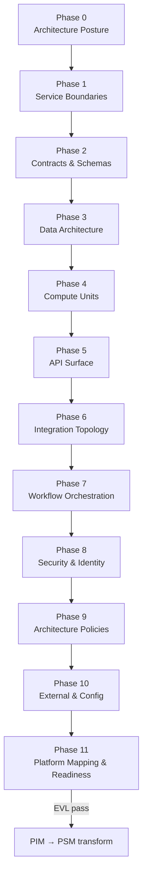

# PIM Modeling Methodology

The Platform-Independent Model (PIM) describes serverless architecture—service boundaries, contracts,
data, compute, integration, and policies—without binding to a specific cloud provider. This guide
covers **12 phases (0–11)** for greenfield PIM work and post–CIM-to-PIM refinement.

After CIM→PIM ETL, treat generated elements as **review tasks within each phase**, not a separate
ad-hoc workflow. Follow the same phase order as greenfield modeling.

## Roles

| Role                   | Responsibility in PIM                                                   |
| ---------------------- | ----------------------------------------------------------------------- |
| **Solution Architect** | Phases 0–10: architecture, boundaries, contracts, integration, policies |
| **Process Reviewer**   | Phase 11: EVL gate approval and platform mapping readiness              |

## Phase Flow

## Phase Overview

| Phase | Name                         | Primary role       | Duration | Inputs                      | Outputs                                   |
| ----- | ---------------------------- | ------------------ | -------- | --------------------------- | ----------------------------------------- |
| 0     | Architecture Posture         | Solution Architect | 30–45m   | CIM transform or greenfield | `PIMModel`, `ImplementationProfile`       |
| 1     | Service Boundaries           | Solution Architect | 1–2h     | Architecture posture        | `ServerlessService` boundaries            |
| 2     | Contracts & Schemas          | Solution Architect | 2–3h     | Service boundaries          | Schemas, event types, envelopes           |
| 3     | Data Architecture            | Solution Architect | 2–3h     | Contracts defined           | Data stores, models, access patterns      |
| 4     | Compute Units                | Solution Architect | 2–3h     | Data architecture           | Functions, triggers, contracts            |
| 5     | API Surface                  | Solution Architect | 1–2h     | Compute units               | APIs, routes, error mappings              |
| 6     | Integration Topology         | Solution Architect | 2–3h     | API surface                 | Channels, flows, routing rules            |
| 7     | Workflow Orchestration       | Solution Architect | ~2h      | Integration topology        | Workflows, human tasks, compensation      |
| 8     | Security & Identity          | Solution Architect | 1–2h     | Workflows drafted           | Identity, permissions, auth policies      |
| 9     | Architecture Policies        | Solution Architect | ~2h      | Security configured         | Resilience, observability, compliance     |
| 10    | External & Config            | Solution Architect | 1–2h     | Policies applied            | Environments, secrets, external endpoints |
| 11    | Platform Mapping & Readiness | Process Reviewer   | 1–2h     | Config complete             | Trace, platform mapping, EVL gate         |

---

## Phase 0 — Architecture Posture

**Viewpoint:** dashboard · **Duration:** 30–45 minutes

Set serverless architecture style and implementation profile before structural PIM work.

### Tasks

#### Architecture Posture

**Palette focus:** `PIMModel`, `ImplementationProfile`

1. Create `PIMModel` with architecture style and implementation profile.
2. Set serverless posture and platform assumptions.

#### Configure Architecture Posture enumerations

Review: `Priority`, `Severity`, `ConstraintStrength`, `LifecycleStatus`, `TraceConfidence`,
`TraceLinkType`, `FindingType`, `StructuredFormat`, `ExpressionLanguage`, `ExpressionPhase`,
`ArchitectureStyle`, `Decision`.

### Common mistakes

| Mistake                                                   | EVL rule |
| --------------------------------------------------------- | -------- |
| Starting service modeling without `PIMModel` root         | —        |
| Architecture style inconsistent with CIM bounded contexts | —        |

### Phase gate checklist

- [ ] `PIMModel` root configured
- [ ] `ImplementationProfile` and architecture style set
- [ ] Entry criteria met (CIM transform complete or greenfield decision documented)

---

## Phase 1 — Service Boundaries

**Viewpoint:** services · **Duration:** 1–2 hours

Align deployable boundaries to CIM bounded contexts.

### Tasks

**Palette focus:** `ServerlessService`, `ServiceElementMembership`

1. Define serverless services aligned to bounded contexts.
2. Assign element memberships and ownership.

### Common mistakes

| Mistake                                         | EVL rule |
| ----------------------------------------------- | -------- |
| Services that do not map to any bounded context | —        |
| Orphan elements without service membership      | —        |
| Boundary type mismatch with ownership kind      | —        |

### Phase gate checklist

- [ ] Services cover deployable boundaries
- [ ] Element memberships assigned
- [ ] Ownership documented per service

---

## Phase 2 — Contracts & Schemas

**Viewpoint:** contracts · **Duration:** 2–3 hours

Define platform-independent contracts aligned with CIM commands and events.

### Tasks

**Palette focus:** `Schema`, `SchemaField`, `SchemaEnumLiteral`, `SchemaValidationConstraint`, `SchemaConstraint`, `EventEnvelope`, `EventType`

1. Define schemas and validation constraints.
2. Model event types and envelopes.
3. Align contracts with CIM commands/events.

### Common mistakes

| Mistake                                              | EVL rule |
| ---------------------------------------------------- | -------- |
| API or event contract without backing schema         | —        |
| Schema fields not traceable to CIM information items | —        |
| Missing validation constraints on required fields    | —        |

### Phase gate checklist

- [ ] Contracts exist for APIs and events
- [ ] Schemas aligned with CIM behavior surface
- [ ] Event envelopes defined for async integration

---

## Phase 3 — Data Architecture

**Viewpoint:** data · **Duration:** 2–3 hours

Model persistent stores, access patterns, and change streams.

### Tasks

#### Data Architecture

**Palette focus:** `DataStore`, `DataChangeStream`, `ObjectStore`, `ObjectNotificationRule`, `DataModel`, `DataField`, `AccessPattern`, `IndexCandidate`, `DataAccess`

1. Model data stores, object stores, and data models.
2. Define access patterns and indexes.
3. Configure change streams and notifications.

#### Configure Data Architecture enumerations

Review: `StoreKind`, `ConsistencyNeed`, `DataAccessMode`, `AccessPatternKind`.

### Common mistakes

| Mistake                                                   | EVL rule |
| --------------------------------------------------------- | -------- |
| Data model without access pattern for hot paths           | —        |
| Index candidates not aligned to query patterns            | —        |
| Consistency need mismatched to CIM aggregate expectations | —        |

### Phase gate checklist

- [ ] Persistent stores cover domain data
- [ ] Access patterns and indexes defined
- [ ] Change streams configured where needed

---

## Phase 4 — Compute Units

**Viewpoint:** compute · **Duration:** 2–3 hours

Map CIM behavior to serverless functions and triggers.

### Tasks

#### Compute Units

**Palette focus:** `Function`, `Trigger`, `FunctionContract`

1. Define functions with contracts and triggers.
2. Map handlers to CIM commands/queries/events.
3. Set compute profiles and execution model.

#### Configure Compute Units enumerations

Review: `FunctionKind`, `ComputeProfile`, `ExecutionModel`, `RuntimeLanguage`, `PackageManager`.

### Common mistakes

| Mistake                                    | EVL rule |
| ------------------------------------------ | -------- |
| Function without contract or trigger       | —        |
| Handler not traceable to CIM command/event | —        |
| Compute profile insufficient for workload  | —        |

### Phase gate checklist

- [ ] Functions cover behavioral surface
- [ ] Triggers and contracts complete
- [ ] CIM trace links maintained

---

## Phase 5 — API Surface

**Viewpoint:** api · **Duration:** 1–2 hours

Expose synchronous entry points with error mapping to business errors.

### Tasks

**Palette focus:** `Api`, `ApiRoute`, `ErrorMapping`, `ApiContract`

1. Define APIs and routes with contracts.
2. Map error responses to business errors.
3. Connect routes to functions.

### Common mistakes

| Mistake                                            | EVL rule |
| -------------------------------------------------- | -------- |
| Route without backing function                     | —        |
| Error mapping missing for declared business errors | —        |
| API contract not linked to schema                  | —        |

### Phase gate checklist

- [ ] Public API surface complete
- [ ] Routes connected to functions
- [ ] Error mappings cover CIM business errors

---

## Phase 6 — Integration Topology

**Viewpoint:** integration · **Duration:** 2–3 hours

Model async channels, flows, and event routing.

### Tasks

**Palette focus:** `EventChannel`, `Queue`, `Topic`, `EventBus`, `Schedule`, `Subscription`, `EventRoutingRule`, `Flow`, `RequestResponseFlow`, `EventFlow`, `MessageFlow`, `PubSubFlow`, `OrchestrationFlow`, `ExternalIntegrationFlow`

1. Model event channels, queues, topics, and buses.
2. Define flows and routing rules.
3. Connect integration endpoints to functions.

### Common mistakes

| Mistake                                                     | EVL rule |
| ----------------------------------------------------------- | -------- |
| Subscription without publisher or consumer                  | —        |
| Flow endpoints not connected                                | —        |
| Delivery semantics inconsistent with CIM event expectations | —        |

### Phase gate checklist

- [ ] Async integration topology complete
- [ ] Flows connect producers and consumers
- [ ] Routing rules cover event types

---

## Phase 7 — Workflow Orchestration

**Viewpoint:** workflow · **Duration:** ~2 hours

Translate CIM business processes into long-running orchestration.

### Tasks

**Palette focus:** `Workflow`, `WorkflowState`, `WorkflowTransition`, `ErrorHandler`, `ParallelBranch`, `MapStateConfig`, `CallbackTaskConfig`, `EscalationPolicy`, `HumanTask`, `ApprovalTask`, `CompensationPolicy`

1. Model workflows from CIM business processes.
2. Add human tasks, approvals, and escalation.
3. Define compensation and error handlers.

### Common mistakes

| Mistake                                          | EVL rule |
| ------------------------------------------------ | -------- |
| Workflow without error handler for failure paths | —        |
| Human task without escalation policy             | —        |
| Compensation not defined for saga-like processes | —        |

### Phase gate checklist

- [ ] Long-running processes orchestrated
- [ ] Human tasks and approvals configured
- [ ] Compensation policies for reversible flows

---

## Phase 8 — Security & Identity

**Viewpoint:** security · **Duration:** 1–2 hours

Apply authentication and authorization across APIs and functions.

### Tasks

#### Security & Identity

**Palette focus:** `IdentityProvider`, `Principal`, `Permission`, `SecurityPolicy`, `AuthPolicy`, `AuthorizationPolicy`

1. Configure identity providers and principals.
2. Define permissions and authorization policies.
3. Apply security policies to APIs and functions.

#### Configure Security & Identity enumerations

Review: `IdentityKind`, `PrincipalKind`, `PermissionEffect`, `PermissionActionKind`, `LeastPrivilegeStatus`.

### Common mistakes

| Mistake                                       | EVL rule |
| --------------------------------------------- | -------- |
| Public API route without auth policy          | —        |
| Permission grants broader than CIM role scope | —        |
| Least-privilege status not assessed           | —        |

### Phase gate checklist

- [ ] Auth model covers all public endpoints
- [ ] Permissions aligned to CIM actors and roles
- [ ] Security policies applied to functions and APIs

---

## Phase 9 — Architecture Policies

**Viewpoint:** policies · **Duration:** ~2 hours

Operational and compliance policies across the architecture.

### Tasks

**Palette focus:** `ArchitecturePolicy`, `PolicySetting`, `DataProtectionPolicy`, `DataQualityPolicy`, `CompliancePolicy`, `BusinessRule`, `DecisionModel`, `DecisionRule`, `ResiliencePolicy`, `RetryPolicy`, `DeadLetterPolicy`, `TimeoutPolicy`, `IdempotencyPolicy`, `ConcurrencyPolicy`, `RateLimitPolicy`, `BatchPolicy`, `OrderingPolicy`, `CachePolicy`, `BackupPolicy`, `RetentionPolicy`, `CostPolicy`, `ObservabilityConfig`, `LoggingPolicy`, `MetricPolicy`, `MetricDimension`, `TracingPolicy`, `AlertPolicy`, `Slo`, `CorsPolicy`

1. Apply resilience, observability, and cost policies.
2. Map business rules and decision models.
3. Configure data protection and compliance policies.

### Common mistakes

| Mistake                                            | EVL rule |
| -------------------------------------------------- | -------- |
| Async handler without retry or dead-letter policy  | —        |
| NFR from CIM not reflected in SLO or alert policy  | —        |
| Data protection policy missing for classified data | —        |

### Phase gate checklist

- [ ] Operational policies applied
- [ ] Business rules mapped from CIM policies/decisions
- [ ] Observability config covers critical paths

---

## Phase 10 — External & Config

**Viewpoint:** config · **Duration:** 1–2 hours

External integrations, environments, and deployment configuration.

### Tasks

#### External & Config

**Palette focus:** `ConfigurationSet`, `ConfigParameter`, `EnvironmentVariable`, `Secret`, `CredentialRequirement`, `DeploymentUnit`, `Environment`, `ExternalEndpoint`, `ExternalAdapter`

1. Model external endpoints and adapters.
2. Configure environments, secrets, and deployment units.
3. Set configuration parameters per environment.

#### Configure External & Config enumerations

Review: `DeploymentUnitType`, `SecretKind`, `ConfigScope`, `EnvironmentClass`, `SupportLevel`.

### Common mistakes

| Mistake                                            | EVL rule |
| -------------------------------------------------- | -------- |
| Secret referenced but not scoped to environment    | —        |
| External adapter without CIM external system trace | —        |
| Deployment unit missing environment binding        | —        |

### Phase gate checklist

- [ ] External integrations and config complete
- [ ] Secrets and credentials scoped per environment
- [ ] Deployment units defined

---

## Phase 11 — Platform Mapping & Readiness

**Viewpoint:** readiness · **Duration:** 1–2 hours

Assess AWS platform fit and pass PIM EVL before PIM→PSM transform.

### Tasks

**Palette focus:** `PlatformCapability`, `PlatformMappingAssessment`, `TraceModel`, `TraceLink`, `TransformationAssumption`, `ProductionReadinessAssessment`, `ReadinessFinding`, `ReadinessCheck`, `ManualDecision`

1. Assess platform capability mapping.
2. Complete trace model and readiness assessment.
3. Pass PIM EVL before PIM→PSM transform.

### Common mistakes

| Mistake                                               | EVL rule                  |
| ----------------------------------------------------- | ------------------------- |
| Proceeding to PSM with unmapped platform capabilities | —                         |
| Open readiness findings at gate                       | `pim-semantic-validation` |
| Broken trace links to CIM source elements             | —                         |

### Phase gate checklist

- [ ] Platform capability mapping assessed
- [ ] Trace model links PIM to CIM elements
- [ ] Readiness findings resolved or waived
- [ ] **PIM EVL passes** (`pim-semantic-validation`)
- [ ] Process Reviewer sign-off obtained

---

## Next Steps

When Phase 11 gate criteria are met, proceed to [PIM → AWS PSM transformation](../concepts/pipeline.md)
and the [PSM Modeling Methodology](psm-modeling-methodology.md).
