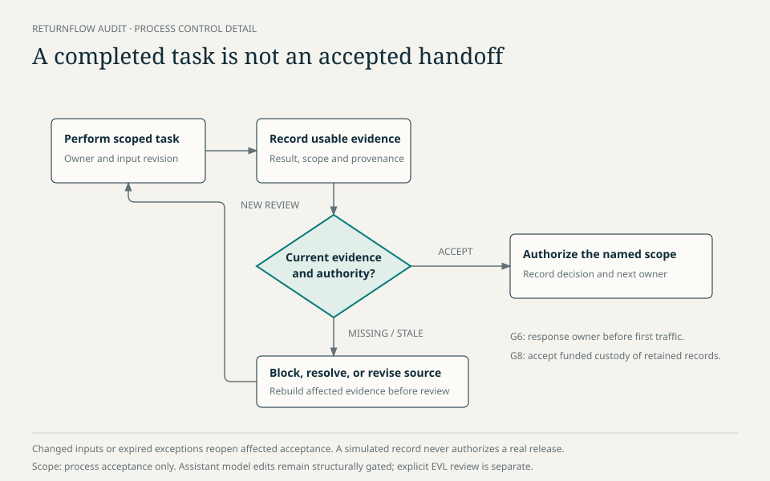

# Process enactment and evaluation

The process has been examined using fictional projects and repository checks.
These expose defects in method definitions and handoffs; they do not establish
that a company can use the methodology effectively without assistance.

The [ReturnFlow report](https://github.com/mehdieidi/modriss/blob/main/mde/process/method/14-returnflow-enactment-audit.md)
walks a six-person marketplace-returns team through 30 steps: inception,
CIM/PIM/PSM decisions, application completion, release, concurrent operations,
change and retirement. It records requirements, role assignments, proposed
model elements, failure cases and acceptance evidence. Application tests and
cloud releases are explicitly hypothetical, not measured outcomes.

The audit led to these process refinements:

- Assign response coverage and recovery before the first production traffic;
  the first release cannot restore a nonexistent previous baseline.
- Reject stale evidence and expired exceptions; reuse unaffected evidence only
  after impact review.
- Route persistent configuration changes through their authoritative model,
  including small PSM-owned alarm changes.
- Permit retirement with retained archives only after verified custody,
  controlled access, funding, expiry and deletion ownership are accepted.
- Label generated task inventories as plans, not execution evidence.

The [revised Eidi assessment](https://github.com/mehdieidi/modriss/blob/main/mde/process/method/07-evaluation.md)
covers 78 criterion rows: 20 general, 24 model-driven and 34 serverless, counting
tracing and logging separately as in the paper's results table. It preserves
the original criterion types, separates specified method from repository
support, and explains partial or absent capabilities. No aggregate maturity
score or productivity claim is made.

The largest unresolved questions concern learning effort, evidence/review
overhead, manual application logic, fault testing, AWS dependence, reverse
engineering and runtime-to-model feedback. Independent practitioner cases,
actual project artifacts and comparative outcome measures are the next step.
The [verification record](https://github.com/mehdieidi/modriss/blob/main/mde/process/method/evaluation/returnflow/verification.md)
states exactly which repository checks were run and their limits.

Assistant-generated model changes are gated only by structural Ecore/EMF
conformance through `ModelService.validateStructural(...)`. EVL semantic
validation remains an explicit user/model workflow outside assistant apply,
repair and commit.
