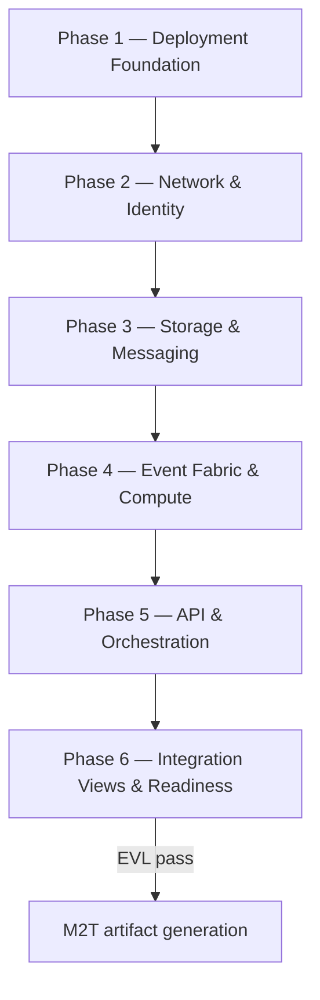

# AWS PSM Modeling Methodology

The Platform-Specific Model (PSM) binds the PIM to AWS resources—SAM stacks, IAM, Lambda, API Gateway,
DynamoDB, messaging, EventBridge, Step Functions, and observability. This guide covers **6 sequential phases** with nested stages and atomic tasks for greenfield AWS PSM work and post–PIM-to-PSM refinement.

After PIM→PSM ETL, refine generated AWS resources **within each task** following the same order as
greenfield modeling. Iterate within engine phases when wiring gaps appear.

## Sequential Phases

| Phase     | Name                          | In engine | Stages (summary)                                      |
| --------- | ----------------------------- | --------- | ----------------------------------------------------- |
| `psm.ph1` | Deployment Foundation         | once      | Account & Stage, Stack Scaffolding, Security Baseline |
| `psm.ph2` | Network & Identity            | once      | Networking, Identity (Cognito)                        |
| `psm.ph3` | Storage & Messaging           | ✓         | Durable Storage, Messaging                            |
| `psm.ph4` | Event Fabric & Compute        | ✓         | Event Fabric, Compute (Lambda)                        |
| `psm.ph5` | API & Orchestration           | ✓         | API Gateway, Workflow & Observability                 |
| `psm.ph6` | Integration Views & Readiness | gate      | Integration Views, Trace & Readiness                  |

## Roles

| Role                        | Responsibility in PSM                                       |
| --------------------------- | ----------------------------------------------------------- |
| **Cloud Platform Engineer** | Engine phases: AWS stacks, resources, integrations          |
| **Process Reviewer**        | Readiness phase: integration views, trace closure, EVL gate |

## Phase Flow

## Detailed tasks

<!-- TASK-CATALOG:START -->
<!-- Generated by mde/methodology/tools/generate-methodology-guides.mjs — do not edit manually -->

## Task Catalog

Process `modless.psm.modeling` · 6 phases · 25 atomic tasks · PSM metamodel coverage enforced in CI.

### Deployment Foundation (`psm.ph1`)

Establish AWS account strategy, SAM stack scaffolding, and security baseline.

**Runs:** once per program · **Role:** cloud-platform-engineer

**Phase entry:**

- PIM transform complete or greenfield PSM

**Phase exit:**

- AWS root and stage strategy configured
- Security baseline applied

#### Account & Stage Strategy (`psm.ph1.st1`)

Create AwsPsmModel root with partition, region, naming, and tagging policies.

**Viewpoint:** dashboard

##### Tasks

#### Create AWS PSM model root (`psm.ph1.st1.t1`)

**Viewpoint:** dashboard
**Duration:** 20m
**Artifacts:** Deployment Strategy
**Palette focus:** `AwsPsmModel`

**Steps:**

1. Create AwsPsmModel with partition and region defaults.
2. Link to PIM source model and set lifecycle metadata.

**Entry criteria:**

- PIM transform complete or greenfield PSM

**Exit criteria:**

- AwsPsmModel root exists

#### Define stage and naming policies (`psm.ph1.st1.t2`)

**Viewpoint:** dashboard
**Duration:** 30m
**Artifacts:** Deployment Strategy
**Palette focus:** `AwsStage`, `AwsNamingPolicy`, `AwsTaggingPolicy`

**Steps:**

1. Configure AwsStage elements for dev, staging, and production.
2. Define AwsNamingPolicy and AwsTaggingPolicy conventions.

**Entry criteria:**

- AWS PSM root exists

**Exit criteria:**

- Stage strategy and naming policies configured

#### Stack Scaffolding (`psm.ph1.st2`)

Create SAM stack with globals and CloudFormation parameters.

**Viewpoint:** stack

##### Tasks

#### Create SAM stack and globals (`psm.ph1.st2.t1`)

**Viewpoint:** stack
**Duration:** 45m
**Artifacts:** SAM Stack Scaffold
**Palette focus:** `SamStack`, `SamGlobals`

**Steps:**

1. Create SamStack elements per deployment unit.
2. Configure SamGlobals for shared function and API defaults.

**Entry criteria:**

- Stage strategy set

**Exit criteria:**

- Stack scaffolding ready for resources

#### Define CFN parameters and outputs (`psm.ph1.st2.t2`)

**Viewpoint:** stack
**Duration:** 30m
**Artifacts:** SAM Stack Scaffold
**Palette focus:** `CfnParameter`, `CfnMapping`, `CfnCondition`, `CfnOutput`

**Steps:**

1. Define CfnParameter, CfnMapping, and CfnCondition elements.
2. Configure CfnOutput and resource lifecycle policies.

**Entry criteria:**

- SAM stack created

**Exit criteria:**

- CFN scaffolding complete per stack

#### Security Baseline (`psm.ph1.st3`)

Establish IAM roles, KMS keys, secrets, and SSM parameters.

**Viewpoint:** security

##### Tasks

#### Configure IAM roles and policies (`psm.ph1.st3.t1`)

**Viewpoint:** security
**Duration:** 1-2h
**Artifacts:** Security Baseline
**Palette focus:** `AwsSecurityBaseline`, `IamRole`, `IamInlinePolicy`, `IamPolicy`, `IamManagedPolicy`, `IamPolicyDocument`, `IamStatement`, `IamPrincipal`, `IamCondition`

**Steps:**

1. Establish AwsSecurityBaseline with least-privilege defaults.
2. Create IamRole elements with inline and managed policies.

**Entry criteria:**

- Stack scaffolding complete

**Exit criteria:**

- IAM roles cover function and service principals

#### Provision KMS, secrets, and SSM (`psm.ph1.st3.t2`)

**Viewpoint:** security
**Duration:** 1h
**Artifacts:** Security Baseline
**Palette focus:** `KmsKey`, `KmsAlias`, `SecretsManagerSecret`, `GenerateSecretStringConfig`, `SecretRotationRules`, `SecretRotationSchedule`, `SecretsManagerResourcePolicy`, `SsmParameter`, `SsmParameterValueExpression`, `SecretValueExpression`

**Steps:**

1. Configure KmsKey and KmsAlias for encryption at rest.
2. Create SecretsManagerSecret with rotation rules.
3. Define SsmParameter elements for non-secret configuration.

**Entry criteria:**

- IAM roles configured

**Exit criteria:**

- Security baseline applied

---

### Network & Identity (`psm.ph2`)

Configure VPC networking and Cognito identity resources aligned to PIM auth model.

**Runs:** once per program · **Role:** cloud-platform-engineer

**Phase entry:**

- Deployment Foundation complete

**Phase exit:**

- Network posture defined for workloads
- Identity resources match PIM auth model

#### Networking (`psm.ph2.st1`)

Configure VPC, subnets, endpoints, and security groups for workloads.

**Viewpoint:** networking

##### Tasks

#### Configure VPC and subnets (`psm.ph2.st1.t1`)

**Viewpoint:** networking
**Duration:** 1h
**Artifacts:** Network & Identity
**Palette focus:** `Vpc`, `Subnet`, `VpcAttachmentConfig`

**Steps:**

1. Create Vpc and Subnet elements when VPC-attached resources are required.
2. Configure VpcAttachmentConfig for cross-stack references.

**Entry criteria:**

- Security baseline applied

**Exit criteria:**

- VPC topology defined for increment slice

#### Define endpoints and security groups (`psm.ph2.st1.t2`)

**Viewpoint:** networking
**Duration:** 45m
**Artifacts:** Network & Identity
**Palette focus:** `VpcEndpoint`, `VpcEndpointReference`, `SecurityGroup`, `SecurityGroupRule`

**Steps:**

1. Configure VpcEndpoint elements for AWS service access.
2. Define SecurityGroup and SecurityGroupRule for workload isolation.

**Entry criteria:**

- VPC topology defined

**Exit criteria:**

- Network posture defined for workloads

#### Identity (`psm.ph2.st2`)

Configure Cognito user pools, clients, and identity pools.

**Viewpoint:** identity

##### Tasks

#### Configure Cognito user pools (`psm.ph2.st2.t1`)

**Viewpoint:** identity
**Duration:** 1h
**Artifacts:** Network & Identity
**Palette focus:** `CognitoUserPool`, `CognitoPasswordPolicy`, `CognitoSchemaAttribute`, `CognitoEmailConfiguration`, `CognitoAccountRecoverySetting`, `CognitoRecoveryMechanism`, `CognitoLambdaConfig`

**Steps:**

1. Create CognitoUserPool elements from PIM identity providers.
2. Configure password policy, schema attributes, and recovery settings.

**Entry criteria:**

- Networking configured

**Exit criteria:**

- User pools match PIM principal model

#### Configure clients, groups, and identity pools (`psm.ph2.st2.t2`)

**Viewpoint:** identity
**Duration:** 45m
**Artifacts:** Network & Identity
**Palette focus:** `CognitoUserPoolClient`, `CognitoOAuthConfiguration`, `CognitoUserPoolGroup`, `CognitoUserPoolDomain`, `CognitoIdentityPool`

**Steps:**

1. Define CognitoUserPoolClient with OAuth configuration.
2. Create CognitoUserPoolGroup and CognitoIdentityPool for federated access.

**Entry criteria:**

- User pools configured

**Exit criteria:**

- Identity resources match PIM auth model

---

### Storage & Messaging (`psm.ph3`)

Provision durable storage and messaging resources matching PIM data and event channels.

**Runs:** in engine cycle · **Role:** cloud-platform-engineer

**Phase entry:**

- Network & Identity complete

**Phase exit:**

- Durable stores match PIM data model
- Messaging matches PIM event channels

#### Durable Storage (`psm.ph3.st1`)

Provision DynamoDB tables and S3 buckets aligned to PIM data architecture.

**Viewpoint:** storage

##### Tasks

#### Provision DynamoDB tables (`psm.ph3.st1.t1`)

**Viewpoint:** storage
**Duration:** 1-2h
**Artifacts:** Durable Storage Layer
**Palette focus:** `DynamoDbTable`, `DynamoDbAttributeDefinition`, `DynamoDbKeySchemaElement`, `DynamoDbProjection`, `DynamoDbProvisionedThroughput`, `DynamoDbOnDemandThroughput`, `DynamoDbLocalSecondaryIndex`, `DynamoDbGlobalSecondaryIndex`, `DynamoDbReplicaSpecification`, `DynamoDbStreamSpecification`, `DynamoDbTimeToLiveSpecification`, `DynamoDbSseSpecification`

**Steps:**

1. Create DynamoDbTable elements from PIM DataStore definitions.
2. Configure key schema, GSIs/LSIs, streams, and TTL.

**Entry criteria:**

- Identity configured

**Exit criteria:**

- DynamoDB tables match PIM data models

#### Configure S3 buckets and policies (`psm.ph3.st1.t2`)

**Viewpoint:** storage
**Duration:** 1-2h
**Artifacts:** Durable Storage Layer
**Palette focus:** `S3Bucket`, `S3BucketEncryption`, `S3OwnershipControls`, `S3OwnershipRule`, `S3LifecycleConfiguration`, `S3LifecycleRule`, `S3LifecycleFilter`, `S3TagFilter`, `S3Transition`, `S3PublicAccessBlockConfiguration`, `S3NotificationConfiguration`, `S3NotificationRule`

**Steps:**

1. Create S3Bucket elements from PIM ObjectStore definitions.
2. Configure encryption, lifecycle, notifications, and bucket policies.

**Entry criteria:**

- DynamoDB tables provisioned

**Exit criteria:**

- S3 buckets match PIM object stores

#### Messaging (`psm.ph3.st2`)

Create SQS queues and SNS topics aligned to PIM event channels.

**Viewpoint:** messaging

##### Tasks

#### Create SQS queues (`psm.ph3.st2.t1`)

**Viewpoint:** messaging
**Duration:** 45m
**Artifacts:** Messaging Layer
**Palette focus:** `SqsQueue`, `SqsRedrivePolicy`, `SqsRedriveAllowPolicy`, `SqsQueuePolicy`

**Steps:**

1. Create SqsQueue elements from PIM Queue definitions.
2. Configure redrive policies and queue policies.

**Entry criteria:**

- Durable storage provisioned

**Exit criteria:**

- SQS queues match PIM integration topology

#### Configure SNS topics and subscriptions (`psm.ph3.st2.t2`)

**Viewpoint:** messaging
**Duration:** 45m
**Artifacts:** Messaging Layer
**Palette focus:** `SnsTopic`, `SnsSubscription`, `SnsFilterRule`, `SnsTopicPolicy`

**Steps:**

1. Create SnsTopic elements from PIM Topic definitions.
2. Define SnsSubscription with filter rules and topic policies.

**Entry criteria:**

- SQS queues created

**Exit criteria:**

- Messaging matches PIM event channels

---

### Event Fabric & Compute (`psm.ph4`)

Configure EventBridge fabric and deploy Lambda compute matching PIM functions.

**Runs:** in engine cycle · **Role:** cloud-platform-engineer

**Phase entry:**

- Storage & Messaging complete for slice

**Phase exit:**

- Event fabric matches PIM integration
- Compute matches PIM functions

#### Event Fabric (`psm.ph4.st1`)

Configure EventBridge buses, rules, schedules, pipes, and API destinations.

**Viewpoint:** events

##### Tasks

#### Configure EventBridge buses and rules (`psm.ph4.st1.t1`)

**Viewpoint:** events
**Duration:** 1-2h
**Artifacts:** Event Fabric
**Palette focus:** `EventBridgeBus`, `EventBridgeBusPolicy`, `EventBridgeRule`, `EventPattern`, `EventBridgeTarget`, `EventBridgeTargetParameters`, `EventBridgeSqsTargetParameters`, `EventBridgeHttpTargetParameters`, `HttpParameter`, `EventBridgeBatchTargetParameters`, `EventBridgeInputTransformer`, `EventBridgeArchive`

**Steps:**

1. Create EventBridgeBus and EventBridgeRule elements from PIM EventBus.
2. Configure targets, input transformers, and retry policies.

**Entry criteria:**

- Messaging configured

**Exit criteria:**

- EventBridge rules match PIM routing rules

#### Configure schedules, pipes, and connections (`psm.ph4.st1.t2`)

**Viewpoint:** events
**Duration:** 1h
**Artifacts:** Event Fabric
**Palette focus:** `EventBridgeSchedule`, `EventBridgeFlexibleTimeWindow`, `EventBridgePipe`, `EventBridgeAuthParameters`, `EventBridgeApiKeyAuthParameters`, `EventBridgeBasicAuthParameters`, `EventBridgeOAuthParameters`, `EventBridgeHttpParameters`, `EventBridgeConnection`, `EventBridgeApiDestination`

**Steps:**

1. Define EventBridgeSchedule elements from PIM Schedule triggers.
2. Configure EventBridgePipe and API destinations for external integration.

**Entry criteria:**

- EventBridge rules configured

**Exit criteria:**

- Event fabric matches PIM integration

#### Compute (`psm.ph4.st2`)

Deploy Lambda functions with event source mappings and permissions.

**Viewpoint:** compute

##### Tasks

#### Deploy Lambda functions (`psm.ph4.st2.t1`)

**Viewpoint:** compute
**Duration:** 2-3h
**Artifacts:** Lambda Compute Layer
**Palette focus:** `AwsLambdaFunction`, `LambdaCodeConfig`, `LambdaZipCodeConfig`, `LambdaImageCodeConfig`, `LambdaImageConfig`, `LambdaEnvironmentVariable`, `LambdaInvocationBinding`, `SamFunctionEvent`, `LambdaLayerVersion`, `LambdaLayerPermission`, `LambdaVersion`, `LambdaAlias`

**Steps:**

1. Create AwsLambdaFunction elements from PIM Function definitions.
2. Configure code config, layers, aliases, and environment variables.

**Entry criteria:**

- Event fabric configured

**Exit criteria:**

- Lambda functions match PIM compute catalog

#### Configure event sources and permissions (`psm.ph4.st2.t2`)

**Viewpoint:** compute
**Duration:** 1-2h
**Artifacts:** Lambda Compute Layer
**Palette focus:** `LambdaEventSourceMapping`, `SqsLambdaEventSourceMapping`, `DynamoDbStreamLambdaEventSourceMapping`, `GenericLambdaEventSourceMapping`, `LambdaDeadLetterConfig`, `LambdaEventInvokeConfig`, `LambdaDestinationConfig`, `LambdaTracingConfig`, `LambdaLoggingConfig`, `LambdaPermission`, `LambdaFunctionUrl`, `LambdaUrlCorsConfiguration`

**Steps:**

1. Configure LambdaEventSourceMapping for SQS, DynamoDB streams, and EventBridge.
2. Set LambdaPermission, dead-letter config, and tracing/logging.

**Entry criteria:**

- Lambda functions deployed

**Exit criteria:**

- Compute matches PIM functions

---

### API & Orchestration (`psm.ph5`)

Configure API Gateway exposure and Step Functions workflows with observability.

**Runs:** in engine cycle · **Role:** cloud-platform-engineer

**Phase entry:**

- Event Fabric & Compute complete for slice

**Phase exit:**

- API Gateway matches PIM APIs
- Workflows and observability complete

#### API Gateway (`psm.ph5.st1`)

Configure HTTP/REST/WebSocket APIs with routes, integrations, and authorizers.

**Viewpoint:** api

##### Tasks

#### Configure APIs and routes (`psm.ph5.st1.t1`)

**Viewpoint:** api
**Duration:** 1-2h
**Artifacts:** API Gateway Layer
**Palette focus:** `ApiGatewayApi`, `HttpApi`, `RestApi`, `WebSocketApi`, `ApiGatewayRoute`, `HttpApiRoute`, `RestApiRoute`, `RestApiResource`, `RestApiMethod`, `WebSocketRoute`

**Steps:**

1. Create HttpApi, RestApi, and WebSocketApi from PIM Api definitions.
2. Define routes, resources, and methods per API style.

**Entry criteria:**

- Compute deployed

**Exit criteria:**

- API routes match PIM API catalog

#### Configure integrations and authorizers (`psm.ph5.st1.t2`)

**Viewpoint:** api
**Duration:** 1-2h
**Artifacts:** API Gateway Layer
**Palette focus:** `ApiGatewayRequestModel`, `ApiGatewayResponseModel`, `ApiGatewayRequestValidator`, `ApiGatewayRouteSetting`, `ApiGatewayAccessLogSetting`, `ApiGatewayIntegration`, `ApiGatewayIntegrationRequestTemplate`, `ApiGatewayIntegrationResponseParameter`, `ApiGatewayStage`, `HttpApiStage`, `RestApiStage`, `WebSocketStage`

**Steps:**

1. Configure ApiGatewayIntegration to Lambda functions.
2. Set up authorizers, stages, and WAF associations.

**Entry criteria:**

- API routes defined

**Exit criteria:**

- API Gateway matches PIM APIs

#### Workflow & Observability (`psm.ph5.st2`)

Deploy Step Functions state machines and CloudWatch observability stack.

##### Step Functions (`psm.ph5.st2.ss1`)

Deploy state machines with ASL from PIM workflows.

**Viewpoint:** workflow

##### Tasks

#### Deploy state machines (`psm.ph5.st2.ss1.t1`)

**Viewpoint:** workflow
**Duration:** 1-2h
**Artifacts:** Workflow & Observability
**Palette focus:** `StepFunctionStateMachine`, `AslDocument`, `AslState`, `AslBranch`, `AslMapConfig`, `AslRetryRule`, `AslCatchRule`, `AslChoiceRule`, `StepFunctionLoggingConfig`, `StepFunctionTracingConfig`, `SamStateMachineEvent`

**Steps:**

1. Create StepFunctionStateMachine from PIM Workflow definitions.
2. Configure ASL states, retry/catch rules, and logging.

**Entry criteria:**

- API Gateway configured

**Exit criteria:**

- State machines match PIM workflows

##### CloudWatch Observability (`psm.ph5.st2.ss2`)

Configure logs, metrics, alarms, and dashboards.

**Viewpoint:** workflow

##### Tasks

#### Configure CloudWatch logs and metrics (`psm.ph5.st2.ss2.t1`)

**Viewpoint:** workflow
**Duration:** 45m
**Artifacts:** Workflow & Observability
**Palette focus:** `CloudWatchLogGroup`, `CloudWatchMetricFilter`, `CloudWatchMetricTransformation`, `CloudWatchLogSubscriptionFilter`, `MetricDimension`

**Steps:**

1. Create CloudWatchLogGroup elements for functions and APIs.
2. Configure metric filters and subscription filters.

**Entry criteria:**

- State machines deployed

**Exit criteria:**

- Logging and metrics configured

#### Configure alarms and dashboards (`psm.ph5.st2.ss2.t2`)

**Viewpoint:** workflow
**Duration:** 45m
**Artifacts:** Workflow & Observability
**Palette focus:** `CloudWatchAlarm`, `CloudWatchCompositeAlarm`, `CloudWatchDashboard`, `TracingConfig`, `CorsConfiguration`

**Steps:**

1. Define CloudWatchAlarm and composite alarms from PIM SLOs.
2. Create CloudWatchDashboard for increment slice.

**Entry criteria:**

- Logging and metrics configured

**Exit criteria:**

- Workflows and observability complete

---

### Integration Views & Readiness (`psm.ph6`)

Create integration relationship views, close traceability, and pass PSM EVL gate.

**Runs:** once per program · **Role:** process-reviewer

**Phase entry:**

- API & Orchestration complete for slice

**Phase exit:**

- PSM EVL passes
- Readiness gate approved

#### Integration Views (`psm.ph6.st1`)

Create cross-resource relationship views for deployment wiring validation.

**Viewpoint:** readiness

##### Tasks

#### Create integration relationship views (`psm.ph6.st1.t1`)

**Viewpoint:** readiness
**Duration:** 1h
**Artifacts:** Integration View Catalog
**Palette focus:** `AwsRelationshipView`, `ApiGatewayLambdaIntegrationView`, `EventBridgeLambdaTargetView`, `SnsLambdaSubscriptionView`, `SqsLambdaEventSourceView`, `StepFunctionEventBridgeTargetView`, `S3LambdaNotificationView`, `S3QueueNotificationView`, `S3TopicNotificationView`, `AwsTag`, `ResourceImport`, `NativeProperty`

**Steps:**

1. Generate AwsRelationshipView elements for Lambda integrations.
2. Validate event source, API, and notification wiring views.
3. Apply AwsTag and ResourceImport for cross-stack references.

**Entry criteria:**

- Workflow and observability complete

**Exit criteria:**

- Integration views cover all wiring paths

#### Trace & Readiness Gate (`psm.ph6.st2`)

Close trace links and production readiness before M2T generation.

**Viewpoint:** readiness

##### Tasks

#### Complete trace and readiness (`psm.ph6.st2.t1`)

**Viewpoint:** readiness
**Duration:** 1-2h
**Artifacts:** Deployment Readiness Record

**Steps:**

1. Build TraceModel links across PIM and PSM resources.
2. Complete ProductionReadinessAssessment and resolve findings.

**Entry criteria:**

- Integration views complete

**Exit criteria:**

- PSM EVL passes; readiness gate approved

**Validation:**

- `psm-semantic-validation`

---

## Next step

When `psm.ph6` exit criteria are met and EVL passes, proceed to the next level in the [modeling pipeline](../concepts/pipeline.md).

<!-- TASK-CATALOG:END -->
