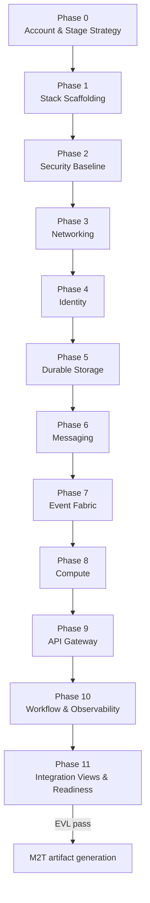

# AWS PSM Modeling Methodology

The Platform-Specific Model (PSM) binds the PIM to AWS resources—SAM stacks, IAM, Lambda, API Gateway,
DynamoDB, messaging, EventBridge, Step Functions, and observability. This guide covers **12 phases
(0–11)** for greenfield AWS PSM work and post–PIM-to-PSM refinement.

After PIM→PSM ETL, refine generated AWS resources **within each phase** following the same order as
greenfield modeling. `SamStack` is the containment hub for most resources.

## Roles

| Role                        | Responsibility in PSM                                              |
| --------------------------- | ------------------------------------------------------------------ |
| **Cloud Platform Engineer** | Phases 0–10: AWS account strategy, stacks, resources, integrations |
| **Process Reviewer**        | Phase 11: integration views, trace closure, EVL gate               |

## Phase Flow

## Phase Overview

| Phase | Name                          | Primary role            | Duration | Inputs                      | Outputs                                |
| ----- | ----------------------------- | ----------------------- | -------- | --------------------------- | -------------------------------------- |
| 0     | Account & Stage Strategy      | Cloud Platform Engineer | 30–45m   | PIM transform or greenfield | `AwsPsmModel`, stages, naming/tagging  |
| 1     | Stack Scaffolding             | Cloud Platform Engineer | ~1h      | Account strategy            | `SamStack`, CFN params/outputs         |
| 2     | Security Baseline             | Cloud Platform Engineer | ~2h      | Stack scaffold              | IAM, KMS, Secrets Manager, SSM         |
| 3     | Networking                    | Cloud Platform Engineer | 1–2h     | Security baseline           | VPC, subnets, endpoints, SGs           |
| 4     | Identity                      | Cloud Platform Engineer | 1–2h     | Networking                  | Cognito pools, clients, identity pools |
| 5     | Durable Storage               | Cloud Platform Engineer | 2–3h     | Identity                    | DynamoDB, S3 buckets and policies      |
| 6     | Messaging                     | Cloud Platform Engineer | 1–2h     | Storage                     | SQS, SNS                               |
| 7     | Event Fabric                  | Cloud Platform Engineer | ~2h      | Messaging                   | EventBridge buses, rules, pipes        |
| 8     | Compute                       | Cloud Platform Engineer | 2–3h     | Event fabric                | Lambda functions, mappings, layers     |
| 9     | API Gateway                   | Cloud Platform Engineer | 2–3h     | Compute                     | HTTP/REST/WebSocket APIs               |
| 10    | Workflow & Observability      | Cloud Platform Engineer | ~2h      | API Gateway                 | Step Functions, CloudWatch             |
| 11    | Integration Views & Readiness | Process Reviewer        | 1–2h     | Workflows complete          | Relationship views, EVL gate           |

---

## Phase 0 — Account & Stage Strategy

**Viewpoint:** dashboard · **Duration:** 30–45 minutes

Define AWS partition, region, stage, and resource naming conventions.

### Tasks

#### Account & Stage Strategy

**Palette focus:** `AwsPsmModel`, `AwsStage`, `AwsNamingPolicy`, `AwsTaggingPolicy`

1. Create `AwsPsmModel` with partition, region, and stage strategy.
2. Define naming and tagging policies.

#### Configure Account & Stage Strategy enumerations

Review: `AwsEnvironmentClass`, `AwsPartition`, `Decision`, `Priority`, `Severity`, `ConstraintStrength`,
`LifecycleStatus`, `TraceConfidence`, `TraceLinkType`, `FindingType`, `StructuredFormat`,
`ExpressionLanguage`, `ExpressionPhase`.

### Common mistakes

| Mistake                                           | EVL rule |
| ------------------------------------------------- | -------- |
| Missing naming policy before resource creation    | —        |
| Stage strategy inconsistent with PIM environments | —        |
| Tags not aligned to organization standards        | —        |

### Phase gate checklist

- [ ] `AwsPsmModel` root with partition and region
- [ ] `AwsStage` strategy defined
- [ ] Naming and tagging policies configured

---

## Phase 1 — Stack Scaffolding

**Viewpoint:** stack · **Duration:** ~1 hour

Create SAM stack structure before adding resources.

### Tasks

**Palette focus:** `SamStack`, `CfnParameter`, `CfnMapping`, `CfnCondition`, `CfnOutput`, `SamGlobals`

1. Create SAM stack with globals.
2. Define CFN parameters, mappings, conditions, outputs.

### Common mistakes

| Mistake                                          | EVL rule |
| ------------------------------------------------ | -------- |
| Resources created outside `SamStack` containment | —        |
| Missing outputs for cross-stack references       | —        |
| Globals not set before function/API defaults     | —        |

### Phase gate checklist

- [ ] `SamStack` with `SamGlobals` configured
- [ ] Parameters, mappings, conditions, and outputs defined
- [ ] Stack scaffolding ready for resources

---

## Phase 2 — Security Baseline

**Viewpoint:** security · **Duration:** ~2 hours

Establish IAM, encryption, and secrets before workload resources.

### Tasks

**Palette focus:** `AwsSecurityBaseline`, `IamRole`, `IamInlinePolicy`, `IamPolicy`, `IamManagedPolicy`, `IamPolicyDocument`, `IamStatement`, `IamPrincipal`, `IamCondition`, `KmsKey`, `KmsAlias`, `GenerateSecretStringConfig`, `SecretsManagerSecret`, `SecretRotationRules`, `SecretRotationSchedule`, `SecretsManagerResourcePolicy`, `SsmParameter`, `SsmParameterValueExpression`, `SecretValueExpression`

1. Establish security baseline and IAM roles/policies.
2. Configure KMS, Secrets Manager, and SSM parameters.

### Common mistakes

| Mistake                                             | EVL rule |
| --------------------------------------------------- | -------- |
| Lambda or API role with overly broad IAM statements | —        |
| Secrets without rotation or resource policy         | —        |
| KMS keys not referenced by encrypted resources      | —        |

### Phase gate checklist

- [ ] Security baseline applied
- [ ] IAM roles and policies for compute/API paths
- [ ] KMS, secrets, and SSM parameters configured

---

## Phase 3 — Networking

**Viewpoint:** networking · **Duration:** 1–2 hours

Configure VPC posture when workloads require private networking.

### Tasks

**Palette focus:** `VpcAttachmentConfig`, `VpcEndpointReference`, `Vpc`, `Subnet`, `VpcEndpoint`, `SecurityGroup`, `SecurityGroupRule`

1. Configure VPC, subnets, and endpoints when required.
2. Define security groups and rules.

### Common mistakes

| Mistake                                                            | EVL rule |
| ------------------------------------------------------------------ | -------- |
| VPC-attached Lambda without subnet or SG                           | —        |
| Security group rules too permissive (0.0.0.0/0 on sensitive ports) | —        |
| Missing VPC endpoints for private AWS service access               | —        |

### Phase gate checklist

- [ ] Network posture defined for workloads
- [ ] Security groups and rules documented
- [ ] VPC endpoints configured where needed

---

## Phase 4 — Identity

**Viewpoint:** identity · **Duration:** 1–2 hours

Map PIM identity providers to Cognito resources.

### Tasks

**Palette focus:** `CognitoUserPool`, `CognitoPasswordPolicy`, `CognitoSchemaAttribute`, `CognitoEmailConfiguration`, `CognitoAccountRecoverySetting`, `CognitoRecoveryMechanism`, `CognitoLambdaConfig`, `CognitoUserPoolClient`, `CognitoOAuthConfiguration`, `CognitoUserPoolGroup`, `CognitoUserPoolDomain`, `CognitoIdentityPool`

1. Configure Cognito user pools, clients, and groups.
2. Set up identity pools for federated access.

### Common mistakes

| Mistake                                              | EVL rule |
| ---------------------------------------------------- | -------- |
| User pool client OAuth config incomplete             | —        |
| PIM `IdentityProvider` not traced to Cognito pool    | —        |
| Password policy weaker than CIM security constraints | —        |

### Phase gate checklist

- [ ] Identity resources match PIM auth model
- [ ] User pool clients and groups configured
- [ ] Identity pools for federated access (if required)

---

## Phase 5 — Durable Storage

**Viewpoint:** storage · **Duration:** 2–3 hours

Provision DynamoDB and S3 aligned to PIM data architecture.

### Tasks

**Palette focus:** `DynamoDbTable`, `DynamoDbAttributeDefinition`, `DynamoDbKeySchemaElement`, `DynamoDbProjection`, `DynamoDbProvisionedThroughput`, `DynamoDbOnDemandThroughput`, `DynamoDbLocalSecondaryIndex`, `DynamoDbGlobalSecondaryIndex`, `DynamoDbReplicaSpecification`, `DynamoDbStreamSpecification`, `DynamoDbTimeToLiveSpecification`, `DynamoDbSseSpecification`, `DynamoDbBackupPolicy`, `S3Bucket`, `S3BucketEncryption`, `S3OwnershipControls`, `S3OwnershipRule`, `S3LifecycleConfiguration`, `S3LifecycleRule`, `S3LifecycleFilter`, `S3TagFilter`, `S3Transition`, `S3PublicAccessBlockConfiguration`, `S3NotificationConfiguration`, `S3NotificationRule`, `S3NotificationDestination`, `S3ReplicationConfiguration`, `S3ReplicationRule`, `S3ReplicationDestination`, `S3BucketPolicy`

1. Provision DynamoDB tables with indexes and streams.
2. Configure S3 buckets with lifecycle and notifications.

### Common mistakes

| Mistake                                             | EVL rule |
| --------------------------------------------------- | -------- |
| GSI key schema not aligned to PIM access pattern    | —        |
| S3 bucket without encryption or public access block | —        |
| Stream specification missing for event-driven paths | —        |

### Phase gate checklist

- [ ] DynamoDB tables match PIM data models
- [ ] Indexes cover access patterns
- [ ] S3 buckets configured with lifecycle and notifications

---

## Phase 6 — Messaging

**Viewpoint:** messaging · **Duration:** 1–2 hours

SQS and SNS resources for PIM channels.

### Tasks

**Palette focus:** `SqsQueue`, `SqsRedrivePolicy`, `SqsRedriveAllowPolicy`, `SqsQueuePolicy`, `SnsTopic`, `SnsSubscription`, `SnsFilterRule`, `SnsTopicPolicy`

1. Create SQS queues with redrive policies.
2. Configure SNS topics and subscriptions.

### Common mistakes

| Mistake                                                      | EVL rule |
| ------------------------------------------------------------ | -------- |
| Queue without dead-letter/redrive configuration              | —        |
| SNS subscription filter not matching PIM event routing       | —        |
| Queue policy missing for cross-account or service principals | —        |

### Phase gate checklist

- [ ] Messaging matches PIM event channels
- [ ] Redrive policies configured
- [ ] Topic subscriptions and filters complete

---

## Phase 7 — Event Fabric

**Viewpoint:** events · **Duration:** ~2 hours

EventBridge buses, rules, schedules, pipes, and API destinations.

### Tasks

**Palette focus:** `EventBridgeBus`, `EventBridgeBusPolicy`, `EventBridgeRule`, `EventPattern`, `EventBridgeTarget`, `EventBridgeTargetParameters`, `EventBridgeSqsTargetParameters`, `EventBridgeHttpTargetParameters`, `HttpParameter`, `EventBridgeBatchTargetParameters`, `EventBridgeInputTransformer`, `EventBridgeArchive`, `EventBridgeSchedule`, `EventBridgeFlexibleTimeWindow`, `EventBridgePipe`, `EventBridgeAuthParameters`, `EventBridgeApiKeyAuthParameters`, `EventBridgeBasicAuthParameters`, `EventBridgeOAuthParameters`, `EventBridgeHttpParameters`, `EventBridgeConnection`, `EventBridgeApiDestination`, `AwsRetryPolicy`

1. Configure EventBridge buses, rules, and targets.
2. Set up schedules, pipes, and API destinations.

### Common mistakes

| Mistake                                                        | EVL rule |
| -------------------------------------------------------------- | -------- |
| Rule target not connected to queue, Lambda, or API destination | —        |
| Schedule without flexible time window when jitter required     | —        |
| API destination connection auth incomplete                     | —        |

### Phase gate checklist

- [ ] Event fabric matches PIM integration topology
- [ ] Rules, schedules, and pipes configured
- [ ] API destinations for external integrations

---

## Phase 8 — Compute

**Viewpoint:** compute · **Duration:** 2–3 hours

Lambda functions with event source mappings and permissions.

### Tasks

#### Compute

**Palette focus:** `AwsLambdaFunction`, `LambdaCodeConfig`, `LambdaZipCodeConfig`, `LambdaImageCodeConfig`, `LambdaImageConfig`, `LambdaEnvironmentVariable`, `LambdaInvocationBinding`, `SamFunctionEvent`, `LambdaEventSourceMapping`, `SqsLambdaEventSourceMapping`, `DynamoDbStreamLambdaEventSourceMapping`, `GenericLambdaEventSourceMapping`, `LambdaDeadLetterConfig`, `LambdaEventInvokeConfig`, `LambdaDestinationConfig`, `LambdaTracingConfig`, `LambdaLoggingConfig`, `LambdaLayerVersion`, `LambdaLayerPermission`, `LambdaVersion`, `LambdaAlias`, `LambdaProvisionedConcurrencyConfig`, `LambdaPermission`, `LambdaFunctionUrl`, `LambdaUrlCorsConfiguration`, `LambdaFileSystemConfig`, `CodeSigningConfig`

1. Deploy Lambda functions with code config and layers.
2. Configure event source mappings and permissions.

#### Configure Compute enumerations

Review: `PackageType`, `LambdaArchitecture`, `LambdaTracingMode`, `LambdaRuntimeManagementMode`,
`LambdaSnapStartApplyOn`, `LambdaInvokeMode`, `LambdaFunctionUrlAuthType`, `LambdaRecursiveLoopMode`,
`LambdaEventSourceKind`, `StartingPosition`.

### Common mistakes

| Mistake                                              | EVL rule |
| ---------------------------------------------------- | -------- |
| Function IAM role from Phase 2 not attached          | —        |
| Event source mapping type mismatched to trigger      | —        |
| Environment variables referencing unresolved secrets | —        |

### Phase gate checklist

- [ ] Compute matches PIM functions
- [ ] Event source mappings and permissions complete
- [ ] Tracing and logging configured

---

## Phase 9 — API Gateway

**Viewpoint:** api · **Duration:** 2–3 hours

HTTP, REST, and WebSocket APIs with authorizers and stages.

### Tasks

#### API Gateway

**Palette focus:** `ApiGatewayApi`, `HttpApi`, `RestApi`, `WebSocketApi`, `ApiGatewayRoute`, `HttpApiRoute`, `RestApiRoute`, `RestApiResource`, `RestApiMethod`, `WebSocketRoute`, `ApiGatewayRequestModel`, `ApiGatewayResponseModel`, `ApiGatewayRequestValidator`, `ApiGatewayRouteSetting`, `ApiGatewayAccessLogSetting`, `ApiGatewayIntegration`, `ApiGatewayIntegrationRequestTemplate`, `ApiGatewayIntegrationResponseParameter`, `ApiGatewayStage`, `HttpApiStage`, `RestApiStage`, `WebSocketStage`, `ApiGatewayAuthorizer`, `JwtAuthorizer`, `CognitoAuthorizer`, `LambdaAuthorizer`, `ApiGatewayDomainName`, `ApiGatewayBasePathMapping`, `ApiGatewayApiKey`, `ApiGatewayUsagePlan`, `ApiGatewayUsagePlanKey`, `ApiGatewayDeployment`, `ApiGatewayTracingConfig`, `WafWebAclAssociation`

1. Configure HTTP/REST/WebSocket APIs with routes.
2. Set up integrations, authorizers, and stages.

#### Configure API Gateway enumerations

Review: `ApiGatewayKind`, `ApiGatewayEndpointType`, `ApiGatewayAuthorizationType`, `ApiGatewayIntegrationType`, `ApiGatewayHttpMethod`.

### Common mistakes

| Mistake                                            | EVL rule |
| -------------------------------------------------- | -------- |
| Route integration pointing to wrong Lambda alias   | —        |
| Cognito authorizer not linked to Phase 4 user pool | —        |
| Missing WAF association on public API              | —        |

### Phase gate checklist

- [ ] API Gateway matches PIM APIs
- [ ] Integrations, authorizers, and stages complete
- [ ] Usage plans and throttling configured (if required)

---

## Phase 10 — Workflow & Observability

**Viewpoint:** workflow · **Duration:** ~2 hours

Step Functions and CloudWatch observability.

### Tasks

**Palette focus:** `StepFunctionStateMachine`, `AslDocument`, `AslState`, `AslBranch`, `AslMapConfig`, `AslRetryRule`, `AslCatchRule`, `AslChoiceRule`, `StepFunctionLoggingConfig`, `StepFunctionTracingConfig`, `SamStateMachineEvent`, `CloudWatchLogGroup`, `CloudWatchMetricFilter`, `CloudWatchMetricTransformation`, `CloudWatchLogSubscriptionFilter`, `CloudWatchAlarm`, `MetricDimension`, `CloudWatchCompositeAlarm`, `CloudWatchDashboard`, `CorsConfiguration`, `TracingConfig`

1. Deploy Step Functions state machines with ASL.
2. Configure CloudWatch logs, alarms, and dashboards.

### Common mistakes

| Mistake                                                | EVL rule |
| ------------------------------------------------------ | -------- |
| ASL state machine not validated before gate            | —        |
| Alarms without dimensions matching PIM SLOs            | —        |
| Step Function IAM role insufficient for target Lambdas | —        |

### Phase gate checklist

- [ ] Workflows and observability complete
- [ ] ASL documents validated
- [ ] CloudWatch alarms and dashboards configured

---

## Phase 11 — Integration Views & Readiness

**Viewpoint:** readiness · **Duration:** 1–2 hours

Cross-resource relationship views and PSM EVL gate before M2T generation.

### Tasks

#### Integration Views & Readiness

**Palette focus:** `AwsTag`, `ResourceImport`, `NativeProperty`, `AwsRelationshipView`, `ApiGatewayLambdaIntegrationView`, `EventBridgeLambdaTargetView`, `SnsLambdaSubscriptionView`, `SqsLambdaEventSourceView`, `StepFunctionEventBridgeTargetView`, `S3LambdaNotificationView`, `S3QueueNotificationView`, `S3TopicNotificationView`, `TraceModel`, `TraceLink`, `TransformationAssumption`, `ProductionReadinessAssessment`, `ReadinessFinding`, `ReadinessCheck`, `ManualDecision`

1. Create integration relationship views.
2. Complete trace and readiness closure.
3. Pass PSM EVL before M2T generation.

#### Configure Integration Views & Readiness enumerations

Review remaining PSM enumerations including `EventBridgeHttpMethod`, `EventBridgeTargetKind`,
`DynamoDbBillingMode`, `StepFunctionType`, `AslStateType`, `IamEffect`, `SamCapability`, and related
storage, messaging, and observability enums.

### Common mistakes

| Mistake                                              | EVL rule                  |
| ---------------------------------------------------- | ------------------------- |
| Relationship view missing for Lambda–API integration | —                         |
| Broken trace link to PIM source                      | —                         |
| Proceeding to M2T with open readiness findings       | `psm-semantic-validation` |

### Phase gate checklist

- [ ] Integration relationship views complete
- [ ] Trace model links PSM to PIM elements
- [ ] Readiness findings resolved or waived
- [ ] **PSM EVL passes** (`psm-semantic-validation`)
- [ ] Process Reviewer sign-off obtained

---

## Next Steps

When Phase 11 gate criteria are met, proceed to [M2T artifact generation](generated-artifacts.md)
and the [End-to-End Modeling Methodology](end-to-end-modeling-methodology.md).
