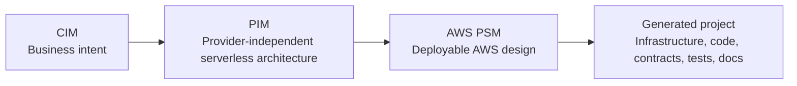

# Varka

Varka is an AI-assisted, model-driven low-code platform for designing and producing serverless
software. It combines formal domain-specific modeling languages, visual editing, semantic
validation, model transformation, artifact generation, and bounded AI assistance in one workflow.

The platform guides a system from business intent to deployable AWS serverless artifacts:

## What Varka Provides

- A browser-based visual editor for CIM, PIM, and PSM models.
- Formal metamodels authored in Emfatic and compiled to Ecore.
- Semantic validation implemented with Eclipse Epsilon EVL.
- CIM-to-PIM and PIM-to-AWS-PSM transformations implemented with ETL.
- AWS project generation implemented with EGX/EGL.
- PostgreSQL persistence for users, projects, models, artifacts, jobs, and assistant state.
- A bounded AI modeling assistant with retrieval, auto-applied validated changes, and undo.
- Reusable Java runners and command-line tools for MDE automation.

## Choose Your Path

| Goal                                 | Start here                                                       |
| ------------------------------------ | ---------------------------------------------------------------- |
| Run the whole platform               | [Quickstart](getting-started/quickstart.md)                      |
| Understand the modeling method       | [Model-Driven Engineering](concepts/model-driven-engineering.md) |
| Create and generate a project        | [Modeling Workflow](guides/modeling-workflow.md)                 |
| Integrate through HTTP               | [REST API](reference/rest-api.md)                                |
| Use the assistant safely             | [AI Assistant](guides/ai-assistant.md)                           |
| Extend a metamodel or transformation | [Change Guide](contributing/change-guide.md)                     |
| Operate or troubleshoot Varka        | [Deployment](operations/deployment.md)                           |

## Current Scope

Varka currently targets AWS serverless architecture. The formal pipeline, backend services,
frontend workbenches, storage, assistant, CLI tools, diagram editing, impact-analysis APIs,
and generated AWS project templates are implemented. Admin workspace APIs under `/api/admin/**`
remain planned endpoints.

The project is both a research platform and an engineering system. Its documentation therefore
describes not only how to use it, but also the formal sources of truth, traceability boundaries,
runtime architecture, and extension rules.
