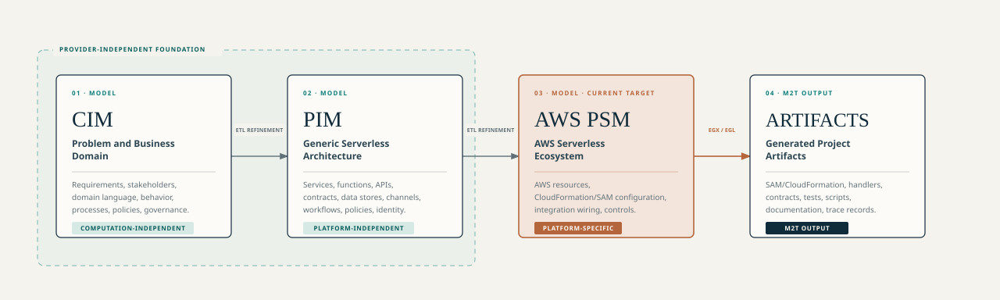

<section class="doc-home-hero" markdown="1">

Academic research project · Technical documentation

# A model-driven methodology for serverless software development

MODRISS is an ongoing academic research project at the Methodology Engineering Laboratory, Sharif University of Technology. It studies support for serverless software development through a defined process and modeling framework, including domain-specific modeling languages, model transformations, and code generation. The project also examines LLM-assisted modeling for creating, explaining, and modifying models.

  <a href="getting-started/quickstart/">Quickstart</a>
  <a href="guides/full-lifecycle-method/">Full-lifecycle development process</a>

</section>

## Methodology structure

The MODRISS methodology comprises a development process and a modeling framework. The process coordinates sequential Development and Delivery phases with an ongoing, event-driven Operations and Maintenance process, and defines activities, roles, tasks, work products, decision points, iterations, and cross-cutting activities. The modeling framework defines the domain-specific languages and metamodels, their semantics and constraints, model transformations, code generation, notation, and tool support. In the process definitions, reusable method content describes role, task, work-product, and guidance definitions; process activities specify how that content is used.

<figure class="doc-diagram">
  
  <figcaption>Two coordinated processes in the maintained product lifecycle.</figcaption>
</figure>

The model-driven delivery engine operates within the single active-product phase. It takes one capability increment through CIM, PIM, AWS PSM, generation, and readiness review. Accepted increments can be assembled, qualified, and promoted through repeatable release activities. Operational evidence can inform later changes to the product and its development process; neither the increment nor release cycle repeats a lifecycle phase.

## Documentation structure

<a class="doc-path-card" href="getting-started/overview/">
  <strong>Project overview</strong>
  Research scope, runtime components, typical lifecycle, and formal sources.
</a>

<a class="doc-path-card" href="guides/end-to-end-modeling-methodology/">
  <strong>Capability-increment process</strong>
  The eight-step capability-increment process and its reviews, roles, and decisions.
</a>

<a class="doc-path-card" href="dsml/">
  <strong>Modeling-language reference</strong>
  Structures and features defined by the CIM, PIM, and AWS PSM metamodels.
</a>

<a class="doc-path-card" href="reference/rest-api/">
  <strong>Prototype reference</strong>
  Architecture, APIs, configuration, persistence, and development operations.
</a>

## Modeling framework

The three modeling levels describe different concerns. CIM records business and domain intent. PIM expresses a serverless architecture without fixing it to a cloud provider. AWS PSM specifies the provider resources and deployment structure used by the current project generator.

<figure class="doc-diagram">
  
  <figcaption>CIM, PIM, AWS PSM, and generated project artifacts.</figcaption>
</figure>

Model transformations provide draft target models for review and refinement. Explicit user/model validation workflows can run EVL semantic rules. Assistant-generated actions, patches, proposals, checkpoints, and model outputs use only structural Ecore/EMF conformance through `ModelService.validateStructural(...)`; assistant apply, repair, and commit paths do not run EVL or stored semantic validation.

## Research prototype

The repository contains browser workbenches for CIM, PIM, and AWS PSM; Ecore metamodels and EVL rules; model transformations and artifact generators; project persistence; and an assistant for CIM and PIM modeling. The implementation remains a research prototype under active development. The current administrative HTTP routes under `/api/admin/**` return HTTP 501.
