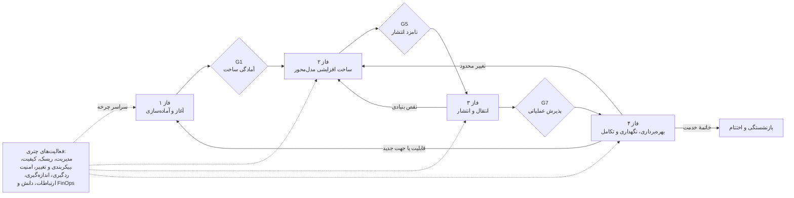
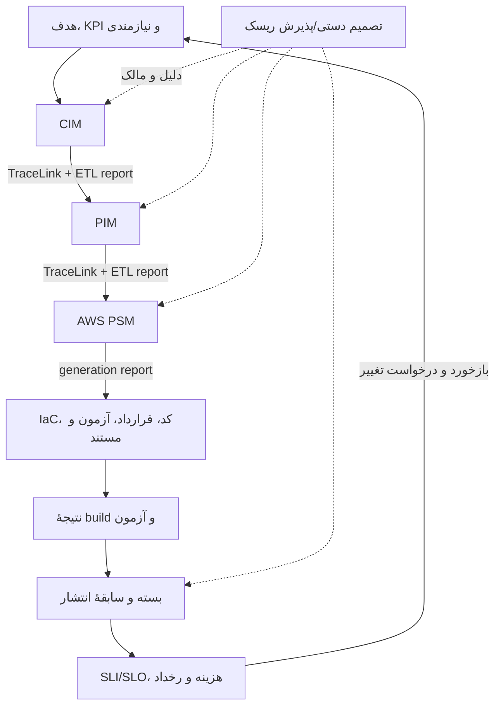
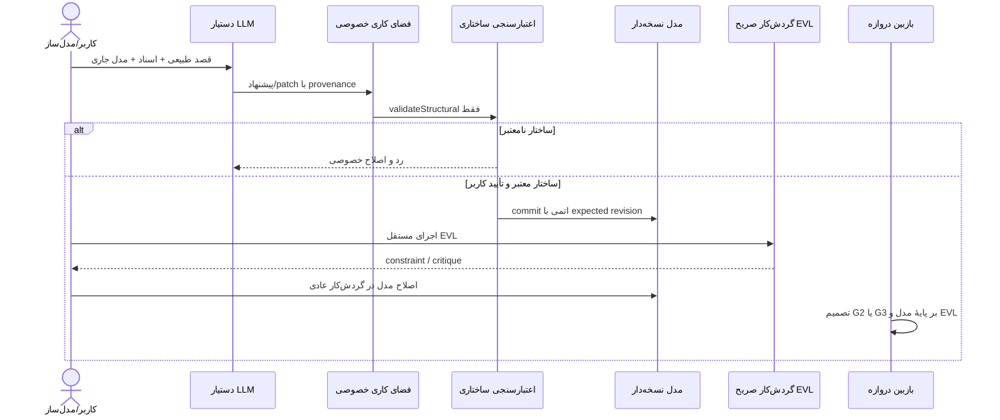
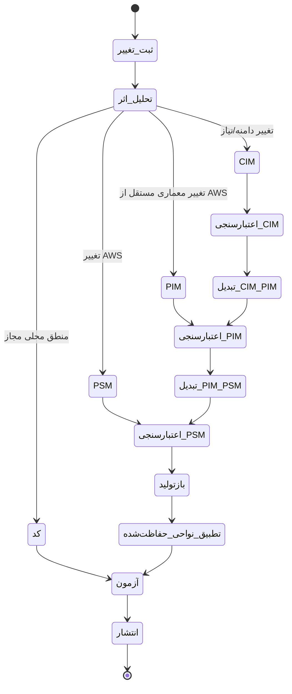
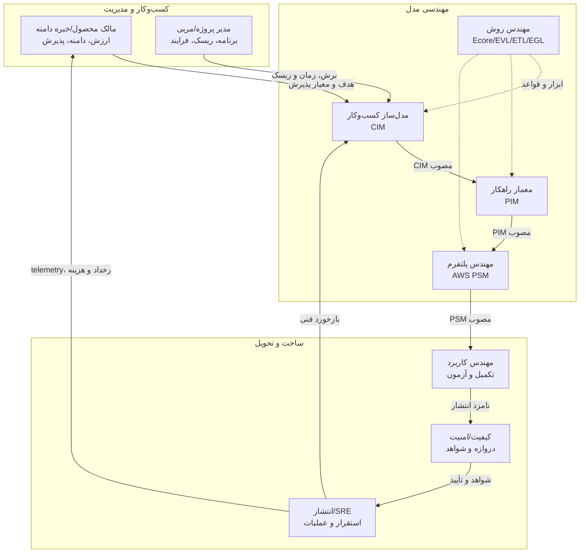

# فرایند توسعهٔ نرم‌افزار مدل‌محور سرورلس Varka

> **وضعیت سند:** تعریف مبنای فرایند (Process Baseline) برای متدولوژی Varka  
> **دامنه:** چرخهٔ کامل پروژه، از توجیه و برنامه‌ریزی تا مدل‌سازی، تولید، انتشار، بهره‌برداری، تکامل و خاتمه  
> **چارچوب علمی:** مهندسی روش موقعیتی (SME)، الگوهای فرایندی MDASP و ساختار سه‌لایهٔ فاز–مرحله–وظیفه  
> **زبان و ابزار مدل‌محور:** Ecore/EMF، EVL، ETL، EGX/EGL و پلتفرم کم‌کد Varka

## ۱. هدف و جایگاه این سند

متدولوژی Varka از دو جزء مکمل تشکیل می‌شود:

1. **چارچوب توسعهٔ مدل‌محور:** تعیین می‌کند مصنوعات فنی چگونه با DSMLهای CIM، PIM و AWS PSM مدل شوند، چگونه اعتبارسنجی و تبدیل شوند و چگونه از آن‌ها کد، زیرساخت، قرارداد، آزمون و مستندات تولید شود.
2. **فرایند توسعهٔ نرم‌افزار:** تعیین می‌کند چه کسی، چه کاری را، در چه زمان و به چه دلیل، با مصرف کدام مصنوعات و تولید کدام شواهد انجام دهد.

این سند جزء دوم را تعریف و آن را با جزء اول یکپارچه می‌کند. بنابراین موضوع سند فقط «فرایند مدل‌سازی» نیست؛ برنامه‌ریزی، زمان‌بندی، سازمان‌دهی تیم، مدیریت ریسک و کیفیت، ساخت، آزمون، انتشار، عملیات، نگهداری و بهبود فرایند را نیز پوشش می‌دهد.

تعریف‌های فنی موجود در `mde/methodology/process-definitions/` و `mde/methodology/spem/` محتوای اجرایی و ماشین‌خوانِ زیرفرایندهای مدل‌سازی هر سطح‌اند. آن‌ها جایگزین چرخهٔ عمر کامل این سند نیستند، بلکه در مرحله‌های CIM، PIM، PSM و تکمیل مصنوعات فراخوانی می‌شوند.

## ۲. مبنای علمی و روش استخراج فرایند

### ۲.۱. مبنای الگوهای فرایندی

Asadi، Esfahani و Ramsin در مقالهٔ «Process Patterns for MDA-Based Software Development» با مطالعهٔ شش متدولوژی MDA، یک فرایند عمومی به نام MDASP و مجموعه‌ای از الگوهای فرایندی قابل‌بازاستفاده ارائه کرده‌اند. این سند مفاهیم زیر را از آن مبنا اقتباس می‌کند:

- ساختار سه‌لایهٔ **الگوی فاز، الگوی مرحله و الگوی وظیفه**؛
- تعریف هر الگو با مسئله/هدف، نقش، زمینهٔ اولیه، زمینهٔ نهایی و مصنوعات ورودی/خروجی؛
- ترتیب کلان فازها و تکرارشوندگی مرحله‌های درونی؛
- الگوهای آغاز پروژه، تعریف CIM، تحلیل نیازمندی، تعریف زیرساخت، برنامه‌ریزی و مدیریت، تعریف PIM، تبدیل، کدنویسی/آزمون، آزمون در مقیاس بزرگ، استقرار، نگهداری، تعمیم و مرور پس از اقدام؛
- استفاده از مهندسی روش موقعیتی برای انطباق فرایند با وضعیت هر پروژه.

مقاله فعالیت‌های چتری را در سراسر چرخهٔ عمر نشان می‌دهد، اما خود تصریح می‌کند که الگوهای ریزدانهٔ آن‌ها را به‌طور کامل استخراج نکرده است. در این سند، این شکاف با فعالیت‌های لازم برای یک پروژهٔ واقعی و با توجه به شواهد فنی Varka تکمیل شده است؛ بنابراین نباید جزئیات فعالیت‌های چتری این سند را عیناً به MDASP نسبت داد.

### ۲.۲. نقش نمونهٔ فارسی

فصل فرایند پیشنهادی Deljouyi نمونه‌ای از انطباق یک چارچوب مدل‌محور با فرایند کامل توسعه است. از آن، شیوهٔ ارائهٔ نقش‌ها، محصولات هر فاز، ساخت تکراری–افزایشی، آزمون کوچک/بزرگ، CI/CD، مسیرهای بازگشت و جداسازی انتقال از نگهداری اقتباس شده است. اجزای خاص دامنهٔ آن مانند هستان‌شناسی، YAML و REST به Varka منتقل نشده‌اند و با CIM/PIM/AWS PSM و زنجیرهٔ واقعی ابزارهای پروژه جایگزین شده‌اند.

### ۲.۳. مهندسی روش موقعیتی

فرایند حاضر یک نسخهٔ تطبیق‌یافته از الگوهاست، نه رونویسی آن‌ها. روش ساخت آن چنین است:

1. استخراج هستهٔ مشترک MDASP؛
2. شناسایی وضعیت پروژه: مدل‌محور، سرورلس، AWS، تولید نیمه‌خودکار، کم‌کد و دارای دستیار LLM؛
3. نگاشت الگوهای عمومی به دارایی‌های واقعی مخزن؛
4. افزودن وظایف ضروری سرورلس مانند امنیت ابری، مشاهده‌پذیری، هزینه، آمادگی عملیاتی و بازیابی؛
5. تعریف نقاط کنترل، بازخورد و قواعد انطباق؛
6. حفظ یک هستهٔ اجباری و اجازهٔ سبک‌سازی کنترل‌شده برای وضعیت‌های مختلف پروژه.

### ۲.۴. نگاشت MDASP به Varka

| الگوی MDASP                   | تحقق یا انطباق در Varka                                                        |
| ----------------------------- | ------------------------------------------------------------------------------ |
| Project Initiation            | فاز ۱: آغاز و آماده‌سازی پروژه                                                 |
| Justify                       | امکان‌سنجی کسب‌وکاری، فنی، عملیاتی، انسانی، امنیتی و هزینه‌ای                  |
| Define CIM                    | کشف مسئله و ساخت افزایشی CIM؛ بخشی از فاز ۱ و موتور ساخت                       |
| Requirements Analysis         | مهندسی نیازمندی و معیار پذیرش، پیوندخورده با CIM                               |
| Define Infrastructure         | آماده‌سازی Varka، مخزن، محیط‌ها، AWS/LocalStack، CI/CD و روش کار               |
| Planning and Management       | برنامهٔ پروژه، بک‌لاگ، زمان‌بندی، ریسک، ارتباطات و راهبرد انتشار               |
| Model-Based Construction      | فاز ۲ و موتور عمودی CIM→PIM→PSM→Artifacts                                      |
| Define PIM                    | زیرفرایند SPEM سطح PIM و بازبینی معمار راهکار                                  |
| Transformation                | ETL از CIM به PIM و از PIM به AWS PSM، همراه با کنترل ورودی/خروجی و ردگیری     |
| Coding/Testing                | EGX/EGL، تکمیل نواحی حفاظت‌شده، آزمون کوچک و یکپارچه‌سازی پیوسته               |
| Source/Target Synchronization | مدیریت تغییر مدل‌محور و بازتولید کنترل‌شده؛ نه همگام‌سازی کور دوطرفهٔ کد و مدل |
| Test in the Large             | فاز ۳: آزمون سامانه، پذیرش، امنیت، کارایی، بازیابی و آزمون استقرار             |
| Deployment                    | انتشار مرحله‌ای، تأیید تولید و واگذاری عملیاتی                                 |
| Maintenance                   | فاز ۴: عملیات، پشتیبانی، نگهداری و تکامل مدل‌محور                              |
| Generalization                | استخراج دارایی‌های قابل‌بازاستفاده از مدل، تبدیل، قالب، راهنما و الگوی عملیات  |
| Postmortem Review             | مرور انتشار/رخداد/پروژه و بهبود خط‌مبنای فرایند                                |

## ۳. مشخصات وضعیت و اصول فرایند

### ۳.۱. ویژگی‌های تعیین‌کننده

- مدل‌ها مصنوعات درجه‌اول و منبع تصمیمات معماری‌اند.
- سه سطح رسمی وجود دارد: CIM، PIM و AWS PSM.
- تبدیل‌های ETL نیمه‌خودکارند و خروجی آن‌ها باید بازبینی و تکمیل شود.
- تولید EGX/EGL علاوه بر زیرساخت و کد Go، قراردادها، آزمون‌ها، اسکریپت‌ها، CI/CD، مستندات و شواهد ردگیری را تولید می‌کند.
- سامانهٔ هدف سرورلس است؛ مسئولیت تیم از تولید کد تا امنیت، مشاهده‌پذیری، هزینه و قابلیت عملیات امتداد دارد.
- دستیار LLM ابزار کمکی مدل‌سازی CIM/PIM است و صاحب تصمیم، تأییدکننده یا دروازهٔ کیفیت نیست.
- فرایند در سطح کلان مرحله‌ای و درون فاز ساخت، تکراری–افزایشی و مبتنی بر برش عمودی است.

### ۳.۲. اصول الزام‌آور

1. **ارزش و ریسک پیش از حجم مدل:** هر تکرار یک قابلیت کوچک، قابل‌آزمون و اولویت‌دار را از مسئله تا مصنوع قابل‌اجرا عبور می‌دهد.
2. **مدل‌اول برای تغییرات ساختاری:** تغییر معماری، قرارداد، منبع ابری یا اتصال ابتدا در نزدیک‌ترین مدل مبدأ اعمال و سپس رو به جلو منتشر می‌شود.
3. **انسان در حلقه:** هیچ تبدیل، پیشنهاد LLM یا خروجی تولیدگر به‌تنهایی مجوز عبور از دروازه نیست.
4. **بازبینی در مرز هر سطح:** CIM، PIM، PSM و نامزد انتشار هر یک معیار خروج مستقل دارند.
5. **کیفیت درون‌ساخت:** اعتبارسنجی و آزمون به انتهای پروژه موکول نمی‌شوند.
6. **ردگیری انتهابه‌انتها:** هدف/نیازمندی باید تا عناصر مدل، مصنوعات تولیدی، آزمون و انتشار قابل‌پیگیری باشد.
7. **امنیت، حریم خصوصی و عملیات از ابتدا:** این موارد نیازمندی عرضی و بخشی از طراحی‌اند، نه کار پس از تولید.
8. **تولید تکرارپذیر:** نامزد انتشار باید از نسخه‌های مشخص مدل، تبدیل و قالب‌ها دوباره تولیدشدنی باشد.
9. **تمایز خطا و هشدار:** شکست constraint اجباری EVL مانع عبور است؛ critique باید رفع یا با دلیل و مالک پذیرفته شود.
10. **بهبود مبتنی بر شواهد:** تغییر فرایند بر اساس سنجه، مرور تکرار، رخداد و مرور پس از اقدام انجام می‌شود.

## ۴. معماری چرخهٔ عمر

فرایند چهار فاز کلان دارد. فازها در مقیاس پروژه جهت غالب ترتیبی دارند، اما بازخورد و تکامل کنترل‌شده میان آن‌ها مجاز است.

### ۴.۱. موتور تکرار عمودی

واحد پیشرفت، «درصد تکمیل یک مدل بزرگ» نیست؛ یک **برش قابلیت** است که شواهد آن در تمام سطوح موجود باشد.

```mermaid
flowchart LR
    B["انتخاب قابلیت و معیار پذیرش"] --> C["CIM<br/>مسئله، دامنه، رفتار و حکمرانی"]
    C --> GC{"G2<br/>CIM آماده؟"}
    GC -->|خیر| C
    GC -->|بله| T1["ETL<br/>CIM→PIM"]
    T1 --> P["PIM<br/>معماری سرورلس مستقل از فراهم‌کننده"]
    P --> GP{"G3<br/>PIM آماده؟"}
    GP -->|خیر| P
    GP -->|بله| T2["ETL<br/>PIM→AWS PSM"]
    T2 --> S["AWS PSM<br/>منابع، اتصال‌ها و استقرار"]
    S --> GS{"G4<br/>PSM آماده؟"}
    GS -->|خیر| S
    GS -->|بله| M2T["EGX/EGL<br/>تولید مصنوعات"]
    M2T --> H["تکمیل، آزمون کوچک و CI"]
    H --> RV["بازبینی افزایش"]
    RV -->|بک‌لاگ باقی است| B
    RV -->|دامنهٔ انتشار کامل است| RC["نامزد انتشار"]
```

هر چرخش می‌تواند به‌صورت پیشنهادی یک تا دو هفته زمان‌بندی شود، اما طول آن باید بر اساس ریسک، اندازهٔ قابلیت و توان تیم ثبت شود. تکمیل یک برش، نه پایان یک بازهٔ زمانی، معیار واقعی پیشرفت است.

## ۵. نقش‌ها

یک فرد می‌تواند در پروژهٔ کوچک چند نقش داشته باشد، اما مسئولیت‌ها حذف نمی‌شوند. در تصمیم‌های پرریسک، بازبین نباید همان پدیدآورندهٔ اصلی باشد.

| شناسه | نقش                             | مسئولیت اصلی                                                              |
| ----- | ------------------------------- | ------------------------------------------------------------------------- |
| R01   | حامی/مالک کسب‌وکار              | تأمین اختیار و بودجه، تأیید توجیه، حل تعارض‌های سطح سازمان                |
| R02   | مالک محصول                      | صدای واحد ذی‌نفعان، اولویت‌بندی بک‌لاگ، پذیرش ارزش و دامنه                |
| R03   | مدیر پروژه/مربی فرایند          | برنامه، زمان‌بندی، ریسک، ارتباطات، اجرای صحیح و انطباق فرایند             |
| R04   | خبرهٔ دامنه                     | معنا و قواعد دامنه، زبان مشترک، سناریو و صحت CIM                          |
| R05   | مهندس نیازمندی/مدل‌ساز کسب‌وکار | نیازمندی، معیار پذیرش، CIM، ردگیری و همگرایی مسئله–راهکار                 |
| R06   | معمار راهکار                    | PIM، مرز خدمات، قرارداد، داده، یکپارچه‌سازی، سیاست و تصمیم معماری         |
| R07   | مهندس پلتفرم ابری               | AWS PSM، حساب/مرحله، IAM، شبکه، منابع، IaC و خودکارسازی تحویل             |
| R08   | مهندس کاربرد                    | تکمیل منطق کسب‌وکار و نواحی حفاظت‌شده، آزمون واحد/یکپارچه و رفع نقص       |
| R09   | مهندس کیفیت/بازبین فرایند       | راهبرد آزمون، بازبینی مستقل مدل، اجرای دروازه‌ها و مدیریت شواهد کیفیت     |
| R10   | مهندس امنیت و حریم خصوصی        | مدل تهدید، کنترل‌های امنیتی، کمینه‌سازی مجوز، بررسی یافته‌ها و پذیرش ریسک |
| R11   | مهندس قابلیت اطمینان/مالک خدمت  | SLO، مشاهده‌پذیری، رخداد، ظرفیت، هزینه، runbook و پذیرش عملیاتی           |
| R12   | مهندس انتشار                    | نسخه‌بندی، بستهٔ انتشار، تأییدها، استقرار مرحله‌ای و بازگشت               |
| R13   | مهندس روش                       | نگهداری متامدل، EVL، ETL، EGX/EGL، فرایند SPEM و سازگاری دارایی‌های روش   |
| R14   | طراح تجربهٔ کاربر               | نمونهٔ رابط، آزمون کاربردپذیری و دسترس‌پذیری؛ در صورت وجود رابط انسانی    |
| R15   | کاربر/نمایندهٔ عملیات           | مشارکت در کشف، آزمون پذیرش، آموزش و بازخورد بهره‌برداری                   |
| T01   | پلتفرم Varka                    | ابزار اجرای مدل‌سازی، ذخیره، اعتبارسنجی، تبدیل، تولید و کاوش مصنوعات      |
| T02   | دستیار مدل‌سازی LLM             | ابزار پیشنهاد/ایجاد ساختاری CIM و PIM تحت کنترل انسان و قواعد بخش ۱۲      |

### ۵.۱. ماتریس مسئولیت کلیدی

راهنما: **پ** پدیدآور/مسئول انجام، **ت** تأییدکننده، **م** مشاور، **آ** آگاه.

| فعالیت                | R02 | R03 | R05 | R06 | R07 | R08 | R09 | R10 | R11 | R12 | R13 |
| --------------------- | --: | --: | --: | --: | --: | --: | --: | --: | --: | --: | --: |
| توجیه و دامنه         |   ت |   پ |   م |   م |   آ |   آ |   آ |   م |   م |   آ |   آ |
| CIM و نیازمندی        |   ت |   آ |   پ |   م |   آ |   آ |   م |   م |   م |   آ |   م |
| PIM                   |   م |   آ |   م | پ/ت |   م |   م |   م |   م |   م |   آ |   م |
| AWS PSM               |   آ |   آ |   آ |   ت |   پ |   م |   م |   م |   م |   آ |   م |
| اعتبارسنجی معنایی مدل |   آ |   آ |   پ |   پ |   پ |   آ |   ت |   م |   م |   آ |   م |
| تولید و تکمیل مصنوعات |   آ |   آ |   آ |   م |   پ |   پ |   م |   م |   م |   آ |   م |
| آزمون و نامزد انتشار  |   ت |   آ |   م |   م |   م |   پ | پ/ت |   م |   م |   پ |   آ |
| مجوز انتشار تولید     |   ت |   آ |   آ |   م |   م |   آ |   م |   ت |   ت |   پ |   آ |
| عملیات و رخداد        |   آ |   آ |   آ |   م |   م |   م |   م |   م | پ/ت |   آ |   آ |
| تغییر دارایی روش      |   آ |   آ |   م |   م |   م |   م |   ت |   م |   م |   آ |   پ |

## ۶. فهرست مصنوعات

| شناسه | مصنوع                                                                  | مالک معمول     | وضعیت/مخزن            |
| ----- | ---------------------------------------------------------------------- | -------------- | --------------------- |
| A01   | منشور، توصیف مسئله و چشم‌انداز محصول                                   | R02/R03        | نسخه‌دار              |
| A02   | مطالعهٔ امکان‌سنجی و توجیه اقتصادی                                     | R03            | مصوب در G0            |
| A03   | دامنه، ذی‌نفعان و نقشهٔ قابلیت‌ها                                      | R02/R05        | پیوندخورده با CIM     |
| A04   | بک‌لاگ نیازمندی‌ها و معیارهای پذیرش                                    | R02/R05        | اولویت‌دار و نسخه‌دار |
| A05   | برنامهٔ پروژه، زمان‌بندی، نقاط عطف و راهبرد تکرار                      | R03            | خط‌مبنای مدیریتی      |
| A06   | دفتر ریسک، فرض، مسئله و وابستگی (RAID)                                 | R03            | زنده                  |
| A07   | برنامهٔ کیفیت و راهبرد آزمون                                           | R09            | زنده                  |
| A08   | مدل تهدید، حریم خصوصی و نیازمندی‌های انطباق                            | R10            | زنده                  |
| A09   | سند انطباق فرایند و سازمان تیم                                         | R03/R13        | مصوب در G1            |
| A10   | CIM و گزارش ساختاری/EVL/آمادگی آن                                      | R05            | مدل رسمی              |
| A11   | PIM و گزارش ساختاری/EVL/آمادگی آن                                      | R06            | مدل رسمی              |
| A12   | AWS PSM و گزارش ساختاری/EVL/آمادگی آن                                  | R07            | مدل رسمی              |
| A13   | TraceModel، تصمیم‌های دستی و تاریخچهٔ منشأ                             | R05/R06/R07    | انتهابه‌انتها         |
| A14   | نسخه و گزارش اجرای ETLها                                               | R13/مجری تبدیل | بازتولیدپذیر          |
| A15   | خط‌مبنای تولیدشده: IaC، کد، قرارداد، آزمون، سند و CI/CD                | R07/R08        | خروجی EGX/EGL         |
| A16   | گزارش تولید، manual actions، security review و protected regions       | R07/R08/R10    | الزام بازبینی         |
| A17   | کد تکمیل‌شده و آزمون‌های کوچک                                          | R08            | نسخه‌دار              |
| A18   | گزارش ساخت، آزمون، اسکن و اعتبارسنجی زیرساخت/قرارداد                   | R09            | شاهد نامزد انتشار     |
| A19   | قرارداد محیط، پارامترها و ارجاع رازها                                  | R07/R11        | بدون راز خام در مخزن  |
| A20   | بستهٔ انتشار، صورت‌مواد نسخه و provenance                              | R12            | تغییرناپذیر           |
| A21   | برنامهٔ استقرار، بازگشت و ارتباطات                                     | R12/R11        | مصوب در G6            |
| A22   | runbook، SLO، داشبورد، هشدار و مالکیت خدمت                             | R11            | آمادگی عملیاتی        |
| A23   | نتایج آزمون بزرگ و پذیرش                                               | R09/R02        | شاهد G6               |
| A24   | سابقهٔ استقرار، پایش پس از انتشار و تأیید عملیاتی                      | R11/R12        | شاهد G7               |
| A25   | رخدادها، درخواست‌های تغییر، درس‌آموخته‌ها و دارایی‌های قابل‌بازاستفاده | R03/R11/R13    | مخزن دانش             |

## ۷. فاز ۱: آغاز و آماده‌سازی پروژه

### هدف و مسئله

پیش از سرمایه‌گذاری در مدل و کد باید ارزش، امکان‌پذیری، دامنه، ریسک و توان اجرای پروژه روشن شود. خروجی فاز، مجوز ورود به ساخت با یک بک‌لاگ و محیط قابل‌اجراست، نه یک طرح ثابت و تفصیلی برای کل آینده.

**زمینهٔ اولیه:** مسئله/فرصت، دیدگاه ذی‌نفعان، محدودیت سازمان و تجربهٔ پیشین.  
**زمینهٔ نهایی:** پروژه توجیه‌شده، تیم و روش متناسب، قابلیت نخست آماده و زیرساخت توسعه برقرار است.  
**ورودی‌های اصلی:** شرح مسئله، سیاست سازمان، سامانه‌های موجود، داده‌های هزینه و ریسک.  
**خروجی‌های اصلی:** A01 تا A09، بذر A10، و آمادگی G1.

### مرحلهٔ ۱.۱: توجیه و امکان‌سنجی

| وظیفه                                        | نقش اصلی   | ورودی                  | خروجی/معیار تکمیل                     |
| -------------------------------------------- | ---------- | ---------------------- | ------------------------------------- |
| تعیین مسئله، ارزش مورد انتظار و معیار موفقیت | R02        | دیدگاه ذی‌نفع          | A01 با اهداف قابل‌اندازه‌گیری         |
| امکان‌سنجی مالی و هزینهٔ مالکیت سرورلس       | R03 با R11 | بار تقریبی، قیمت/سیاست | بخش مالی A02 و فرض‌های هزینه          |
| امکان‌سنجی فنی و مدل‌پذیری                   | R06/R13    | دامنه و محدودیت        | پوشش اولیهٔ DSML و فهرست شکاف‌ها      |
| امکان‌سنجی عملیاتی، انسانی و سازمانی         | R03/R11    | مهارت و عملیات فعلی    | نیاز آموزشی، مالک خدمت و مدل پشتیبانی |
| امکان‌سنجی امنیت، حریم خصوصی و انطباق        | R10        | طبقه‌بندی داده/قانون   | ریسک‌های توقف‌دهنده و کنترل‌های اولیه |
| کسب حمایت و مجوز                             | R01/R02    | A01، A02، A06          | **G0: مجوز/رد/تعلیق مستدل**           |

### مرحلهٔ ۱.۲: کشف دامنه، نیازمندی و CIM اولیه

1. شناسایی ذی‌نفعان، کاربران، سامانه‌های بیرونی و مرز مسئله؛
2. استخراج هدف، KPI، قابلیت کسب‌وکار، واژگان مشترک و سناریوهای اصلی؛
3. ثبت نیازمندی‌های وظیفه‌ای، کیفیتی، امنیتی، عملیاتی و محدودیت‌های قانونی؛
4. تعریف معیار پذیرش قابل‌آزمون و اولویت‌بندی بر اساس ارزش، ریسک و وابستگی؛
5. ایجاد بذر CIM برای قابلیت نخست با مشارکت R04 و R05؛
6. نمونه‌سازی پرریسک در صورت نیاز، بدون اشتباه گرفتن نمونه با معماری مصوب.

این مرحله با مرحلهٔ معماری در تکرارهای بعدی رابطهٔ Twin Peaks دارد: کشف معماری می‌تواند نیازمندی را اصلاح کند و نیازمندی جدید می‌تواند ساختار دامنه را تغییر دهد.

### مرحلهٔ ۱.۳: انتخاب و انطباق فرایند

R03 و R13 ویژگی‌های پروژه را ثبت و یک نمایه از بخش ۱۵ انتخاب می‌کنند. موارد زیر باید تعیین شوند:

- طول تکرار و واحد برش؛
- نقش‌ها و امکان ادغام آن‌ها؛
- سطح استقلال بازبینی؛
- دروازه‌ها و شواهد الزامی؛
- راهبرد محیط‌ها، انتشار، بازگشت و مالکیت عملیاتی؛
- قواعد استفاده از LLM؛
- موارد حذف/سبک‌سازی‌شده و دلیل و ریسک آن‌ها.

هیچ انطباقی مجاز نیست دروازه‌های ساختاری و معنایی مدل، ردگیری حداقلی، آزمون نامزد انتشار، مالک عملیاتی و برنامهٔ بازگشت را حذف کند.

### مرحلهٔ ۱.۴: برنامه‌ریزی و سازمان‌دهی

- تشکیل ترجیحی تیم‌های کوچک میان‌وظیفه‌ای پیرامون قابلیت/خدمت؛
- ساخت WBS در سطح قابلیت و شاهد، نه فهرست عناصر متامدل؛
- برآورد تلاش، هزینهٔ ابری، وابستگی و ظرفیت؛
- تعریف نقاط عطف G1، G5، G6 و G7 و بازنگری غلتان زمان‌بندی؛
- ایجاد A06 و برنامهٔ پاسخ برای ریسک‌های اولویت‌دار؛
- تعیین کانال تصمیم، بازبینی، escalation و ارتباط با ذی‌نفعان.

### مرحلهٔ ۱.۵: آماده‌سازی زیرساخت توسعه

- ایجاد پروژه، عضویت‌ها و سطح دسترسی در Varka؛
- ایجاد مخزن، راهبرد شاخه/نسخه و قواعد تغییر؛
- آماده‌سازی محیط توسعه، آزمون، staging و حساب/ناحیهٔ AWS غیرتولیدی یا LocalStack؛
- برقراری CI پایه، مدیریت امن رازها و ثبت provenance ابزارها؛
- آزمون smoke برای ذخیره/واردکردن مدل، EVL، ETL و EGX/EGL؛
- تثبیت نسخهٔ متامدل‌ها، قواعد تبدیل و قالب‌های مولد برای تکرار نخست.

### دروازهٔ G1: آمادگی ساخت

عبور زمانی مجاز است که:

- G0 مثبت باشد؛
- هدف، دامنهٔ اولیه و معیار موفقیت روشن باشند؛
- قابلیت نخست دارای معیار پذیرش و مالک باشد؛
- ریسک‌های توقف‌دهنده پاسخ داشته باشند؛
- نقش‌های ضروری و مالک خدمت تعیین شده باشند؛
- خط لولهٔ حداقلی مدل→تبدیل→تولید smoke شده باشد؛
- نمایهٔ انطباق فرایند ثبت و پذیرفته شده باشد.

## ۸. فاز ۲: ساخت افزایشی مدل‌محور

### هدف و زمینه

هدف، تولید تکرارشوندهٔ افزایش‌های قابل‌استقرار است. هر افزایش از یک برش کسب‌وکاری آغاز و تا مدل‌های رسمی، مصنوعات تولیدی، منطق تکمیل‌شده و شواهد آزمون ادامه می‌یابد.

**زمینهٔ اولیه:** G1، بک‌لاگ اولویت‌دار، محیط آماده و خط‌مبنای دارایی‌های روش.  
**زمینهٔ نهایی:** یک یا چند افزایش یکپارچه و یک نامزد انتشار بازتولیدپذیر.  
**ورودی:** A04 تا A09 و مدل‌ها/درس‌آموخته‌های پیشین.  
**خروجی:** A10 تا A20 و G5.

موتور ماشین‌خوان `varka.end-to-end.engine` ترتیب عمودی سطوح را محقق می‌کند. زیرفرایند
`varka.artifact.deployment-readiness` نیز از بازرسی خط‌مبنای تولیدشده در این فاز آغاز می‌شود و
سخت‌سازی، راستی‌آزمایی نامزد، تأیید انتشار و واگذاری عملیاتی آن در فاز ۳ ادامه می‌یابد.

### مرحلهٔ ۲.۱: برنامه‌ریزی تکرار و برش عمودی

R02، R03 و تیم:

1. قابلیت/سناریوی بعدی را با توجه به ارزش، ریسک و وابستگی انتخاب می‌کنند؛
2. دامنهٔ برش را در CIM، PIM، PSM و آزمون تقریب می‌زنند؛
3. تعریف آماده (DoR) و تعریف انجام (DoD) تکرار را ثبت می‌کنند؛
4. وظایف موازی، مالک‌ها و بودجهٔ زمان/هزینه را تعیین می‌کنند؛
5. ریسک‌های تکرار و آزمایش‌های کاهش آن را مشخص می‌کنند.

### مرحلهٔ ۲.۲: مهندسی CIM

زیرفرایند رسمی `varka.cim.modeling` اجرا می‌شود:

- قاب‌بندی افزایش و هدف/KPI؛
- کشف بازیگران، قابلیت‌ها و زبان مشترک؛
- مدل‌سازی اطلاعات، موجودیت، ارزش‌شیء و روابط؛
- مدل‌سازی فرمان، پرس‌وجو، رخداد، خطا و شرط؛
- ترکیب aggregate، فرایند، سیاست، تصمیم و bounded context؛
- تکمیل نیازمندی، حکمرانی، ردگیری و آمادگی.

**قاعدهٔ کیفیت:** ابتدا انطباق ساختاری Ecore/EMF بررسی می‌شود؛ سپس در یک گردش‌کار صریح کاربر/مدل، EVL سطح CIM اجرا می‌شود. همهٔ constraintهای اجباری باید رفع شوند. critiqueها رفع یا با دلیل، مالک و تاریخ بازنگری پذیرفته می‌شوند.

**G2, آمادگی CIM:** دامنه و رفتار قابلیت پوشش دارد، معیارهای پذیرش ردگیری شده‌اند، EVL اجباری عبور کرده و R02/R04/R09 آن را بازبینی کرده‌اند.

### مرحلهٔ ۲.۳: تبدیل CIM به PIM

1. قفل منطقی نسخهٔ ورودی A10 و ثبت نسخهٔ ETL؛
2. اجرای profile رسمی `cim-to-pim`؛
3. نگهداری گزارش، هشدار، TraceLink و ManualDecision؛
4. مقایسهٔ پوشش خروجی با قابلیت و قرارداد تبدیل؛
5. طبقه‌بندی شکاف به «نقص CIM»، «تصمیم معماری PIM» یا «نقص قاعدهٔ ETL»؛
6. اصلاح در مبدأ مناسب و اجرای مجدد؛ ممنوعیت پنهان‌کردن شکاف با ویرایش بی‌ردگیری خروجی.

### مرحلهٔ ۲.۴: پالایش PIM

زیرفرایند `varka.pim.modeling` اجرا می‌شود:

- مرز خدمات و وضعیت معماری؛
- schema، قرارداد رخداد و معماری داده؛
- function، trigger، API و route؛
- کانال/گذرگاه، جریان، مسیریابی و workflow؛
- هویت، مجوز، تاب‌آوری، throughput، مشاهده‌پذیری، SLO و حکمرانی؛
- endpoint بیرونی، پیکربندی، محیط و واحد استقرار؛
- ارزیابی قابلیت نگاشت به پلتفرم، ردگیری و آمادگی.

PIM باید مستقل از فراهم‌کننده باقی بماند. هر تصمیم AWS-specific که در این سطح دیده شود یا باید به یک سیاست انتزاعی تبدیل گردد یا تا PSM به تعویق افتد و دلیل آن ثبت شود.

**G3, آمادگی PIM:** معماری سرورلس برای برش کامل، قراردادها نسخه‌پذیر، امنیت/عملیات مدل‌شده، نگاشت پلتفرم امکان‌پذیر، EVL اجباری موفق و تصمیم‌های دستی تعیین تکلیف شده‌اند.

### مرحلهٔ ۲.۵: تبدیل PIM به AWS PSM

مانند مرحلهٔ ۲.۳، با profile رسمی `pim-to-awspsm` انجام می‌شود. تیم باید به‌طور ویژه موارد زیر را بازبینی کند:

- نگاشت واحدهای استقرار به stack؛
- IAM و کمینه‌سازی مجوز؛
- نگاشت داده، پیام، رخداد، API و workflow؛
- راهبرد حساب، region، stage و نام‌گذاری؛
- محدودیت‌ها و quotaهای AWS؛
- ردگیری عنصر PSM به PIM و ثبت تصمیم پلتفرمی.

### مرحلهٔ ۲.۶: پالایش AWS PSM

زیرفرایند `varka.psm.modeling` اجرا می‌شود:

- account/stage، SAM stack، پارامتر، خروجی و baseline امنیت؛
- VPC، subnet، endpoint، security group و Cognito؛
- DynamoDB، S3، SQS و SNS؛
- EventBridge، schedule، pipe و Lambda؛
- API Gateway، authorizer، Step Functions و CloudWatch؛
- viewهای اتصال، ردگیری و آمادگی.

**G4, آمادگی PSM:** منابع و اتصال‌ها کامل و کمینه، secrets صرفاً ارجاعی، مشاهده‌پذیری و بازیابی مدل‌شده، EVL اجباری موفق، readiness تأیید و PSM برای تولید پایدار است.

### مرحلهٔ ۲.۷: تولید متن و خط‌مبنای مصنوعات

EGX/EGL رسمی `awspsm-to-artifacts` از نسخهٔ مصوب A12 اجرا می‌شود. خروجی شامل SAM/IaC، handlerهای Go، OpenAPI، ASL، JSON Schema، نمونه‌رخداد، آزمون، اسکریپت build/test/deploy، workflowهای CI/CD، مستندات معماری/امنیت/عملیات و شواهد trace است.

پس از تولید:

1. A16 خوانده و همهٔ manual actionها مالک‌گذاری می‌شوند؛
2. security review و IAM rationale بازبینی می‌شوند؛
3. فایل‌های تولیدشده با generation report تطبیق می‌یابند؛
4. خط‌مبنای تولیدی در کنترل نسخه ثبت می‌شود؛
5. هر خروجی ناقص به یکی از این دسته‌ها می‌رود: تکمیل مجاز، بازخورد PSM، نقص قالب، یا نقص روش.

### مرحلهٔ ۲.۸: تکمیل، آزمون کوچک و یکپارچه‌سازی

- تکمیل منطق کاربردی فقط در نقاط مجاز و نواحی حفاظت‌شده؛
- افزودن آزمون واحد، قرارداد، یکپارچه و موارد مرزی؛
- اعتبارسنجی OpenAPI/JSON Schema/ASL و templateهای زیرساخت؛
- build تکرارپذیر و ثبت وابستگی‌ها؛
- اجرای CI برای هر تغییر؛
- بررسی diff تولید مجدد برای جلوگیری از drift و حذف ناخواستهٔ کار دستی؛
- رفع نقص در نزدیک‌ترین منبع درست: مدل، ETL، قالب یا ناحیهٔ دستی.

ویرایش دستی ساختار تولیدشده که باید از PSM یا قالب ناشی شود مجاز نیست. اگر مداخلهٔ اضطراری لازم باشد، بدهی همگام‌سازی ثبت و پیش از بستن تغییر به مدل/قالب بازگردانده می‌شود.

### مرحلهٔ ۲.۹: بازبینی افزایش و تعمیم

- نمایش سناریوی قابل‌اجرا به R02/R15؛
- بررسی معیار پذیرش، زمان، هزینه، ریسک و کیفیت؛
- ثبت درس‌آموخته و اقدام بهبود؛
- استخراج اجزای عمومی مدل، قاعدهٔ تبدیل، قالب، آزمون یا runbook؛
- برچسب‌گذاری، مستندسازی و ذخیرهٔ دارایی قابل‌بازاستفاده توسط R13؛
- تصمیم برای تکرار بعدی یا تشکیل نامزد انتشار.

### دروازهٔ G5: نامزد انتشار

- تمام قابلیت‌های دامنهٔ انتشار از A04 تا آزمون ردگیری می‌شوند؛
- G2، G3 و G4 برای نسخه‌های دقیق مدل موجود است؛
- تولید از نسخه‌های pinned بازتکرار شده و diff توضیح‌ناپذیر ندارد؛
- build و آزمون کوچک/یکپارچه موفق است؛
- manual action بدون مالک یا تصمیم باز وجود ندارد؛
- نقص توقف‌دهنده، راز خام یا یافتهٔ امنیتی بحرانی وجود ندارد؛
- A20 از همان commit و همان مصنوعات موردآزمون ساخته شده است.

## ۹. فاز ۳: انتقال و انتشار

### هدف و زمینه

هدف، اثبات آمادگی نامزد انتشار در محیطی شبیه تولید، اخذ مجوز و انتقال کنترل‌شده به محیط واقعی است.

**زمینهٔ اولیه:** G5، بستهٔ تغییرناپذیر و محیط‌های مقصد.  
**زمینهٔ نهایی:** نسخه در تولید، پایدار، قابل‌بازگشت و پذیرفته‌شده توسط عملیات.  
**ورودی:** A18 تا A23.  
**خروجی:** A24، به‌روزرسانی A22/A25 و G7.

### مرحلهٔ ۳.۱: برنامه‌ریزی انتشار و محیط

- تعیین دامنه و شناسهٔ release، پنجره و ذی‌نفعان؛
- بررسی قرارداد پارامتر، راز، دادهٔ مهاجرتی و پیش‌نیاز حساب؛
- تعیین راهبرد rolling/canary/blue-green متناسب با نوع منابع؛
- تعریف checkpointهای توقف و معیار rollback؛
- تهیهٔ برنامهٔ ارتباطات، تغییر و پشتیبانی؛
- کنترل اینکه همان artifact تأییدشده ترویج می‌شود، نه بازسازی نامشخص.

### مرحلهٔ ۳.۲: آزمون در مقیاس بزرگ

R09 با R02، R10 و R11 آزمون‌های متناسب را اجرا می‌کند:

- سامانه و انتهابه‌انتها؛
- پذیرش کاربر و سناریوی کسب‌وکار؛
- قرارداد و سازگاری مصرف‌کنندگان؛
- امنیت، مجوز، secrets و سوءاستفاده؛
- بار، burst، concurrency، throttling و quota؛
- تاب‌آوری، retry، DLQ، idempotency و شکست جزئی؛
- مشاهده‌پذیری، alarm، trace و قابلیت تشخیص؛
- backup/restore، rollback و بازیابی؛
- هزینهٔ تقریبی سناریوهای عادی و اوج؛
- کاربردپذیری و دسترس‌پذیری در صورت وجود UI.

LocalStack می‌تواند شاهد زودهنگام استقرار باشد، اما محدودیت شبیه‌ساز باید ثبت شود. برای انتشار واقعی، آزمون در حساب AWS غیرتولیدی لازم است، زیرا موفقیت شبیه‌ساز معادل اثبات رفتار AWS نیست.

### مرحلهٔ ۳.۳: رفع نقص و بازکاری

| نوع یافته                              | مقصد بازگشت                  |
| -------------------------------------- | ---------------------------- |
| ابهام هدف/نیازمندی                     | CIM یا فاز ۱                 |
| مرز خدمت/قرارداد/سیاست مستقل از AWS    | PIM                          |
| resource، IAM، اتصال یا deployment AWS | PSM                          |
| نقص تکرارشوندهٔ تولید                  | EGX/EGL یا ETL تحت کنترل R13 |
| منطق کسب‌وکار داخل نقطهٔ تکمیل         | کد حفاظت‌شده و آزمون         |
| نقص عملیات/انتشار                      | A21/A22 و خودکارسازی تحویل   |

پس از بازکاری، همهٔ دروازه‌های پایین‌دستی متاثر دوباره اجرا می‌شوند؛ تأیید قدیمی قابل‌انتقال به نسخهٔ جدید نیست.

### دروازهٔ G6: آمادگی تولید

- A23 نشان می‌دهد آزمون‌های الزامی موفق‌اند؛
- ریسک باقیمانده مالک، تاریخ و پذیرش معتبر دارد؛
- A21 تمرین یا دست‌کم dry-run شده است؛
- SLO، dashboard، alert، on-call و runbook فعال‌اند؛
- ظرفیت، quota، بودجه/هشدار هزینه و پشتیبان‌گیری آماده‌اند؛
- جداسازی وظایف و تأیید R10، R11، R12 و R02 مطابق نمایهٔ پروژه انجام شده است.

### مرحلهٔ ۳.۴: استقرار، آموزش و واگذاری

1. استقرار مرحله‌ای با ثبت رخدادهای خط لوله؛
2. اجرای smoke، synthetic و کنترل سلامت؛
3. مشاهده در بازهٔ تثبیت و مقایسه با baseline؛
4. rollback فوری در صورت عبور از آستانه؛
5. آموزش کاربر/پشتیبانی و تحویل A22؛
6. اعلام نتیجه و ثبت نسخه/پیکربندی واقعی.

### دروازهٔ G7: پذیرش عملیاتی

نسخه زمانی تحویل‌شده است که سلامت پس از استقرار پایدار، مالکیت خدمت پذیرفته، telemetry قابل‌استفاده، موارد باز مالک‌گذاری و سابقهٔ استقرار A24 کامل باشد.

## ۱۰. فاز ۴: بهره‌برداری، نگهداری و تکامل

### هدف و زمینه

حفظ ارزش، امنیت، قابلیت اعتماد و کارایی هزینه‌ای خدمت و تبدیل بازخورد تولید به تغییرات کنترل‌شدهٔ محصول و مدل.

**ورودی:** سامانهٔ در حال اجرا، A22، A24، telemetry، رخداد و بازخورد.  
**خروجی:** نسخهٔ پایدار/تکامل‌یافته، درخواست تغییر، درس‌آموخته، دارایی بازاستفاده یا برنامهٔ بازنشستگی.

### مرحلهٔ ۴.۱: پایش و پشتیبانی

- پایش SLI/SLO، خطا، latency، saturation، throttling و جریان‌های کسب‌وکار؛
- پایش امنیت، انقضای راز/کلید، آسیب‌پذیری و drift پیکربندی؛
- پایش مصرف و هزینه به تفکیک خدمت/مرحله؛
- پاسخ به کاربر و ثبت مسئله با پیوند به نسخه و trace؛
- بازنگری دوره‌ای dashboard، alarm و runbook.

### مرحلهٔ ۴.۲: رخداد و بازیابی

فرایند رخداد شامل تشخیص، فرماندهی، مهار، بازیابی، ارتباطات، حفظ شواهد و مرور بدون سرزنش است. اصلاح اضطراری تولید مجاز است، اما باید:

1. دامنه و مجوز رخداد داشته باشد؛
2. پس از تثبیت به مدل/قالب/کد مبدأ بازگردانده شود؛
3. همهٔ شواهد downstream بازتولید شود؛
4. پیش از بستن رخداد، drift باقی‌مانده صفر یا با استثنای زمان‌دار باشد.

### مرحلهٔ ۴.۳: طبقه‌بندی و اجرای تغییر

| کلاس تغییر                                | مسیر                                    |
| ----------------------------------------- | --------------------------------------- |
| اصلاح منطق محلی بدون تغییر قرارداد/معماری | فاز ۲ از مرحلهٔ ۲.۸، سپس آزمون و انتشار |
| تغییر resource یا اتصال AWS               | PSM → تولید مجدد → فاز ۳                |
| تغییر قرارداد، مرز خدمت یا سیاست          | PIM → PSM → تولید → فاز ۳               |
| قابلیت، قاعدهٔ دامنه یا نیازمندی جدید     | CIM و موتور کامل فاز ۲                  |
| تغییر بنیادین ارزش، دامنه یا مدل عملیاتی  | بازگشت به فاز ۱ و G0/G1 جدید            |
| تغییر متامدل/EVL/ETL/EGL                  | گردش‌کار مهندسی روش بخش ۱۳              |

### مرحلهٔ ۴.۴: بهینه‌سازی و تکامل

- تحلیل ظرفیت، cold start، concurrency و الگوی مصرف؛
- rightsizing و حذف منابع بی‌استفاده با حفظ SLO؛
- ارتقای runtime و وابستگی؛
- سفت‌کردن IAM، رمزنگاری و سیاست نگهداری داده؛
- تکامل قرارداد با نسخه‌بندی و برنامهٔ مهاجرت؛
- بازسنجی معماری در برابر نیاز واقعی و انتشار افزایش بعدی.

### مرحلهٔ ۴.۵: مرور پس از اقدام و بهبود

در پایان هر انتشار مهم، رخداد جدی یا دورهٔ پروژه:

- برآورد با واقعیت زمان/هزینه مقایسه می‌شود؛
- نرخ عبور دروازه، بازکاری، نقص فراری و drift تحلیل می‌شود؛
- اثربخشی نقش، ابزار، LLM و تبدیل‌ها بررسی می‌شود؛
- اقدام بهبود با مالک و موعد ثبت می‌شود؛
- دارایی‌های قابل‌بازاستفاده عمومی و به مخزن روش افزوده می‌شوند؛
- در صورت تغییر فرایند، نسخهٔ این سند و محتوای SPEM سازگار می‌شود.

### مرحلهٔ ۴.۶: بازنشستگی و اختتام

- برنامهٔ مهاجرت/خاموشی و اطلاع‌رسانی؛
- نگهداری یا حذف قانونی داده و رازها؛
- حذف کنترل‌شدهٔ stackها و جلوگیری از هزینهٔ یتیم؛
- بایگانی مدل، artifact، trace، تصمیم و شواهد؛
- بستن قرارداد/دسترسی و انتقال دانش؛
- مرور نهایی و ثبت A25.

## ۱۱. فعالیت‌های چتری

این فعالیت‌ها در همهٔ فازها اجرا می‌شوند و برای هر کدام مالک، cadence و شاهد تعریف می‌شود.

| فعالیت چتری                | کارهای اصلی                                            | مالک        | شواهد                               |
| -------------------------- | ------------------------------------------------------ | ----------- | ----------------------------------- |
| مدیریت پروژه و زمان‌بندی   | برنامهٔ غلتان، ظرفیت، وابستگی، نقطهٔ عطف، گزارش پیشرفت | R03         | A05 و گزارش وضعیت                   |
| مدیریت ریسک و تصمیم        | RAID، آزمایش کاهش ریسک، ADR/ManualDecision، escalation | R03/R06     | A06، A13                            |
| تضمین کیفیت                | برنامه کیفیت، بازبینی، دروازه، آزمون و ممیزی شاهد      | R09         | A07، A18، A23                       |
| پیکربندی و تغییر           | نسخهٔ مدل/قاعده/قالب/کد، baseline، impact و approval   | R12/R13     | commit، release، change record      |
| امنیت، حریم خصوصی و انطباق | threat model، least privilege، داده، یافته و استثنا    | R10         | A08، security review                |
| ردگیری و provenance        | هدف→مدل→تبدیل→artifact→test→release                    | R05/R06/R07 | A13، trace JSON                     |
| اندازه‌گیری و تحلیل        | سنجه‌های بخش ۱۴، روند و اقدام اصلاحی                   | R03/R09/R11 | dashboard فرایند                    |
| مدیریت دانش و بازاستفاده   | تعمیم، catalog، درس‌آموخته و آموزش                     | R13/R03     | A25 و مخزن دارایی                   |
| نیروی انسانی و ارتباطات    | تیم، مهارت، handoff، ذی‌نفع و آموزش                    | R03         | برنامهٔ ارتباط/مهارت                |
| عملیات و FinOps            | SLO، ظرفیت، quota، هزینه، رخداد و بازیابی              | R11         | A22/A24                             |
| حکمرانی روش و ابزار        | تکامل Ecore/EVL/ETL/EGL/SPEM و سازگاری نسخه‌ها         | R13         | نسخهٔ دارایی روش و گزارش regression |

## ۱۲. سیاست دستیار مدل‌سازی LLM

دستیار یک **نقش ابزاری** است و می‌تواند سرعت کشف و ساخت مدل را افزایش دهد؛ اما صلاحیت تأیید، پذیرش ریسک یا عبور از دروازه ندارد.

### ۱۲.۱. دامنهٔ مجاز

- پاسخ خواندنی دربارهٔ مدل؛
- پیشنهاد یا ایجاد/ویرایش CIM و PIM بر اساس زبان طبیعی و اسناد ورودی؛
- ثبت منشأ، evidence، checkpoint و نسخهٔ مورد انتظار؛
- بازبینی انسانی پیش از پذیرش تغییر.

جلسهٔ دستیار برای PSM مجاز نیست. PSM فقط از گردش‌کار رسمی تبدیل/مدل‌سازی پلتفرم مدیریت می‌شود.

### ۱۲.۲. مرز الزام‌آور اعتبارسنجی

مسیرهای تولید، پیشنهاد، اعمال، ترمیم و commit دستیار **فقط** با انطباق ساختاری Ecore/EMF و `ModelService.validateStructural(...)` دروازه‌بندی می‌شوند. در این مسیرها فراخوانی `ModelService.validate(...)`، endpointهای validation ذخیره‌شده، `validateGeneratedXmi(...)`، `EpsilonEvlValidator`، CLIهای EVL یا profileهای EVL ممنوع است.

این محدودیت به معنی حذف اعتبارسنجی معنایی نیست. پس از commit دستیار، کاربر در گردش‌کار مستقل و صریح مدل‌سازی، EVL سطح CIM یا PIM را اجرا می‌کند و نتیجه برای G2/G3 الزام‌آور است. به بیان دیگر:

### ۱۲.۳. کنترل‌های حاکمیتی

- ورودی حساس فقط مطابق سیاست دادهٔ پروژه به فراهم‌کننده ارسال شود؛
- provider call، prompt contract، منشأ سند و patch پذیرفته‌شده قابل‌ممیزی باشند؛
- خروجی LLM به‌عنوان فرضیه تلقی و با خبرهٔ دامنه/معمار بازبینی شود؛
- نرخ پذیرش پیشنهاد جایگزین سنجهٔ کیفیت مدل نیست؛
- شکست یا نبود دستیار نباید فرایند دستی پلتفرم را متوقف کند؛
- تصمیم‌های معماری/ریسک باید به نام انسان مسئول ثبت شوند.

## ۱۳. مدیریت تغییر و تکامل دارایی‌های روش

### ۱۳.۱. انتشار تغییر در مصنوعات محصول

تحلیل اثر باید traceهای پایین‌دستی، قرارداد مصرف‌کننده، داده/مهاجرت، IAM، SLO، هزینه و برنامهٔ rollback را پوشش دهد.

### ۱۳.۲. تغییر متامدل، EVL، ETL یا مولد

این دارایی‌ها بخشی از «زبان/چارچوب روش» هستند و تغییر آن‌ها می‌تواند همهٔ پروژه‌ها را متاثر کند. گردش‌کار اجباری:

1. ثبت مسئله، دامنهٔ سازگاری و تصمیم معماری روش؛
2. تغییر متامدل و تعیین migration مدل‌های موجود؛
3. به‌روزرسانی EVL، ETL، EGX/EGL و metadata رابط در صورت اثر؛
4. به‌روزرسانی محتوای SPEM، task-to-concept coverage و راهنما؛
5. اجرای نمونه‌های رگرسیون CIM→PIM→PSM→artifacts؛
6. بررسی حفظ trace، protected regions و رفتار ارتقا؛
7. نسخه‌بندی و انتشار هم‌بستهٔ دارایی‌ها؛
8. اطلاع‌رسانی و migration پروژه‌های فعال.

تغییر قواعد تبدیل برای حل یک مورد پروژه بدون عمومی‌سازی و آزمون رگرسیون مجاز نیست؛ تفاوت موقعیتی باید در profile/تصمیم تبدیل ثبت شود.

## ۱۴. سنجه‌ها و کنترل تجربی

سنجه‌ها برای تصمیم و بهبودند، نه ارزیابی فردی.

| سنجه                        | تعریف                                                | کاربرد                      |
| --------------------------- | ---------------------------------------------------- | --------------------------- |
| زمان عبور برش               | از انتخاب قابلیت تا artifact قابل‌آزمون              | اندازهٔ مناسب برش و گلوگاه  |
| نرخ عبور بار اول G2/G3/G4   | درصد مدل‌های بدون بازکاری اجباری                     | کیفیت ورودی/راهنما/تبدیل    |
| پوشش ردگیری                 | درصد معیارهای پذیرش دارای مسیر تا آزمون و release    | کامل‌بودن شواهد             |
| بازکاری تبدیل               | تعداد/زمان حلقه‌های بازگشت پس از ETL                 | کیفیت مدل مبدأ و قواعد      |
| drift مدل–مصنوع             | تفاوت توضیح‌ناپذیر پس از تولید مجدد                  | سلامت model-first           |
| سهم تکمیل دستی              | تغییر دستی مجاز نسبت به خروجی تولیدی                 | فرصت بهبود مدل/مولد         |
| نقص فراری                   | نقص کشف‌شده پس از G7                                 | اثربخشی آزمون و دروازه      |
| فراوانی انتشار و lead time  | سنجهٔ جریان تحویل                                    | توان تحویل پایدار           |
| MTTR و تحقق SLO             | بازیابی و قابلیت اعتماد                              | کیفیت عملیات                |
| هزینه به ازای تراکنش/قابلیت | هزینهٔ تخصیص‌یافتهٔ سرورلس                           | FinOps و تصمیم معماری       |
| نرخ بازگشت انتشار           | rollback / کل انتشار                                 | کیفیت نامزد و راهبرد انتشار |
| پذیرش اصلاح‌شدهٔ LLM        | پیشنهاد پذیرفته‌شده پس از بازبینی و نرخ بازکاری بعدی | سود/ریسک واقعی دستیار       |
| بازاستفادهٔ دارایی روش      | استفادهٔ موفق از مدل/قاعده/قالب عمومی                | اثربخشی تعمیم               |

اهداف عددی در آغاز پروژه و متناسب با baseline تعیین می‌شوند. عدد ثابت عمومی بدون دادهٔ زمینه‌ای الزام این متدولوژی نیست.

## ۱۵. انطباق برای وضعیت پروژه

### ۱۵.۱. هستهٔ غیرقابل‌حذف

- تعریف ارزش، دامنه و معیار پذیرش؛
- مالک مشخص برای محصول و خدمت؛
- G2، G3 و G4 با ساختار + EVL صریح؛
- بازبینی انسانی تبدیل‌ها و manual decisionها؛
- ردگیری حداقلی CIM→PIM→PSM→artifact→test؛
- build/آزمون تکرارپذیر نامزد انتشار؛
- امنیت، رازها، مشاهده‌پذیری و rollback؛
- ثبت تغییر و بازگرداندن اصلاح ساختاری به منبع درست؛
- رعایت مرز اعتبارسنجی دستیار LLM.

### ۱۵.۲. نمایه‌های پیشنهادی

| ویژگی      | اکتشافی/نمونه                          | محصول استاندارد       | بحرانی/قانون‌مند                         |
| ---------- | -------------------------------------- | --------------------- | ---------------------------------------- |
| نقش‌ها     | قابل‌ادغام با ثبت مسئولیت              | تیم میان‌وظیفه‌ای     | جداسازی پدیدآور/تأییدکننده               |
| مستندات    | حداقل مصنوعات A01/A04/A06/A10–A18      | همهٔ مصنوعات مرتبط    | evidence رسمی، امضا و retention          |
| محیط       | LocalStack + AWS غیرتولیدی پیش از ادعا | dev/test/staging/prod | محیط‌های جدا، کنترل دسترسی و audit       |
| آزمون بزرگ | سناریوی اصلی + امنیت پایه              | مجموعهٔ کامل متناسب   | آزمون مستقل، بازیابی و شواهد انطباق      |
| انتشار     | دستی کنترل‌شده مجاز                    | pipeline و approval   | دو/چند تأیید، پنجره و rollback تمرین‌شده |
| مرور       | پایان تکرار                            | تکرار + انتشار        | ممیزی دوره‌ای و مرور مستقل               |

### ۱۵.۳. پرسش‌های انطباق

R03 و R13 پیش از G1 پاسخ می‌دهند:

- اندازه و توزیع تیم چگونه است؟
- تازگی دامنه و ریسک فناوری چقدر است؟
- حساسیت داده و الزام قانونی چیست؟
- هدف availability و شدت پیامد شکست چیست؟
- پیچیدگی یکپارچه‌سازی و brownfield چقدر است؟
- تعداد حساب/region و راهبرد بازیابی چیست؟
- نرخ تغییر قرارداد و مصرف‌کنندگان بیرونی چقدر است؟
- میزان استفاده از LLM و حساسیت دادهٔ ورودی چیست؟

خروجی این پرسش‌ها A09 است؛ هر حذف، ادغام یا افزودن مرحله باید مسئله، دلیل، ریسک و جبران خود را ثبت کند.

## ۱۶. تعریف آماده و تعریف انجام

### تعریف آمادهٔ یک برش

- ارزش و مالک مشخص؛
- سناریو و معیار پذیرش قابل‌آزمون؛
- مرز تقریبی و وابستگی‌های معلوم؛
- ریسک اصلی و آزمایش کاهش آن؛
- داده/امنیت/عملیات اولیه؛
- اندازهٔ مناسب برای عبور انتهابه‌انتها در یک تکرار.

### تعریف انجام یک افزایش

- مدل‌های متاثر از نظر ساختاری و EVL صریح معتبرند؛
- trace و decisionها کامل‌اند؛
- artifact از نسخهٔ مصوب بازتولید شده است؛
- منطق مجاز تکمیل و آزمون کوچک/یکپارچه موفق است؛
- مستندات، امنیت و عملیات متناسب به‌روزند؛
- نمایش و بازبینی انجام و اقدام‌های بعدی ثبت شده‌اند.

### تعریف انجام یک انتشار

- G5 و G6 و سپس G7 عبور کرده‌اند؛
- همان بستهٔ آزموده‌شده مستقر شده است؛
- rollback، runbook، SLO و on-call عملی‌اند؛
- trace release تا مدل و commit برقرار است؛
- وضعیت پایداری و موارد باز به مالک خدمت تحویل شده است.

## ۱۷. نمای یکپارچهٔ «چه کسی، چه چیزی، چه وقت و چرا»

## ۱۸. منابع و شواهد پروژه

### منابع علمی مبنا

1. M. Asadi, N. Esfahani, R. Ramsin, “Process Patterns for MDA-Based Software Development,” _Eighth ACIS International Conference on Software Engineering Research, Management and Applications (SERA)_, 2010, pp. 190–197. فایل محلی: `.idea/8_Asadi - Process Patterns for MDA-Based Software Development, SERA, 2010.pdf`.
2. فصل «فرایند پیشنهادی برای ایجاد سرویس‌های وب مبتنی بر REST»، نمونهٔ فارسی موجود در `.idea/Deljouyi - Process.pdf`، صص. ۹۷–۱۱۰.
3. OMG, _Software & Systems Process Engineering Meta-Model Specification (SPEM), Version 2.0_؛ مبنای ساختار محتوای ماشین‌خوان موجود پروژه.

### دارایی‌های پروژه که انطباق بر اساس آن‌ها انجام شده است

- `mde/metamodels/{cim,pim,psm}/*-combined.ecore`؛
- `mde/validation/{cim,pim,psm}/` و profileهای EVL؛
- `mde/transformations/cim-to-pim/` و `mde/transformations/pim-to-awspsm/`؛
- `mde/generation/awspsm-to-artifacts/` و خروجی‌های EGX/EGL؛
- `mde/methodology/process-definitions/` و `mde/methodology/spem/`؛
- معماری پلتفرم، فرایند modeling workflow و راهنمای deployment/testing؛
- معماری دستیار یکپارچه و مرز اعتبارسنجی ساختاری آن.

## ۱۹. نتیجه

با این تعریف، Varka صرفاً یک مجموعه زبان و ابزار مدل‌محور نیست. **چارچوب مدل‌محور** چگونگی ساخت و تبدیل مصنوعات را تعیین می‌کند و **فرایند حاضر** زمان، نقش، دلیل، ورودی، خروجی، کنترل و مسیر بازخورد آن ساخت را در کل چرخهٔ پروژه مشخص می‌سازد. ترکیب این دو، متدولوژی کامل توسعهٔ نرم‌افزار مدل‌محور سرورلس Varka را تشکیل می‌دهد.
