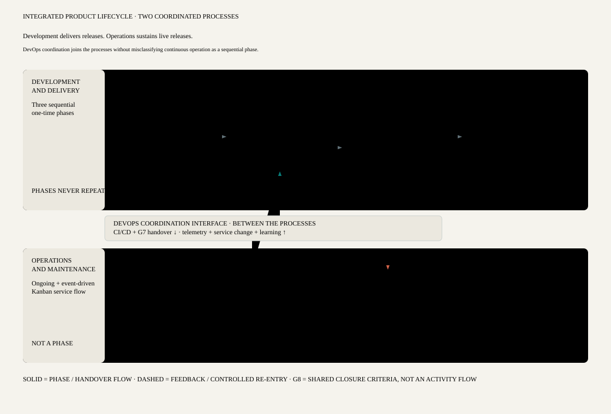
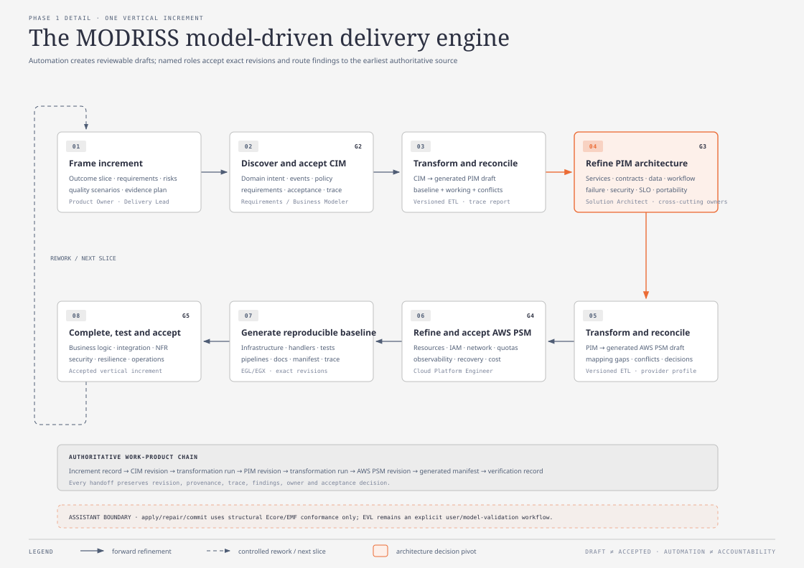

# Engineering the MODRISS Software Development Process

## Abstract

The MODRISS methodology has two parts: a full-lifecycle software development
process and a modeling framework for serverless systems. The
framework supplies
three domain-specific modeling languages at the computation-independent,
platform-independent, and platform-specific levels; Ecore metamodels; semantic
constraints expressed in the Epsilon Validation Language; model
transformations written in ETL; and artifact generation implemented with EGX
and EGL. Those facilities explain how models are represented, checked,
transformed, and turned into software artifacts. The framework defines how the
models are represented and processed. The development process guides the human
and organizational work surrounding them: opportunity analysis, requirements,
planning, architecture, implementation, verification, release, operation,
change, team coordination, risk, quality, and retirement.

This chapter describes how the process part of the methodology was engineered
and presents the resulting process design. The construction followed a
requirements-led, situational method-engineering approach. An iterative
criteria-based technique was used to
derive and stabilize requirements; process patterns from situational method
engineering and model-driven development supplied reusable fragments; Hybrid
Methodology Design guided top-down assembly; and a serverless-specific
evaluation framework was used to expose missing lifecycle and engineering
concerns. The resulting process has five lifecycle phases, an iterative
CIM–PIM–PSM delivery engine, nine evidence gates, sixteen conceptual roles,
twenty-nine principal work products, four reference configurations, and a
repository of reusable process patterns. It is represented using SPEM 2.0 and
connected to the executable process definitions already present in MODRISS.

The result is best understood as an engineered process design with strong
structural and traceability evidence. Its practical effectiveness remains an
empirical question and must be assessed through enactment in representative
projects.

## 1. Introduction

The word _methodology_ is sometimes used for a modeling language, a toolchain,
or a sequence of modeling steps. None of these meanings is sufficient here.
Ramsin and Paige describe a software development methodology as having two
closely related parts: modeling conventions, including their syntax and
semantics, and a process that places development activities and products in an
ordered and manageable course of work (Ramsin and Paige, 2010). This distinction
is especially useful for MODRISS. In this project, **methodology** names the
whole design, comprising the development process and modeling framework.
**Process** refers to lifecycle guidance, activities, roles, decisions, and
evidence. Reusable SPEM method content supplies definitions used by activities
within the process part.

The MODRISS modeling framework is already substantial. It defines three
abstraction levels—CIM, PIM, and AWS PSM—and provides dedicated DSMLs for them.
Their abstract syntax is expressed in Ecore, their semantic constraints are
written in EVL, the CIM-to-PIM and PIM-to-PSM refinements are implemented in
ETL, and the PSM is used by EGX/EGL generators to produce deployable and
supporting artifacts. In other words, MODRISS provides a coherent path from
problem-domain intent to a provider-specific realization.

Yet a development team cannot begin with an ETL transformation. Before any
model exists, somebody has to decide whether the product is worth pursuing,
whether serverless is a suitable architectural choice, which risks and cost
assumptions matter, and how the work should be organized. After generation,
the software still has to be completed, tested, released, operated, changed,
and eventually retired. The models also live inside a social setting: people
own decisions, teams share boundaries, releases carry risk, incidents create
new information, and evidence has to survive beyond a meeting or a tool run.

The purpose of the process developed in this research is therefore broader
than teaching a modeler how to populate the three DSMLs. It provides full-
lifecycle guidance for engineering serverless software with the MODRISS
modeling framework. The process is intended to answer three
questions:

1. What development lifecycle is needed to take a serverless product from an
   initial opportunity to responsible retirement?
2. How should the existing CIM, PIM, PSM, transformation, and generation
   capabilities be embedded in that lifecycle without turning the process into
   a rigid waterfall?
3. How can the process be justified, tailored, represented, and evaluated in a
   way that is academically defensible and practically usable?

The process described in this chapter targets event-driven and API-oriented
information systems that can be represented by the MODRISS metamodels. The
current provider-specific realization is AWS. CIM and PIM preserve a meaningful
degree of provider independence, but the implemented PSM, transformation, and
generator do not justify a claim of realized multi-cloud portability. Likewise,
the high-assurance configuration described later is an extension point, not a
claim that MODRISS on its own makes a system safe or compliant.

## 2. Research foundations

No single source in the studied literature provides the process needed by
MODRISS. The sources play different roles: one explains how to derive method
requirements; another explains how to build a situational method from reusable
patterns; another provides a model-driven process backbone; and another supplies
serverless-specific evaluation criteria. Their value lies in combination, not
in selecting one source and renaming its phases.

### 2.1 Requirements engineering for the methodology

Ramsin and Paige's iterative criteria-based approach treats a methodology as an
engineered artifact with requirements of its own. It begins with preliminary
requirements derived from the target development situation and desirable
method qualities. These requirements become evaluation criteria, which are
applied to relevant existing methodologies. The comparison reveals ambiguity,
omissions, and useful practices; the criteria are then refined and applied
again. Once the criteria stabilize, they are converted into concrete method
requirements and realization tactics (Ramsin and Paige, 2010).

This procedure is preferable to inventing a lifecycle directly from experience.
It forces the method engineer to explain why a phase, role, or work product is
present and what requirement it satisfies. Ramsin and Paige also provide a
useful quality test for the criteria themselves: they should be general enough
to apply across the candidate methods, precise enough to distinguish them,
comprehensive enough to cover significant concerns, and balanced across
technical, managerial, and usage perspectives.

### 2.2 Situational method engineering and process patterns

Situational method engineering rejects the assumption that one fixed process
fits every project. A method is assembled or adapted for the circumstances in
which it will be enacted. Asadi and Ramsin organize this work through reusable
process patterns and a generic Situational Method Engineering Process (SMEP).
Their pattern model describes a recurring problem, an initial context, a result
context, participating roles, and work products. Patterns can operate at task,
stage, or phase scale. SMEP also distinguishes several construction policies,
including instantiation, assembly, configuration, integration,
artifact-oriented construction, and abstraction or generalization (Asadi and
Ramsin, 2009).

Two consequences follow for MODRISS. First, the existing CIM, PIM, and PSM mini
processes should not be discarded. They are reusable method chunks with real
tool and metamodel bindings. Second, tailoring cannot mean casually deleting
steps. A project configuration has to preserve the control objective of any
content it removes or replaces.

### 2.3 Hybrid Methodology Design

Rahimian and Ramsin demonstrate how a domain-specific method can be developed
through a top-down, iterative process. Hybrid Methodology Design prioritizes
method requirements at the current level of abstraction, selects appropriate
construction policies, incorporates knowledge from existing methods and
patterns, restructures the emerging design, and then moves to a more detailed
level. Requirements and method structure are revisited as knowledge grows
(Rahimian and Ramsin, 2008).

The mobile domain used in their study is not directly relevant to serverless
software. The construction logic is. MODRISS uses the same broad reasoning:
start with a generic lifecycle structure, add domain-specific engineering
concerns, integrate implemented method fragments, and refine the design until
its requirements, products, roles, and activities form a coherent whole.

### 2.4 Model-driven process patterns

Model-Driven Architecture defines abstraction levels and model-transformation
principles, but it does not prescribe a complete software process. Asadi,
Esfahani, and Ramsin address this gap with the MDA Software Process (MDASP),
which was derived from recurring features of six MDA-based methodologies. Its
patterns cover justification, CIM definition, requirements analysis,
infrastructure setup, planning and management, PIM definition, transformation,
coding and testing, source/target synchronization, testing in the large,
generalization, deployment, maintenance, and postmortem review (Asadi,
Esfahani, and Ramsin, 2010).

MDASP supplied the initial model-driven backbone for MODRISS. It was not adopted
unchanged. Release and operational responsibilities needed greater visibility;
serverless decisions had to be added; the construction phase had to work as a
vertical increment loop; and retirement had to become a first-class phase.

### 2.5 Serverless evaluation criteria

Eidi and Ramsin evaluate model-driven serverless and microservice approaches
using three groups of criteria: general software-development concerns,
MDD-related concerns, and serverless-related concerns. Their comparison shows a
recurring imbalance. Several approaches provide useful design-time modeling or
deployment automation, while early feasibility, cost and risk, project
management, requirements traceability, deployment strategy, cold starts, and
operational feedback receive uneven support (Eidi and Ramsin, 2026).

These criteria were used twice in this research. During construction they acted
as requirements-discovery instruments: a weak or absent concern became a
candidate requirement. After construction they acted as an evaluation
framework. This dual use makes omissions visible early and prevents the final
evaluation from being invented to favor the resulting process design.

### 2.6 Process-centered presentation

The supplied process chapter by Deljouyi presents a model-driven REST service
method as a process with start-up, construction, transition, and maintenance
phases, iterative internal work, feedback paths, roles, input/output products,
and umbrella activities (Deljouyi, n.d.). The domain and modeling framework are
different from MODRISS, so its content was not reused as a serverless process.
Its contribution is presentational: the complete lifecycle and the modeling
chain can be shown together without pretending that modeling is the entire
software process.

Table 1 summarizes how the source material was used.

| Source                             | Contribution to this research                                                               | Deliberate boundary                                                      |
| ---------------------------------- | ------------------------------------------------------------------------------------------- | ------------------------------------------------------------------------ |
| Ramsin and Paige (2010)            | Iterative derivation and stabilization of method requirements; method-quality criteria      | Does not prescribe the target serverless lifecycle                       |
| Asadi and Ramsin (2009)            | SMEP, process-pattern structure, method repository, construction and configuration policies | Patterns require domain-specific specialization                          |
| Rahimian and Ramsin (2008)         | Top-down, iterative Hybrid Methodology Design logic                                         | Mobile-domain process content was not copied                             |
| Asadi, Esfahani, and Ramsin (2010) | MDASP lifecycle backbone and model-driven process patterns                                  | Release, operations, serverless concerns, and retirement were extended   |
| Eidi and Ramsin (2026)             | General, MDD, and serverless evaluation criteria; evidence of gaps in existing approaches   | Criteria indicate required support but do not define the resulting tasks |
| Deljouyi (n.d.)                    | Process-centered presentation, lifecycle feedback, umbrella activities                      | REST-specific language and activities were not reused                    |

## 3. Method-engineering procedure

The process was constructed through ten connected activities. They are
described sequentially for clarity, although several were revisited when later
analysis exposed a gap.

### 3.1 Define the methodology and process boundary

The first decision was to distinguish the two parts of the methodology. The
modeling framework comprises the DSMLs, metamodels, model semantics,
transformations, and generators. The development process comprises lifecycle
phases, human work, responsibilities, work-product states, decisions, evidence,
management, and tailoring. A transformation pipeline is one part of the
framework, so it cannot represent the whole methodology. The process describes
how people use the framework during the product lifecycle.

### 3.2 Establish seed criteria

The initial criteria combined full lifecycle coverage, model-driven
automation, requirements traceability, explicit serverless engineering,
practicality, configurability, and governance. The Eidi and Ramsin criteria
expanded the serverless and MDD portions. Ramsin and Paige's process
requirements expanded lifecycle, user participation, testability,
seamlessness, complexity management, extensibility, and inconsistency
management.

### 3.3 Inspect the MODRISS baseline

The repository was treated as evidence, not merely as an implementation to be
documented after the process had been designed. The inspection covered the CIM,
PIM, PSM, and shared metamodels; EVL validation suites; ETL transformations;
trace, readiness, identity, and reconciliation behavior; EGL/EGX templates;
coverage matrices; existing modeling guides; and the five executable process
definitions.

This inspection changed the construction problem. MODRISS already contained
26 CIM tasks, 32 PIM tasks, 28 PSM tasks, 16 artifact-readiness tasks, and a
30-task integrated process. The goal was therefore not to replace the detailed
modeling guidance. It was to justify, assemble, surround, and govern those
components as parts of the MODRISS methodology.

### 3.4 Refine criteria into requirements

The criteria were repeatedly applied to the sources and repository baseline.
When a criterion remained too broad to guide design, it was split. For example,
“deployment support” became requirements for immutable candidates, promotion,
version and alias management, progressive strategies, recovery, observation,
and handover. “Model validation” was separated into structural conformance,
semantic validation, transformation verification, and product testing.

The stabilized set contains 57 requirements in six families.

| Family                        | IDs        | Count | Main concern                                                                                                     |
| ----------------------------- | ---------- | ----: | ---------------------------------------------------------------------------------------------------------------- |
| Lifecycle                     | `MR-LC-*`  |     7 | Full lifecycle, gates, concurrency, feedback, and method-content separation                                      |
| Requirements and stakeholders | `MR-RE-*`  |     5 | Outcomes, events, NFRs, user involvement, evolution, and traceability                                            |
| Model-driven engineering      | `MR-MDE-*` |    12 | Level boundaries, transformations, identity, reconciliation, validation, reuse, and standards                    |
| Serverless engineering        | `MR-SL-*`  |    18 | Suitability, cost, provider choice, events, state, failure, security, testing, delivery, operations, and lock-in |
| Management and scale          | `MR-MG-*`  |     7 | Planning, risk, quality, security, configuration, evidence, teams, measurement, and learning                     |
| Process quality               | `MR-Q-*`   |     8 | Understandability, configurability, practicality, scalability, visibility, and preserved controls                |

Each requirement has a support level—MUST, SHOULD, or MAY—and a verification
statement. This is significant: a requirement such as provider selection is
not satisfied because the chapter mentions provider selection. It is satisfied
only when the process assigns a task and accountable role, produces a decision
record, places that record before provider-specific design, and makes it
reviewable at a gate.

### 3.5 Construct the lifecycle top-down

The initial MDASP initiation–construction–deployment structure was expanded
into five phases: initiation and tailoring; model-driven delivery; release and
transition; operation and evolution; and retirement. The expansion keeps
release decisions distinct from construction, recognizes the service's life
after deployment, and prevents retirement from remaining an undocumented
operational afterthought.

### 3.6 Build an artifact chain

An artifact-oriented construction policy connected the work from one end of
the lifecycle to the other:

`opportunity → charter → method profile → requirements/CIM → PIM → PSM →
generated baseline → release candidate → deployed release → operational
evidence → change or retirement evidence`.

Every transition was given an accountable role, an input/output relation, a
revision and provenance expectation, and a review outcome. This chain connects
modeling, development, and operations activities within the full-lifecycle
process.

### 3.7 Assemble and specialize process patterns

The implemented CIM, PIM, PSM, and artifact processes were assembled as child
process components. MDASP patterns supplied generic model-driven work.
Serverless-specific fragments were then added for suitability, cost, provider
selection, event contracts, function boundaries, state, failure, security,
cold starts, observability, progressive delivery, and operational feedback.
Finally, continuous management and assurance disciplines were woven through
the phases.

### 3.8 Define situational configurations

The process was designed as a stable core with configuration packages rather
than several unrelated lifecycle variants. Project novelty, serverless fit,
criticality, data sensitivity, team topology, skills, volatility, architectural
novelty, platform strategy, integration landscape, release risk, availability,
scale uncertainty, compliance, cadence, and legacy constraints influence the
selected profile and evidence depth.

### 3.9 Evaluate the integrated process

The assembled design was checked for lifecycle continuity, requirement
coverage, role and work-product ownership, traceability, fragment compatibility,
SPEM consistency, and alignment with repository capabilities. It was then
evaluated against the complete Eidi and Ramsin criteria. Unsupported or only
partially implemented capabilities were retained as gaps rather than silently
scored as complete.

### 3.10 Publish and plan empirical validation

The resulting process design was published as human-readable guidance, a
machine-readable fragment catalog, a consolidated method-content index, and a
SPEM-logical exchange model. An empirical protocol defines contrasting case
studies, observation points, measures, evidence sources, rival explanations,
and validity safeguards. This final activity matters because internal
coherence is not evidence that the process improves real projects.

## 4. The MODRISS model-driven foundation

The process is anchored in the division of concerns shown in Table 2. Each
model level has a distinct purpose; the process treats movement between levels
as a reviewed refinement, not a mechanical file conversion.

| Level                             | Purpose                                                                                  | Representative concerns                                                                                                                      | Transition                                                                                             |
| --------------------------------- | ---------------------------------------------------------------------------------------- | -------------------------------------------------------------------------------------------------------------------------------------------- | ------------------------------------------------------------------------------------------------------ |
| CIM                               | Express the problem and organizational intent without committing to a computing platform | stakeholders, outcomes, capabilities, domain language, information, commands, queries, events, policies, processes, requirements, governance | CIM-to-PIM ETL produces a traceable PIM draft                                                          |
| PIM                               | Describe a provider-independent serverless solution architecture                         | services, boundaries, functions, contracts, events, APIs, data, state, workflows, integration, security, failure, SLOs, deployment intent    | PIM-to-AWS-PSM ETL produces a traceable provider-specific draft                                        |
| AWS PSM                           | Describe the concrete cloud realization                                                  | Lambda, API Gateway, EventBridge, SQS/SNS, Step Functions, DynamoDB/S3, IAM/KMS, networking, observability, stages, quotas, recovery         | EGX/EGL produces infrastructure, code, contracts, tests, pipelines, documentation, and trace artifacts |
| Generated and completed artifacts | Realize the accepted PSM and complete behavior that cannot or should not be generated    | business logic, adapters, clients, tests, configuration, manifests, release artifacts, runbooks                                              | CI/CD qualifies and promotes an immutable release candidate                                            |

The transformations use stable identity, trace information, and a
baseline/working/new-generated reconciliation model. This allows generated
changes and human refinements to coexist and exposes overlapping edits as
conflicts. It is more accurate to call this controlled forward synchronization
than complete round-trip engineering: MODRISS does not currently implement a
general reverse PSM-to-PIM-to-CIM transformation.

Transformation and generation results are drafts. A completed ETL or EGX run
does not accept a model, satisfy a requirement, or authorize a release. Human
roles remain accountable for unresolved mappings, architectural decisions,
security, quality, and operational readiness.

## 5. The engineered lifecycle

Figure 1 presents the final lifecycle. It deliberately shows two structures at
once. Horizontally, a product or service progresses through initiation,
delivery, release, operation, and retirement. Inside Phase 1, a vertical
increment moves through the model-driven engineering chain. Dashed paths show
that operational evidence and lifecycle learning can return work to an earlier
authoritative source. The bar beneath the phases represents continuous
disciplines rather than a separate late-stage review.

**Figure 1. The MODRISS full-lifecycle software development process.** Each
phase answers a governing question, performs defined work, produces reviewable
evidence, and yields a primary outcome. Solid arrows show lifecycle progression;
dashed arrows show controlled re-entry and learning.

The phases are dominant modes of work, not departments or one-time waterfall
handoffs. Feasibility can be revisited when operations reveal a false cost
assumption. Architecture work can overlap with requirements discovery when the
affected scope and revisions are clear. A release may contain several accepted
increments. The process nevertheless uses explicit gates because iteration
without stable decisions makes traceability and responsibility difficult to
defend.

The lifecycle therefore has three nested cycles. The outer product/service
lifecycle begins with Phase 0 and ends only when Phase 4 retirement is
authorized. Within it, a release cycle traverses Phases 1, 2, and 3 repeatedly.
Within each release, Phase 1 executes one or more vertical increment cycles.
After G7, the deployed baseline remains in operation while roadmap demand,
telemetry, incidents, risks, cost evidence, and user feedback are evaluated.
If further work is selected, the team defines a new release hypothesis and
returns to Phase 1; it does not restart initiation and it does not proceed to
retirement by default. A G6 rejection or failed promotion also returns to
Phase 1 for correction and requalification. This distinction makes the
apparently linear phase layout compatible with continuous product evolution.

### 5.1 Phase 0 — Initiate, Tailor, and Organize

Phase 0 begins with the product or service problem, not with a preferred cloud
service. The Product Owner, Sponsor, Domain Expert, Solution Architect, and
Service Owner frame the outcomes, stakeholders, system boundary, constraints,
non-goals, expected lifetime, operational expectations, and initial release
hypothesis.

The team then assesses serverless suitability. Workload shape, latency, state,
integration, availability, compliance, skills, cost, portability, operating
model, and exit constraints are compared across serverless, hybrid, and
non-serverless alternatives. When uncertainty is high, the phase authorizes a
bounded experiment instead of disguising an assumption as a decision. Provider
selection is also explicit. AWS is currently the implemented target, but the
fact that a tool supports AWS is not, by itself, a reason for selecting it.

The Method Engineer evaluates the situational factors and creates a versioned
method profile. The Delivery Lead defines team boundaries, model and
integration ownership, dependencies, cadence, escalation, and repository
strategy. Quality, security, platform, release, and service roles establish the
initial assurance, environment, secret, SLO, observability, recovery, and
CI/CD expectations.

The phase has two decisions. Gate G0 records whether to pursue, explore,
redirect, or stop. Gate G1 confirms that process tailoring and organization are ready
for the first increment. The principal outputs are the product/system charter,
serverless suitability record, cost model and budget guardrails, risk register,
situational method profile, team topology, and initial roadmap.

### 5.2 Phase 1 — Iterative-Incremental Model-Driven Delivery

Phase 1 is the technical engine within the development process, but it does not operate as “finish
the complete CIM, then the complete PIM, then the complete PSM.” Each iteration
selects a coherent and valuable slice and takes it through every level needed to
produce testable software. Broader models may provide context, yet acceptance
is revision- and scope-specific.

The phase begins by framing the increment: outcome, capability or event journey,
requirements, quality scenarios, dependencies, risks, and acceptance evidence.
The CIM component then models strategic intent, domain meaning, behavior,
policies, processes, and requirements without introducing provider detail. Gate
G2 accepts the CIM revision for the slice.

The CIM-to-PIM transformation runs into a generated target. Its output is
reconciled with the prior generated baseline and the working PIM, after which
the team inspects trace links, assumptions, conflicts, placeholders, and manual
decisions. The PIM is then refined to express service boundaries, functions,
contracts, data and state, events, APIs, workflows, integrations, security,
failure behavior, SLOs, observability, deployment units, cost, and portability
decisions. Gate G3 confirms that the provider-independent architecture is
accepted and mappable.

The PIM-to-PSM transformation and reconciliation follow the same discipline.
The AWS PSM is refined with exact resources, IAM and encryption, networking,
quotas, concurrency, storage, messaging, workflows, observability, stages,
recovery, retention, and cost controls. Gate G4 accepts the precise PSM revision
for generation.

EGX/EGL then produces a reproducible artifact baseline. The generation record
captures the source model, transformation and template versions, configuration,
manifest, hashes, warnings, trace, protected regions, and manual actions.
Software engineers complete business logic and supported extensions. Testing
moves from units, contracts, components, policies, permissions, and failure
paths to integration, end-to-end behavior, performance, concurrency, cold
starts, resilience, recovery, security, usability, operability, and cost
signals. Gate G5 accepts, returns, or defers the increment.

Figure 2 expands this loop.

**Figure 2. The MODRISS iterative model-driven delivery engine.** Automated
transformations create reviewable drafts. Gates G2–G5 accept exact revisions,
and findings return to the earliest authoritative source rather than being
patched only in a downstream artifact.

### 5.3 Phase 2 — Release and Transition

An accepted increment is not automatically a production release. Phase 2
assembles compatible increments and freezes the exact model revisions,
transformation profiles, generator versions, source revisions, artifact
digests, schemas, configuration, database changes, and dependencies that form
the candidate. Compatibility, consumer readiness, data migration, quotas,
feature controls, supply-chain evidence, support readiness, SLOs, backup,
restore, rollback or roll-forward, and communication are examined against that
immutable candidate.

Gate G6 authorizes or rejects the release, or records a time-bounded exception
with an accountable risk owner. Promotion proceeds through the selected
environments using a strategy proportionate to risk: canary or weighted alias,
blue/green, feature control, or a governed direct promotion for a genuinely
low-risk change. Business, technical, security, and cost signals are observed
against declared stop and rollback thresholds.

The Service Owner accepts dashboards, alerts, traces, runbooks, on-call and
support responsibility, access, recovery procedures, known errors, and
residual risks. Gate G7 records operational transition. Deployment is not
considered complete merely because infrastructure exists in the target account.
Nor is G7 a terminal point: it establishes the operating baseline from which a
later release may be justified and engineered.

### 5.4 Phase 3 — Operate, Evolve, and Learn

The running service is managed against product outcomes and SLOs. The process
expects observation of latency, availability, errors, throttling, concurrency,
retries, dead letters, workflow failures, quota use, cold starts, security
signals, capacity, cost per meaningful business unit, and provider health.
Routine recovery, dependency updates, access review, key rotation, patching,
and continuity work remain owned.

Incidents first trigger recovery and communication. The subsequent problem
analysis may reveal a defect in a domain rule, architecture, provider mapping,
generator, implementation, release control, or process guidance. The change is
routed to the earliest authoritative source:

| Nature of change                                                              | Authoritative re-entry point      |
| ----------------------------------------------------------------------------- | --------------------------------- |
| Outcome, requirement, domain rule, or event meaning                           | CIM                               |
| Service boundary, contract, data, workflow, or provider-independent policy    | PIM                               |
| AWS resource, IAM, network, runtime, deployment, or observability realization | PSM                               |
| Reusable scaffold or generation defect                                        | Transformation or EGL/EGX source  |
| Product-specific business logic                                               | Supported implementation workflow |
| Promotion, environment, recovery, or support control                          | Release/operations workflow       |
| Repeated process friction or missing guidance                                 | Method-engineering backlog        |

Emergency downstream repairs are permitted when service restoration requires
them, but they create a reconciliation obligation. Otherwise, the running
system and its authoritative models gradually become unrelated artifacts.

Retrospectives compare actual outcomes, SLOs, cost, risk, estimates, and flow
with the original hypotheses. Reusable models, transformations, tests,
templates, runbooks, and reusable method content are generalized only after review.

### 5.5 Phase 4 — Retire, Migrate, and Close

Retirement is treated as a controlled release. The team identifies the reason,
successor, users and consumers, legal and contractual obligations, data
retention or disposition, integrations, access, resources, communications,
rollback window, and evidence-retention needs.

Migration covers users, data, events, and integrations. Decommissioning stops
traffic and schedules, revokes credentials, closes subscriptions and endpoints,
removes queues, alarms, domains, and cloud resources in a controlled order, and
verifies that billing has ceased. Required models, source, logs, decisions, and
audit evidence are retained according to policy.

Gate G8 closes the lifecycle only when product, service, security/privacy, and
records owners agree that no user, data set, integration, access path,
infrastructure resource, cost, support duty, or legal record has become
ownerless.

## 6. Method content

The lifecycle uses reusable method content rather than embedding every
definition in the phase descriptions. In SPEM terms, a role, task, work
product, or guidance item is defined once and used in one or more activities
(OMG, 2008). This distinction allows a task such as risk review to have a
stable meaning while its frequency, evidence depth, and reviewer independence
vary by project profile.

### 6.1 Process-pattern repository

Seventeen lifecycle patterns and one composite continuous pattern form the
method repository.

| ID    | Pattern                                                   | Default use                                      |
| ----- | --------------------------------------------------------- | ------------------------------------------------ |
| MF-01 | Opportunity and feasibility                               | Required                                         |
| MF-02 | Serverless suitability, cost, risk, and provider decision | Required before provider-specific commitment     |
| MF-03 | Situational method tailoring                              | Required                                         |
| MF-04 | Product, release, and increment framing                   | Required per increment                           |
| MF-05 | Event-driven domain discovery and CIM modeling            | Required                                         |
| MF-06 | CIM assurance and readiness                               | Required                                         |
| MF-07 | CIM-to-PIM transformation and reconciliation              | Required when the MODRISS transformation is used |
| MF-08 | Platform-independent serverless architecture              | Required                                         |
| MF-09 | PIM-to-PSM transformation and reconciliation              | Required for a supported PSM                     |
| MF-10 | AWS PSM refinement and assurance                          | Required for the AWS profile                     |
| MF-11 | Reproducible model-to-text generation                     | Required                                         |
| MF-12 | Artifact completion and test in the small                 | Required                                         |
| MF-13 | Test in the large and release qualification               | Required; depth is risk-based                    |
| MF-14 | Progressive CI/CD and transition                          | Required; strategy is situational                |
| MF-15 | Operate, observe, control cost, and learn                 | Required                                         |
| MF-16 | Incident, problem, and controlled change propagation      | Required                                         |
| MF-17 | Retirement, migration, and closure                        | Required                                         |
| UF-01 | Integrated management, assurance, and evidence            | Continuous; depth is tailored                    |

Each pattern records its problem, initial context, result context, roles, work
products, source, selection rule, and requirements. A core fragment may be
replaced only by another fragment that satisfies the same control objectives
and provides compatible outputs.

### 6.2 Roles and team structure

Roles are responsibility and competency sets, not mandatory job titles. One
person may perform several roles in a small team, while a large program may
assign several people to one role. Combining people does not combine away
accountability.

| ID   | Role                              | Principal accountability                                                                             |
| ---- | --------------------------------- | ---------------------------------------------------------------------------------------------------- |
| R-01 | Sponsor                           | Investment authorization and business-level continuation or stop decisions                           |
| R-02 | Product Owner                     | Outcomes, priorities, scope, user representation, and increment/release acceptance                   |
| R-03 | Domain Expert/User Representative | Domain truth, language, rules, scenarios, and user or operational feedback                           |
| R-04 | Method Engineer                   | Situation assessment, method configuration, control preservation, and method evolution               |
| R-05 | Delivery Lead                     | Integrated flow, planning, dependencies, cadence, blockers, communication, and escalation            |
| R-06 | Requirements/Business Modeler     | Requirements, CIM discovery, acceptance criteria, and problem-domain traceability                    |
| R-07 | Solution Architect                | PIM architecture, contracts, service boundaries, data, workflow, and provider-independent trade-offs |
| R-08 | Cloud Platform Engineer           | Provider mapping, PSM, infrastructure automation, environments, and platform guardrails              |
| R-09 | Software Engineer                 | Business logic, adapters, clients, tests, and supported extensions                                   |
| R-10 | Quality Engineer                  | Verification strategy, evidence quality, NFR testing, and finding workflow                           |
| R-11 | Security and Privacy Engineer     | Threat/privacy analysis, least privilege, secrets, encryption, testing, and exceptions               |
| R-12 | FinOps/Cost Analyst               | Cost hypotheses, budgets, allocation, anomaly thresholds, and cost feedback                          |
| R-13 | Release Engineer                  | Immutable candidates, promotion, versions/aliases, rollback, and deployment records                  |
| R-14 | Service Owner/SRE                 | SLOs, observability, support, resilience, incidents, continuity, and service outcomes                |
| R-15 | Process/Assurance Reviewer        | Risk-proportionate independent review and recorded assurance decisions                               |
| R-16 | Records/Data Steward              | Retention, disposition, migration evidence, and records/data closure                                 |

A small product team can combine architecture, implementation, platform, and
release responsibilities, provided that the needed skills and decision rights
remain visible. Multiple stream-aligned teams own bounded capability slices and
publish contracts. A platform team owns reusable PSM profiles, generators,
pipelines, environments, and guardrails; it does not silently assume product
acceptance for the stream teams. Communities of practice maintain modeling,
architecture, quality, security, FinOps, and SRE guidance without becoming an
approval queue for routine decisions.

High-risk security exceptions, production releases, and irreversible data
retirement cannot be approved solely by the person who produced the work. The
exact separation of duties is configured according to criticality and
regulatory context.

### 6.3 Work products

The process defines twenty-nine principal work products. A work product is
broader than a file: it has an accountable owner, revision, state, quality
criteria, consumers, provenance, and retention rule.

| Group                      | ID    | Work product                                    | Accountable role                    |
| -------------------------- | ----- | ----------------------------------------------- | ----------------------------------- |
| Strategy and method        | WP-01 | Product/System Charter                          | Product Owner                       |
|                            | WP-02 | Feasibility and Serverless Suitability Record   | Solution Architect                  |
|                            | WP-03 | Initial Cost Model and Budget Guardrails        | FinOps/Cost Analyst                 |
|                            | WP-04 | Risk and Opportunity Register                   | Delivery Lead                       |
|                            | WP-05 | Situational Method Profile                      | Method Engineer                     |
|                            | WP-06 | Team Topology and Responsibility Assignment     | Delivery Lead                       |
|                            | WP-07 | Integrated Roadmap, Release, and Increment Plan | Product Owner                       |
| Model-driven engineering   | WP-08 | CIM Revision                                    | Requirements/Business Modeler       |
|                            | WP-09 | CIM Review and Readiness Record                 | Assurance Reviewer                  |
|                            | WP-10 | CIM-to-PIM Transformation Run                   | Solution Architect                  |
|                            | WP-11 | PIM Revision                                    | Solution Architect                  |
|                            | WP-12 | Architecture Decision Record Set                | Solution Architect                  |
|                            | WP-13 | Threat, Privacy, Failure, and Cost Analysis     | Security/Architecture/FinOps owners |
|                            | WP-14 | PIM Review and Readiness Record                 | Assurance Reviewer                  |
|                            | WP-15 | PIM-to-PSM Transformation Run                   | Cloud Platform Engineer             |
|                            | WP-16 | AWS PSM Revision                                | Cloud Platform Engineer             |
|                            | WP-17 | PSM Review and Readiness Record                 | Assurance Reviewer                  |
|                            | WP-18 | Generated Artifact Baseline and Manifest        | Cloud Platform Engineer             |
| Implementation and release | WP-19 | Source and Test Baseline                        | Software Engineer                   |
|                            | WP-20 | Verification and Validation Record              | Quality Engineer                    |
|                            | WP-21 | Immutable Release Candidate                     | Release Engineer                    |
|                            | WP-22 | Release and Recovery Plan                       | Release Engineer                    |
|                            | WP-23 | Operational Readiness and Handover Pack         | Service Owner                       |
|                            | WP-24 | Deployment/Promotion Record                     | Release Engineer                    |
| Operation and closure      | WP-25 | Operational Evidence Set                        | Service Owner                       |
|                            | WP-26 | Incident and Problem Record                     | Service Owner                       |
|                            | WP-27 | Change and Impact Record                        | Requirements Engineer               |
|                            | WP-28 | Retirement/Migration Plan and Closure Record    | Service Owner                       |
|                            | WP-29 | Retrospective and Improvement Record            | Method Engineer                     |

Ordinary work products progress through `identified`, `draft`, `reviewed`,
`accepted`, `baselined`, `superseded`, and `archived`. Rejection, deferral, and
withdrawal are explicit alternatives. Generated output uses a
`generated-draft` state before review. Release candidates progress through
`assembled`, `qualified`, `authorized`, and `promoted`. Editing an accepted
product creates a new revision; it does not silently rewrite the evidence on
which an earlier decision was made.

## 7. Gates, governance, and continuous disciplines

### 7.1 Evidence gates

The nine gates are decision points rather than phase-completion percentages.

| Gate | Decision                                  | Minimum evidence focus                                                                          |
| ---- | ----------------------------------------- | ----------------------------------------------------------------------------------------------- |
| G0   | Pursue, explore, redirect, or stop        | Outcomes, feasibility, serverless fit, alternatives, cost and risk assumptions                  |
| G1   | Process and organization ready            | Method profile, owners, team topology, first increment, controls, dependencies                  |
| G2   | CIM accepted                              | Stakeholder meaning, requirements, domain behavior, acceptance, trace, open decisions           |
| G3   | PIM accepted and platform-mappable        | Contracts, data/state, failure behavior, security, SLOs, trace, capability needs                |
| G4   | PSM accepted for generation               | Exact revision, mapping decisions, IAM/network/quota/cost controls, trace, generation readiness |
| G5   | Increment accepted, reworked, or deferred | Completed implementation, integrated tests, NFR/security/operational evidence                   |
| G6   | Release authorized or rejected            | Exact immutable candidate, compatibility, recovery, risk, support and authorization evidence    |
| G7   | Release transitioned                      | Running-service checks, telemetry, support ownership, runbooks, access and residual risks       |
| G8   | Lifecycle closed                          | Users, data, integrations, access, resources, billing, retention and closure evidence           |

Every gate records the authority, date, exact scope and revisions, criteria,
evidence, findings, exceptions, and follow-up. Its possible outcomes are accept;
accept with a time-bounded exception; rework; or defer/stop. A meeting is not a
gate unless its decision and evidence are preserved.

### 7.2 Continuous disciplines

The continuous pattern is operationally decomposed into the following
disciplines:

- **Product and delivery management** maintains outcomes, backlog, release
  hypotheses, dependencies, forecasts, decisions, blockers, capacity, and
  communication.
- **Risk and opportunity management** connects product, technical, MDE,
  security, cost, schedule, supplier, release, and operational risks to
  treatments, experiments, tests, monitors, or contingency.
- **Quality assurance** defines objectives, review strategy, finding states,
  evidence, independence, and acceptance thresholds across models, software,
  releases, and operations.
- **Security, privacy, and compliance** carries threat/privacy analysis, least
  privilege, secrets and keys, encryption, supply-chain posture, exception
  expiry, incident coordination, and evidence retention through the lifecycle.
- **Configuration and change management** baselines accepted models and
  candidates, maintains provenance, controls compatibility, and reconciles
  emergency fixes.
- **Traceability and evidence management** links outcomes and requirements to
  CIM, PIM, PSM, artifacts, tests, releases, runtime measures, changes, and
  retirement.
- **FinOps and measurement** compares demand and cost hypotheses with runtime
  evidence and uses measures for system and process improvement, never for
  ranking individuals.
- **Knowledge and reuse** reviews model fragments, patterns, transformations,
  templates, tests, and runbooks before placing them in a governed repository.
- **Team and supplier coordination** manages cross-team dependencies,
  compatibility, ownership, escalation, SLAs, external-service boundaries, and
  exit arrangements.

### 7.3 Release and CI/CD semantics

The process distinguishes an increment, release candidate, release, and
deployment. An increment is an accepted vertical slice. A release candidate is
an immutable compatible assembly of increments and configuration. A release is
an authorized candidate, and a deployment is one promotion event within its
strategy.

The CI/CD flow checks repository and model structure, runs the explicit model
validation workflows required by the profile, verifies transformations and
trace reports, generates from an accepted PSM in a clean environment, compares
manifests and provenance, builds and tests outputs, publishes immutable
artifacts, exercises non-production environments, obtains candidate-specific
authorization, promotes progressively, and records post-deployment validation.
Automation can stop a release. It does not silently accept residual risk.

## 8. Situational tailoring

Tailoring occurs before the first increment and whenever risk, team structure,
platform, compliance, or release strategy changes. The Method Engineer records
factor evidence, selects the nearest reference profile, adds conditional
packages, combines roles only where competence and accountability remain,
adjusts evidence depth, and documents every omission or substitution together
with the control it preserves.

Four reference profiles give teams a starting point.

| Profile                           | Intended situation                                                   | Characteristic treatment                                                                                                                        |
| --------------------------------- | -------------------------------------------------------------------- | ----------------------------------------------------------------------------------------------------------------------------------------------- |
| A — Exploration                   | High uncertainty before production commitment                        | Short experiments, thin CIM/PIM slices, explicit suitability/cost/cold-start/integration hypotheses; prototype PSMs may be disposable           |
| B — Standard product delivery     | Ordinary business application with one or a few teams                | Full lifecycle, peer review, automated CI and tests, progressive promotion, service ownership, SLO/cost signals, lightweight complete records   |
| C — Multi-team product/platform   | Several independently planning stream teams with platform enablement | Bounded model ownership, integration owners, compatibility policy, dependency board, release coordination, communities of practice              |
| D — Regulated or high-criticality | Strong assurance, privacy, audit, or criticality needs               | Independent review, segregation, stronger trace/change control, retention, supplier evidence, recovery rehearsal, explicit deviation acceptance |

Conditional packages strengthen the base for multi-team scale, sensitive data,
high availability or disaster recovery, portability or multi-cloud intent,
legacy migration, high release risk, external suppliers, and AI-assisted
modeling.

Tailoring cannot remove product intent; suitability and provider decisions;
accountable model and service ownership; requirements traceability; structural
conformance and appropriate semantic review; security, quality, risk, and
change responsibility; reproducible generation and release identity; recovery
and operational ownership; or closure of data, integrations, access, resources,
and evidence. Activities may change, but these control objectives remain.

## 9. Validation semantics and the AI-assistant boundary

MODRISS distinguishes four kinds of evidence that are often collapsed under
the word _validation_:

1. structural Ecore/EMF conformance;
2. semantic model validation expressed in EVL;
3. transformation verification, trace, readiness, and reconciliation; and
4. verification and validation of the realized software and service.

Passing one does not imply passing another. A structurally valid PSM may still
contain an insecure architectural choice. A transformation can execute without
proving that an unresolved mapping is acceptable. Generated tests do not prove
their own adequacy.

The AI-assisted modeling workflow has a stricter boundary. Assistant-generated
actions, patches, proposals, checkpoints, and model outputs are gated only by
structural Ecore/EMF conformance through
`ModelService.validateStructural(...)`. Assistant apply, repair, and commit
paths do not call `ModelService.validate(...)`, stored semantic-validation
endpoints, `validateGeneratedXmi(...)`, `EpsilonEvlValidator`, EVL command-line
profiles, or equivalent semantic validators. EVL remains available only in an
explicit user/model-validation workflow outside those assistant paths. The
process therefore never describes assistant acceptance as semantic approval.

## 10. SPEM representation and repository realization

SPEM 2.0 was selected because it explicitly separates reusable Method Content
from its use in a Process (OMG, 2008). The MODRISS method library contains
RoleDefinitions, TaskDefinitions, WorkProductDefinitions, Guidance, Activities,
TaskUses, RoleUses, WorkProductUses, ProcessParameters, ProcessPerformers,
WorkSequences, Milestones, and MethodConfigurations.

The current consolidated package contains:

- 17 stable RoleDefinitions mapped to the 16 conceptual lifecycle roles;
- 132 TaskDefinitions drawn from the integrated and child processes;
- 88 WorkProductDefinitions, including the 29 lifecycle products defined here;
- 44 Guidance elements, including all 18 process patterns;
- five process components: end-to-end, CIM, PIM, PSM, and artifact readiness;
- four MethodConfigurations corresponding to exploration, standard,
  multi-team, and regulated/high-criticality profiles.

The fragment-by-fragment rationale and the textual description of the library
are reported in `12-method-library-and-fragment-report.md`. A generated
human-readable appendix, `method-library/reusable-method-content-catalog.md`,
lists every consolidated role, task, work product, and guidance definition.
The Markdown appendix and the JSON/SPEM representations are built from the same
sources so that the academic account does not become a separate, stale process
description.

The formal package uses the normative SPEM 2.0 namespace and standard metaclass
names. MODRISS-specific provenance, coverage, gate, and runtime metadata are
isolated as extensions. The representation is deliberately called a
_SPEM-logical exchange model_. Native import into every proprietary SPEM, EPF,
or RMC tool has not been certified and should not be claimed without testing
the relevant serialization dialect.

The formal representation is tied to concrete repository assets. CIM, PIM,
and PSM TaskDefinitions reference the existing executable process catalogs;
coverage matrices bind tasks to metamodel concepts; transformations and
generators are linked as implementation evidence; and the integrated process
provides the executable lifecycle view. This relation matters because a SPEM
diagram alone can describe a process that no tool or project can
actually enact.

## 11. Criteria-based evaluation

The finished design was evaluated with the complete Eidi and Ramsin criterion
set. Two ratings were kept separate:

- **process-design coverage**, which asks whether explicit activities, roles,
  products, guidance, and evidence rules address a criterion; and
- **repository realization**, which asks how much of that support is currently
  implemented by the metamodels, validation, transformations, generators,
  process definitions, and tools.

This separation prevents prose from being scored as automation and prevents a
generator feature from being mistaken for a development process.

The design provides explicit support across the general lifecycle: requirements,
analysis, design, implementation, testing, deployment, maintenance, management,
quality, risk, reuse, user involvement, adaptation, traceability, complexity,
and method definition. Its MDE support is strongest in level boundaries,
CIM/PIM/PSM creation, forward transformations, source/target reconciliation,
generation, trace, metadata, and process-linked metamodel coverage. Its
serverless design support covers suitability, cost, risk, provider selection,
events, NFRs, function boundaries, workflows, choreography, data/state,
contracts, fault behavior, integrations, security, secrets, CI/CD, progressive
delivery, observability, feedback, cold starts, and lock-in.

Several realization ratings remain partial:

- the PSM and generator are AWS-specific;
- synchronization is strong in the forward direction, but general reverse
  transformations are absent;
- cost analysis is method-supported but not yet generated quantitatively from
  workload models and current provider pricing;
- automated deployment-strategy coverage is not uniform;
- cold-start, resilience, and serverless-risk tests vary by project profile;
- model-derived testing does not yet provide complete systematic coverage;
- telemetry does not automatically update models; and
- process-run persistence and native vendor-tool SPEM exchange remain incomplete.

No aggregate percentage was calculated. Averaging dozens of criteria would
hide a blocking absence and assume that every criterion has equal weight in
every situation. A future case study should weight criteria according to its
method profile, retain criterion-level evidence, and report assessor agreement.

## 12. Validity and limitations

The process design has four kinds of evidence. Source validity comes from the
explicit relation between lifecycle families and the reviewed method-engineering
and model-driven sources. Requirements validity comes from iterative criteria
refinement. Internal validity comes from the trace among requirements,
patterns, tasks, roles, work products, gates, and SPEM elements. Implementation
validity comes from links to actual MODRISS metamodels, transformations,
generators, coverage matrices, and executable process definitions.

These forms of evidence support the claim that the process was systematically
engineered. They do not demonstrate that it is efficient, easy to learn, or
more effective than an alternative process. The author is also both method
designer and evaluator, which creates a risk of confirmation bias. The
criterion set mitigates that risk by being defined before the final evaluation,
but independent review and enactment are still needed.

The planned empirical evaluation uses at least two contrasting cases. One is a
standard single-team serverless product; the other introduces a different
source of difficulty, such as multiple teams, compliance, legacy integration,
strict availability, or portability. Evidence is collected at tailoring,
increment gates, release, an operating period, a controlled change or incident,
and retirement or a retirement rehearsal. Measures include cycle and wait time,
effort by activity family, rework, trace closure, transformation conflicts,
finding stage, escaped defects, forecast and observed cost, SLO evidence,
deviations, and practitioner experience. Independent assessors should rescore
the criteria from the evidence package and preserve disagreements.

Until such studies are completed, the defensible claim is that MODRISS provides
a criteria-evaluated, SPEM-structured, full-lifecycle development process
designed to work with the implemented three-level modeling framework. Claims about productivity,
quality improvement, scalability in practice, or superiority require empirical
results.

## 13. Conclusion

The MODRISS methodology comprises the development process and the modeling
framework. The process connects the framework's modeling capabilities with the
wider work of developing and operating a software product. It places CIM, PIM,
PSM, transformation, and generation activities inside a product and service
lifecycle.
The process starts with value, feasibility, and situational tailoring; delivers
thin model-driven increments; separates release authorization from generation;
connects operation to authoritative models; and gives retirement the same
discipline as deployment.

The process was not assembled by adding generic agile or DevOps terminology
around a modeling chain. Its lifecycle, fragments, roles, products, gates, and
profiles can be traced to stabilized requirements, literature-derived patterns,
serverless evaluation criteria, and concrete MODRISS capabilities. The SPEM
library preserves the distinction between reusable method content and its use
in a configured process, while the executable definitions keep the design
connected to the tool-supported project.

The resulting process is intentionally configurable. A small exploratory team
and a regulated multi-team program should not produce identical evidence or
staff every role separately. They should, however, preserve the same essential
control objectives: explicit intent, accountable decisions, traceable model
refinement, reproducible realization, evidence-based release, owned operation,
and verifiable closure. That balance between a stable engineering core and
situational enactment is the central design choice of the MODRISS process.

## References

Asadi, M., Esfahani, N., and Ramsin, R. (2010). “Process Patterns for
MDA-Based Software Development.” In _Proceedings of the 8th ACIS International
Conference on Software Engineering Research, Management and Applications
(SERA 2010)_, pp. 190–197. <https://doi.org/10.1109/SERA.2010.32>.

Asadi, M., and Ramsin, R. (2009). “Patterns of Situational Method
Engineering.” In R. Lee and N. Ishii (eds.), _Software Engineering Research,
Management and Applications 2009_, Studies in Computational Intelligence,
vol. 253, pp. 277–291. Springer. <https://doi.org/10.1007/978-3-642-05441-9_24>.

Deljouyi (n.d.). “Proposed Process for Developing REST-Based Web Services.”
Thesis process chapter supplied as _Deljouyi — Process_, pp. 97–110. [In
Persian].

Eidi, M., and Ramsin, R. (2026). “Model-Driven Approaches for Serverless
Software Development: Evaluation and Future Directions.” In _Proceedings of
the 14th International Conference on Model-Based Software and Systems
Engineering (MODELSWARD 2026)_, pp. 560–567. SCITEPRESS.
<https://doi.org/10.5220/0014634200004058>.

Object Management Group (OMG) (2008). _Software & Systems Process Engineering
Metamodel Specification, Version 2.0_. OMG formal/2008-04-01.
<https://www.omg.org/spec/SPEM/2.0/>.

Rahimian, V., and Ramsin, R. (2008). “Designing an Agile Methodology for Mobile
Software Development: A Hybrid Method Engineering Approach.” In _Proceedings
of the 2nd International Conference on Research Challenges in Information
Science (RCIS 2008)_, pp. 337–342.
<https://doi.org/10.1109/RCIS.2008.4632123>.

Ramsin, R., and Paige, R. F. (2010). “Iterative Criteria-Based Approach to
Engineering the Requirements of Software Development Methodologies.” _IET
Software_, 4(2), 91–104. <https://doi.org/10.1049/iet-sen.2009.0032>.
